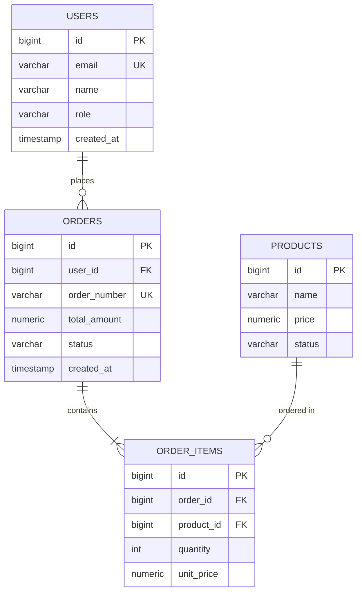

# データベース設計書

## 1. DB基本方針

### DBMS
| 項目 | 内容 |
|------|------|
| DBMS | [例: PostgreSQL 15.2] |
| 文字コード | UTF-8 |
| タイムゾーン | UTC (アプリ層で変換) |

### 命名規則
| 対象 | 規則 | 例 |
|------|------|-----|
| テーブル名 | スネークケース・複数形 | users, order_items |
| カラム名 | スネークケース | user_id, created_at |
| インデックス名 | idx_{テーブル}_{カラム} | idx_users_email |
| 外部キー名 | fk_{テーブル}_{参照先} | fk_orders_users |

### データ型方針
| 用途 | データ型 | 備考 |
|------|---------|------|
| 主キー | BIGSERIAL | 自動採番 |
| 外部キー | BIGINT | |
| 短文字列 | VARCHAR(255) | |
| 長文字列 | TEXT | |
| 日時 | TIMESTAMP WITH TIME ZONE | UTC保存 |
| 日付のみ | DATE | |
| 金額 | NUMERIC(10,2) | 精度保証 |
| 真偽値 | BOOLEAN | |
| 列挙型 | VARCHAR(50) + CHECK制約 | |

### 共通カラム (全テーブルに設定)
| カラム名 | データ型 | NULL | デフォルト | 説明 |
|---------|---------|------|----------|------|
| id | BIGSERIAL | NOT NULL | auto | 主キー |
| created_at | TIMESTAMP WITH TIME ZONE | NOT NULL | CURRENT_TIMESTAMP | 作成日時 |
| updated_at | TIMESTAMP WITH TIME ZONE | NOT NULL | CURRENT_TIMESTAMP | 更新日時 |
| deleted_at | TIMESTAMP WITH TIME ZONE | NULL | NULL | 論理削除日時 |

---

## 2. ER図



---

## 3. テーブル定義

### テーブル一覧
| No | テーブル名 | 論理名 | 想定件数(5年後) |
|----|----------|-------|---------------|
| 1 | users | ユーザー | 10,000 |
| 2 | orders | 注文 | 100,000 |
| 3 | order_items | 注文明細 | 500,000 |
| 4 | products | 商品 | 1,000 |

---

### 3.1 users (ユーザー)

**テーブル概要**
- 用途: システム利用ユーザーの管理
- 想定件数: 10,000件 (5年後)

**カラム定義**
| カラム名 | 型 | NULL | PK | FK | UK | デフォルト | 説明 | バリデーション |
|---------|-----|------|----|----|----|-----------|----|--------------|
| id | BIGSERIAL | NOT NULL | ○ | | | auto | 主キー | |
| email | VARCHAR(255) | NOT NULL | | | ○ | | メールアドレス | メール形式 |
| password_hash | VARCHAR(255) | NOT NULL | | | | | パスワードハッシュ | bcrypt |
| name | VARCHAR(100) | NOT NULL | | | | | 氏名 | 1-100文字 |
| role | VARCHAR(20) | NOT NULL | | | | 'user' | ロール | admin/user |
| status | VARCHAR(20) | NOT NULL | | | | 'active' | ステータス | active/inactive/suspended |
| last_login_at | TIMESTAMP WITH TIME ZONE | NULL | | | | | 最終ログイン | |
| created_at | TIMESTAMP WITH TIME ZONE | NOT NULL | | | | CURRENT_TIMESTAMP | 作成日時 | |
| updated_at | TIMESTAMP WITH TIME ZONE | NOT NULL | | | | CURRENT_TIMESTAMP | 更新日時 | |
| deleted_at | TIMESTAMP WITH TIME ZONE | NULL | | | | | 論理削除日時 | |

**制約**
```sql
CONSTRAINT pk_users PRIMARY KEY (id)
CONSTRAINT uk_users_email UNIQUE (email)
CONSTRAINT chk_users_role CHECK (role IN ('admin', 'user'))
CONSTRAINT chk_users_status CHECK (status IN ('active', 'inactive', 'suspended'))
CONSTRAINT chk_users_email_format CHECK (email ~* '^[A-Za-z0-9._%+-]+@[A-Za-z0-9.-]+\.[A-Za-z]{2,}$')
```

**インデックス**
```sql
CREATE INDEX idx_users_email ON users(email);
CREATE INDEX idx_users_status ON users(status) WHERE deleted_at IS NULL;
CREATE INDEX idx_users_deleted_at ON users(deleted_at);
```

**DDL**
```sql
CREATE TABLE users (
    id BIGSERIAL PRIMARY KEY,
    email VARCHAR(255) NOT NULL UNIQUE,
    password_hash VARCHAR(255) NOT NULL,
    name VARCHAR(100) NOT NULL,
    role VARCHAR(20) NOT NULL DEFAULT 'user',
    status VARCHAR(20) NOT NULL DEFAULT 'active',
    last_login_at TIMESTAMP WITH TIME ZONE,
    created_at TIMESTAMP WITH TIME ZONE NOT NULL DEFAULT CURRENT_TIMESTAMP,
    updated_at TIMESTAMP WITH TIME ZONE NOT NULL DEFAULT CURRENT_TIMESTAMP,
    deleted_at TIMESTAMP WITH TIME ZONE,
    CONSTRAINT chk_users_role CHECK (role IN ('admin', 'user')),
    CONSTRAINT chk_users_status CHECK (status IN ('active', 'inactive', 'suspended')),
    CONSTRAINT chk_users_email_format CHECK (email ~* '^[A-Za-z0-9._%+-]+@[A-Za-z0-9.-]+\.[A-Za-z]{2,}$')
);

CREATE INDEX idx_users_status ON users(status) WHERE deleted_at IS NULL;
CREATE INDEX idx_users_deleted_at ON users(deleted_at);

-- updated_at自動更新トリガー
CREATE OR REPLACE FUNCTION update_updated_at_column()
RETURNS TRIGGER AS $$
BEGIN
    NEW.updated_at = CURRENT_TIMESTAMP;
    RETURN NEW;
END;
$$ LANGUAGE plpgsql;

CREATE TRIGGER trg_users_updated_at
BEFORE UPDATE ON users
FOR EACH ROW
EXECUTE FUNCTION update_updated_at_column();
```

---

### 3.2 orders (注文)

**テーブル概要**
- 用途: 注文情報の管理
- 想定件数: 100,000件 (5年後)

**カラム定義**
| カラム名 | 型 | NULL | PK | FK | UK | デフォルト | 説明 | バリデーション |
|---------|-----|------|----|----|----|-----------|----|--------------|
| id | BIGSERIAL | NOT NULL | ○ | | | auto | 主キー | |
| user_id | BIGINT | NOT NULL | | ○ | | | ユーザーID | users.id参照 |
| order_number | VARCHAR(50) | NOT NULL | | | ○ | | 注文番号 | ORD-YYYYMMDD-NNNN形式 |
| order_date | DATE | NOT NULL | | | | | 注文日 | |
| total_amount | NUMERIC(10,2) | NOT NULL | | | | | 合計金額(税込) | >= 0 |
| status | VARCHAR(20) | NOT NULL | | | | 'pending' | ステータス | pending/confirmed/shipped/delivered/cancelled |
| created_at | TIMESTAMP WITH TIME ZONE | NOT NULL | | | | CURRENT_TIMESTAMP | 作成日時 | |
| updated_at | TIMESTAMP WITH TIME ZONE | NOT NULL | | | | CURRENT_TIMESTAMP | 更新日時 | |
| deleted_at | TIMESTAMP WITH TIME ZONE | NULL | | | | | 論理削除日時 | |

**制約**
```sql
CONSTRAINT pk_orders PRIMARY KEY (id)
CONSTRAINT uk_orders_order_number UNIQUE (order_number)
CONSTRAINT fk_orders_users FOREIGN KEY (user_id) REFERENCES users(id) ON DELETE RESTRICT
CONSTRAINT chk_orders_total_amount CHECK (total_amount >= 0)
CONSTRAINT chk_orders_status CHECK (status IN ('pending', 'confirmed', 'shipped', 'delivered', 'cancelled'))
```

**インデックス**
```sql
CREATE INDEX idx_orders_user_id ON orders(user_id);
CREATE INDEX idx_orders_order_date ON orders(order_date);
CREATE INDEX idx_orders_status ON orders(status) WHERE deleted_at IS NULL;
CREATE INDEX idx_orders_user_status ON orders(user_id, status) WHERE deleted_at IS NULL;
```

**DDL**
```sql
CREATE TABLE orders (
    id BIGSERIAL PRIMARY KEY,
    user_id BIGINT NOT NULL,
    order_number VARCHAR(50) NOT NULL UNIQUE,
    order_date DATE NOT NULL,
    total_amount NUMERIC(10,2) NOT NULL,
    status VARCHAR(20) NOT NULL DEFAULT 'pending',
    created_at TIMESTAMP WITH TIME ZONE NOT NULL DEFAULT CURRENT_TIMESTAMP,
    updated_at TIMESTAMP WITH TIME ZONE NOT NULL DEFAULT CURRENT_TIMESTAMP,
    deleted_at TIMESTAMP WITH TIME ZONE,
    CONSTRAINT fk_orders_users FOREIGN KEY (user_id) REFERENCES users(id) ON DELETE RESTRICT,
    CONSTRAINT chk_orders_total_amount CHECK (total_amount >= 0),
    CONSTRAINT chk_orders_status CHECK (status IN ('pending', 'confirmed', 'shipped', 'delivered', 'cancelled'))
);

CREATE INDEX idx_orders_user_id ON orders(user_id);
CREATE INDEX idx_orders_order_date ON orders(order_date);
CREATE INDEX idx_orders_status ON orders(status) WHERE deleted_at IS NULL;
CREATE INDEX idx_orders_user_status ON orders(user_id, status) WHERE deleted_at IS NULL;

CREATE TRIGGER trg_orders_updated_at
BEFORE UPDATE ON orders
FOR EACH ROW
EXECUTE FUNCTION update_updated_at_column();
```

---

### 3.3 order_items (注文明細)

**テーブル概要**
- 用途: 注文の明細情報
- 想定件数: 500,000件 (5年後)

**カラム定義**
| カラム名 | 型 | NULL | PK | FK | UK | デフォルト | 説明 | バリデーション |
|---------|-----|------|----|----|----|-----------|----|--------------|
| id | BIGSERIAL | NOT NULL | ○ | | | auto | 主キー | |
| order_id | BIGINT | NOT NULL | | ○ | | | 注文ID | orders.id参照 |
| product_id | BIGINT | NOT NULL | | ○ | | | 商品ID | products.id参照 |
| quantity | INTEGER | NOT NULL | | | | | 数量 | > 0 |
| unit_price | NUMERIC(10,2) | NOT NULL | | | | | 単価 | >= 0 |
| amount | NUMERIC(10,2) | NOT NULL | | | | | 金額 | >= 0 |
| created_at | TIMESTAMP WITH TIME ZONE | NOT NULL | | | | CURRENT_TIMESTAMP | 作成日時 | |
| updated_at | TIMESTAMP WITH TIME ZONE | NOT NULL | | | | CURRENT_TIMESTAMP | 更新日時 | |

**制約**
```sql
CONSTRAINT pk_order_items PRIMARY KEY (id)
CONSTRAINT fk_order_items_orders FOREIGN KEY (order_id) REFERENCES orders(id) ON DELETE CASCADE
CONSTRAINT fk_order_items_products FOREIGN KEY (product_id) REFERENCES products(id) ON DELETE RESTRICT
CONSTRAINT chk_order_items_quantity CHECK (quantity > 0)
CONSTRAINT chk_order_items_unit_price CHECK (unit_price >= 0)
CONSTRAINT chk_order_items_amount CHECK (amount >= 0)
```

**インデックス**
```sql
CREATE INDEX idx_order_items_order_id ON order_items(order_id);
CREATE INDEX idx_order_items_product_id ON order_items(product_id);
```

**DDL**
```sql
CREATE TABLE order_items (
    id BIGSERIAL PRIMARY KEY,
    order_id BIGINT NOT NULL,
    product_id BIGINT NOT NULL,
    quantity INTEGER NOT NULL,
    unit_price NUMERIC(10,2) NOT NULL,
    amount NUMERIC(10,2) NOT NULL,
    created_at TIMESTAMP WITH TIME ZONE NOT NULL DEFAULT CURRENT_TIMESTAMP,
    updated_at TIMESTAMP WITH TIME ZONE NOT NULL DEFAULT CURRENT_TIMESTAMP,
    CONSTRAINT fk_order_items_orders FOREIGN KEY (order_id) REFERENCES orders(id) ON DELETE CASCADE,
    CONSTRAINT fk_order_items_products FOREIGN KEY (product_id) REFERENCES products(id) ON DELETE RESTRICT,
    CONSTRAINT chk_order_items_quantity CHECK (quantity > 0),
    CONSTRAINT chk_order_items_unit_price CHECK (unit_price >= 0),
    CONSTRAINT chk_order_items_amount CHECK (amount >= 0)
);

CREATE INDEX idx_order_items_order_id ON order_items(order_id);
CREATE INDEX idx_order_items_product_id ON order_items(product_id);

CREATE TRIGGER trg_order_items_updated_at
BEFORE UPDATE ON order_items
FOR EACH ROW
EXECUTE FUNCTION update_updated_at_column();
```

---

### 3.4 products (商品)

**テーブル概要**
- 用途: 商品マスタ
- 想定件数: 1,000件 (5年後)

**カラム定義**
| カラム名 | 型 | NULL | PK | FK | UK | デフォルト | 説明 | バリデーション |
|---------|-----|------|----|----|----|-----------|----|--------------|
| id | BIGSERIAL | NOT NULL | ○ | | | auto | 主キー | |
| name | VARCHAR(200) | NOT NULL | | | | | 商品名 | 1-200文字 |
| description | TEXT | NULL | | | | | 商品説明 | |
| price | NUMERIC(10,2) | NOT NULL | | | | | 価格 | >= 0 |
| stock | INTEGER | NOT NULL | | | | 0 | 在庫数 | >= 0 |
| status | VARCHAR(20) | NOT NULL | | | | 'active' | ステータス | active/inactive |
| created_at | TIMESTAMP WITH TIME ZONE | NOT NULL | | | | CURRENT_TIMESTAMP | 作成日時 | |
| updated_at | TIMESTAMP WITH TIME ZONE | NOT NULL | | | | CURRENT_TIMESTAMP | 更新日時 | |
| deleted_at | TIMESTAMP WITH TIME ZONE | NULL | | | | | 論理削除日時 | |

**制約**
```sql
CONSTRAINT pk_products PRIMARY KEY (id)
CONSTRAINT chk_products_price CHECK (price >= 0)
CONSTRAINT chk_products_stock CHECK (stock >= 0)
CONSTRAINT chk_products_status CHECK (status IN ('active', 'inactive'))
```

**インデックス**
```sql
CREATE INDEX idx_products_status ON products(status) WHERE deleted_at IS NULL;
CREATE INDEX idx_products_name ON products(name) WHERE deleted_at IS NULL;
```

**DDL**
```sql
CREATE TABLE products (
    id BIGSERIAL PRIMARY KEY,
    name VARCHAR(200) NOT NULL,
    description TEXT,
    price NUMERIC(10,2) NOT NULL,
    stock INTEGER NOT NULL DEFAULT 0,
    status VARCHAR(20) NOT NULL DEFAULT 'active',
    created_at TIMESTAMP WITH TIME ZONE NOT NULL DEFAULT CURRENT_TIMESTAMP,
    updated_at TIMESTAMP WITH TIME ZONE NOT NULL DEFAULT CURRENT_TIMESTAMP,
    deleted_at TIMESTAMP WITH TIME ZONE,
    CONSTRAINT chk_products_price CHECK (price >= 0),
    CONSTRAINT chk_products_stock CHECK (stock >= 0),
    CONSTRAINT chk_products_status CHECK (status IN ('active', 'inactive'))
);

CREATE INDEX idx_products_status ON products(status) WHERE deleted_at IS NULL;
CREATE INDEX idx_products_name ON products(name) WHERE deleted_at IS NULL;

CREATE TRIGGER trg_products_updated_at
BEFORE UPDATE ON products
FOR EACH ROW
EXECUTE FUNCTION update_updated_at_column();
```

---

## 4. 初期データ

### マスタデータ投入
```sql
-- 管理者ユーザー (パスワード: admin123)
INSERT INTO users (email, password_hash, name, role, status) VALUES
('admin@example.com', '$2b$10$abcdefghijklmnopqrstuvwxyz1234567890', '管理者', 'admin', 'active');

-- サンプル商品
INSERT INTO products (name, description, price, stock, status) VALUES
('商品A', '商品Aの説明', 1000.00, 100, 'active'),
('商品B', '商品Bの説明', 2000.00, 50, 'active'),
('商品C', '商品Cの説明', 3000.00, 30, 'active');
```

---

## 5. 重要な設計判断

### 論理削除の採用
- **対象**: users, orders, products
- **理由**: データ整合性維持、監査要件
- **運用**: deleted_at IS NULL で有効データを判定

### 外部キーのON DELETE方針
- **RESTRICT**: users, products (参照されている場合は削除不可)
- **CASCADE**: order_items (親の注文削除時に明細も削除)

### インデックス設計方針
- 主キー・外部キー・ユニーク制約には自動でインデックス
- WHERE句で頻繁に使うカラム (status等) にインデックス
- 論理削除採用テーブルは WHERE deleted_at IS NULL の部分インデックス

### パフォーマンス考慮事項
- 複合インデックス: よく一緒に検索される列の組み合わせ (user_id, status等)
- パーティショニング: 将来的にordersテーブルがorder_date別にパーティション分割を検討

---

## 6. データ保持ポリシー

| テーブル | 保持期間 | 削除方式 | 実施タイミング |
|---------|---------|---------|--------------|
| users | 永続 | 論理削除のみ | - |
| orders | 5年 | 論理削除→5年後物理削除 | 月次バッチ |
| order_items | 5年 | ordersに連動 | 月次バッチ |
| products | 永続 | 論理削除のみ | - |
