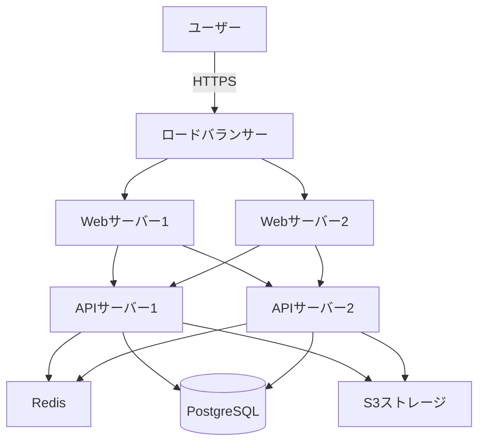

# システム構成図

## 1. システム構成方針

### インフラ構成
| 項目 | 内容 |
|------|------|
| クラウド/オンプレ | [例: AWS / GCP / Azure / オンプレミス] |
| 構成パターン | [例: 3層アーキテクチャ / マイクロサービス] |
| 可用性目標 | [例: 99.9% (年間8.76時間ダウン許容)] |

### 技術スタック
| レイヤー | 技術 | バージョン |
|---------|------|-----------|
| フロントエンド | [例: React] | 18.x |
| バックエンド | [例: Node.js] | 20.x |
| DB | [例: PostgreSQL] | 15.x |
| キャッシュ | [例: Redis] | 7.x |
| ストレージ | [例: S3] | - |

---

## 2. システム構成図

### 全体構成図 (Mermaid)


### 論理構成 (3層アーキテクチャ)
```
┌─────────────────────────────────────┐
│  プレゼンテーション層                 │
│  - React SPA                        │
│  - Nginx (静的ファイル配信)          │
└──────────────┬──────────────────────┘
               │ HTTPS/REST
┌──────────────▼──────────────────────┐
│  アプリケーション層                   │
│  - Node.js/Express                  │
│  - ビジネスロジック                  │
│  - 認証・認可                        │
└──────────────┬──────────────────────┘
               │ SQL/TCP
┌──────────────▼──────────────────────┐
│  データ層                            │
│  - PostgreSQL (RDB)                 │
│  - Redis (キャッシュ/セッション)     │
│  - S3 (ファイルストレージ)           │
└─────────────────────────────────────┘
```

---

## 3. 各コンポーネント定義

### 3.1 ロードバランサー
| 項目 | 内容 |
|------|------|
| 種類 | [例: AWS ALB / Nginx] |
| 負荷分散方式 | ラウンドロビン |
| ヘルスチェック | `/health` に30秒毎アクセス |
| SSL証明書 | Let's Encrypt |

### 3.2 Webサーバー
| 項目 | 内容 |
|------|------|
| ソフトウェア | Nginx 1.24 |
| 役割 | 静的ファイル配信、リバースプロキシ |
| 台数 | 2台 (冗長化) |
| スペック | [例: 2vCPU / 4GB RAM] |

### 3.3 APIサーバー
| 項目 | 内容 |
|------|------|
| ランタイム | Node.js 20.x |
| フレームワーク | Express 4.x |
| 台数 | 2台 (冗長化、Auto Scaling対応) |
| スペック | [例: 4vCPU / 8GB RAM] |
| スケーリング | CPU使用率70%でスケールアウト |

### 3.4 データベース
| 項目 | 内容 |
|------|------|
| DBMS | PostgreSQL 15.x |
| 構成 | プライマリ1台 + レプリカ1台 (読み取り分散) |
| スペック | [例: 4vCPU / 16GB RAM / 500GB SSD] |
| バックアップ | 日次フルバックアップ + 1時間毎差分 |
| 接続プール | 最大100接続 |

### 3.5 キャッシュ
| 項目 | 内容 |
|------|------|
| ソフトウェア | Redis 7.x |
| 用途 | セッション管理、APIレスポンスキャッシュ |
| 構成 | プライマリ1台 + レプリカ1台 |
| メモリ | 4GB |

### 3.6 ストレージ
| 項目 | 内容 |
|------|------|
| サービス | [例: AWS S3 / GCS] |
| 用途 | ユーザーアップロードファイル、帳票PDF |
| バックアップ | バージョニング有効化 |
| アクセス制御 | 署名付きURL (有効期限7日) |

---

## 4. ネットワーク構成

### セグメント構成
| セグメント | 用途 | アクセス制御 |
|-----------|------|-------------|
| Public | ロードバランサー、Webサーバー | インターネットからアクセス可 |
| Private | APIサーバー、DB、Redis | VPC内部のみアクセス可 |

### 通信フロー
| 送信元 | 宛先 | プロトコル | ポート | 用途 |
|-------|------|----------|-------|------|
| インターネット | ロードバランサー | HTTPS | 443 | ユーザーアクセス |
| LB | Webサーバー | HTTP | 80 | 静的ファイル配信 |
| Webサーバー | APIサーバー | HTTP | 3000 | API呼び出し |
| APIサーバー | PostgreSQL | TCP | 5432 | DB接続 |
| APIサーバー | Redis | TCP | 6379 | キャッシュアクセス |
| APIサーバー | S3 | HTTPS | 443 | ファイル操作 |

---

## 5. 環境構成

| 環境 | 用途 | 構成 | デプロイ方式 |
|------|------|------|-------------|
| 開発環境 | 開発者ローカル | Docker Compose | 手動 |
| ステージング環境 | テスト | 本番同等構成 (スペック縮小) | CI/CD自動デプロイ |
| 本番環境 | サービス提供 | 上記構成 | CI/CD + 手動承認 |

---

## 6. 監視・ログ

### 監視項目
| 対象 | 監視項目 | しきい値 | アラート |
|------|---------|---------|---------|
| Webサーバー | CPU使用率 | 80% | Slack通知 |
| APIサーバー | メモリ使用率 | 85% | Slack通知 |
| DB | 接続数 | 90 | Slack通知 |
| API | エラー率 | 1% | Slack通知 |
| API | レスポンスタイム | 1秒 | Slack通知 |

### ログ収集
| ログ種別 | 出力先 | 保存期間 |
|---------|-------|---------|
| アクセスログ | CloudWatch Logs | 90日 |
| アプリログ | CloudWatch Logs | 90日 |
| エラーログ | CloudWatch Logs | 180日 |

---

## 7. バックアップ・DR

### バックアップ
| 対象 | 方式 | 頻度 | 保存期間 |
|------|------|------|---------|
| PostgreSQL | フルバックアップ | 日次 | 30日 |
| PostgreSQL | 差分バックアップ | 1時間毎 | 7日 |
| S3ファイル | バージョニング | リアルタイム | 30日 |

### DR方針
| 項目 | 目標値 |
|------|-------|
| RPO (復旧時点目標) | 1時間 |
| RTO (復旧時間目標) | 4時間 |

---

## 8. セキュリティ

### ネットワークセキュリティ
- VPC: プライベートネットワーク分離
- セキュリティグループ: 必要最小限のポート開放
- WAF: SQLインジェクション、XSS対策

### データ暗号化
- 通信: TLS 1.2以上
- DB: 保管データ暗号化 (AES-256)
- S3: サーバーサイド暗号化

### 認証・認可
- API: JWT (Bearer Token)
- 管理画面アクセス: MFA必須

---

## 9. スケーリング戦略

### 垂直スケーリング (スペックアップ)
- DBサーバー: メモリ・CPUを増強
- 実施タイミング: 使用率80%継続時

### 水平スケーリング (台数増加)
- APIサーバー: Auto Scaling (CPU70%でスケールアウト)
- 最小台数: 2台、最大台数: 10台

---

## 10. 重要な設計判断

### 可用性
- **冗長化**: Web/API/DBすべて2台構成
- **Auto Scaling**: APIサーバーは負荷に応じて自動増減
- **ヘルスチェック**: 異常検知時は自動切り離し

### パフォーマンス
- **キャッシュ**: Redis でAPIレスポンス5分間キャッシュ
- **DBレプリカ**: 読み取り処理はレプリカに分散
- **CDN**: 静的ファイルはCDN配信 (オプション)

### コスト最適化
- **Auto Scaling**: 夜間・休日は最小台数に自動縮小
- **リザーブドインスタンス**: DB・Redis は予約購入でコスト削減
- **S3ライフサイクル**: 古いファイルは自動でGlacierへ移動
