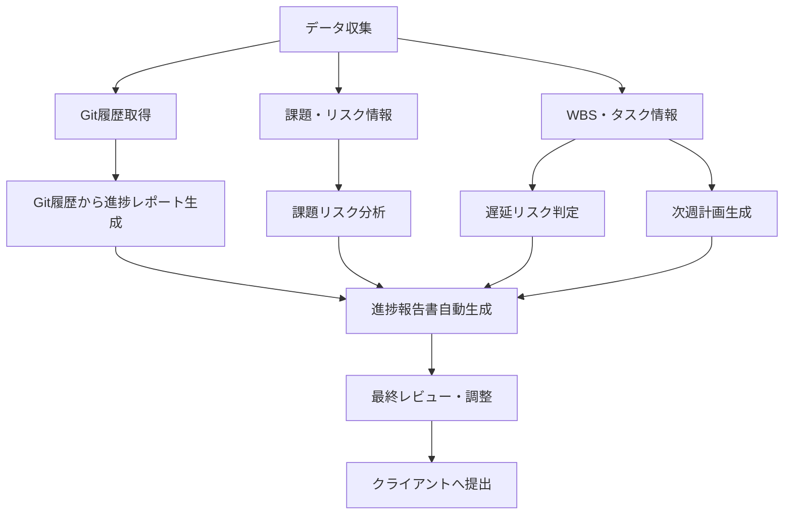

# 進捗報告関連ドキュメント

## 📁 フォルダ構成

```
05_進捗報告/
├── README.md                          # このファイル
├── テンプレート/
│   └── 週次進捗報告書_テンプレート.md  # 週次進捗報告書の標準フォーマット
└── プロンプト/
    ├── 進捗報告書自動生成プロンプト.md          # 全体統合（メインプロンプト）
    ├── Git履歴から進捗レポート自動生成プロンプト.md  # セクション2: 今週の実績
    ├── 遅延リスク判定プロンプト.md               # セクション4: スケジュール分析
    ├── 課題リスク分析プロンプト.md               # セクション6-7: 課題・リスク管理
    └── 次週計画生成プロンプト.md                 # セクション10: 次週の予定
```

## 🎯 目的

週次進捗報告書を効率的に作成するためのテンプレートとAIプロンプト集です。
各プロンプトは報告書の特定セクションに対応しており、段階的またはまとめて生成できます。

## 📋 テンプレート

### 週次進捗報告書_テンプレート.md

**13セクション構成**:
1. エグゼクティブサマリー（総合ステータス、今週のハイライト）
2. 今週の実績（自動生成）- Git履歴から抽出
3. BPR関連進捗（該当プロジェクトのみ）
4. スケジュール状況（マイルストーン進捗、遅延リスク）
5. 予算状況（予算消化、予算超過リスク）
6. 課題管理（新規課題、解決済み課題、未解決課題）
7. リスク管理（新規リスク、主要リスク一覧）
8. 品質状況（レビュー実施状況、不具合状況）
9. 変更管理（変更要求、承認済み変更）
10. 次週の予定（重点タスク、予定会議）
11. KPI（主要成果指標）
12. その他特記事項
13. 添付資料

## 🔄 ワークフロー

### 推奨フロー: 段階的生成

週次で以下の順序で実行すると効率的です：



### ステップ1: データ収集

#### 1.1 Git履歴取得
```bash
# 今週のコミット履歴
git log --since="7 days ago" --pretty=format:"%h|%an|%ad|%s" --date=short --numstat

# コミット統計
git shortlog --since="7 days ago" -s -n
```

#### 1.2 タスク管理データ
- プロジェクト管理ツール（Jira, Redmine, Backlog等）からエクスポート
- または、WBSから手動で集計

#### 1.3 課題・リスク情報
- 課題管理表、リスク管理表から最新情報を取得
- 今週新規発生の課題・リスクを整理

### ステップ2: セクション別生成（並行実行可能）

#### 2.1 今週の実績（セクション2）
**プロンプト**: `Git履歴から進捗レポート自動生成プロンプト.md`

**入力**:
- Git履歴（上記コマンドの出力）
- ブランチ情報
- タスク管理情報

**出力**:
- 開発活動サマリー
- 実装完了機能
- 修正・改善項目
- 作業中の項目

#### 2.2 スケジュール分析（セクション4）
**プロンプト**: `遅延リスク判定プロンプト.md`

**入力**:
- 残タスク数、残期間
- 過去の週次タスク消化数
- マイルストーン情報

**出力**:
- リスクレベル判定（🟢/🟡/🔴）
- バッファ率分析
- 推奨アクション

#### 2.3 課題・リスク分析（セクション6-7）
**プロンプト**: `課題リスク分析プロンプト.md`

**入力**:
- 新規課題・既存課題
- 新規リスク・既存リスク
- プロジェクト制約条件

**出力**:
- 優先度付き課題一覧
- リスク定量評価（リスク値）
- エスカレーション判定

#### 2.4 次週計画（セクション10）
**プロンプト**: `次週計画生成プロンプト.md`

**入力**:
- WBS（残タスク）
- 今週の進捗状況
- メンバー稼働状況

**出力**:
- 重点タスク（クリティカルパス優先）
- 予定会議
- リスク対策

### ステップ3: 全体統合

**プロンプト**: `進捗報告書自動生成プロンプト.md`

**入力**:
- ステップ2で生成した各セクション
- その他の定性情報（ステークホルダー状況、品質状況など）

**出力**:
- 完全な週次進捗報告書

### ステップ4: 最終調整

- [ ] 数値データの正確性確認
- [ ] 専門用語のチェック（平易な表現に置換）
- [ ] トーン調整（ポジティブだが正確に）
- [ ] 添付資料の準備（WBS、ガントチャート等）

## 📊 プロンプトの詳細

### 1. 進捗報告書自動生成プロンプト（メイン）

**役割**: 週次進捗報告書全体を統合生成

**特徴**:
- 全13セクションをカバー
- クライアント向けの平易な表現
- テンプレート形式に完全準拠

**使用タイミング**: 全データ収集後、最終統合時

---

### 2. Git履歴から進捗レポート自動生成プロンプト

**役割**: セクション2「今週の実績」を自動生成

**特徴**:
- Gitコミット履歴から客観的に分析
- Conventional Commits形式に対応
- 技術用語をビジネス用語に変換

**使用タイミング**: 週末にGit履歴をエクスポートして実行

**コマンド例**:
```bash
# レポート生成スクリプト
./scripts/generate_git_report.sh "7 days ago" "now" > git_report.txt
```

---

### 3. 遅延リスク判定プロンプト

**役割**: セクション4「スケジュール状況」の分析・警告

**特徴**:
- バッファ率の定量計算
- リスクレベルの自動判定（🔴高/🟡中/🟢低）
- シミュレーション（現状維持 vs 改善シナリオ）

**使用タイミング**: 週次進捗会議の前（早期警告）

**判定基準**:
- バッファ率 ≥30%: 🟢余裕あり
- バッファ率 10-30%: 🟡注意
- バッファ率 <10%: 🔴危険

---

### 4. 課題リスク分析プロンプト

**役割**: セクション6-7「課題管理」「リスク管理」の分析

**特徴**:
- 優先度の自動判定（高/中/低）
- リスク値の定量計算（発生確率 × 影響度）
- エスカレーション要否の判定

**使用タイミング**: 課題・リスクが更新されたタイミング

**リスク値計算**:
```
リスク値 = 発生確率(%) ÷ 100 × 影響度(1-10)

例: 発生確率50%、影響度8の場合
リスク値 = 0.5 × 8 = 4.0（🟡中リスク）
```

---

### 5. 次週計画生成プロンプト

**役割**: セクション10「次週の予定」を生成

**特徴**:
- クリティカルパス優先のタスク選定
- リソース最適化（稼働率80-90%で計画）
- 具体的な成果物と完了条件

**使用タイミング**: 週末（金曜日）の計画立案時

**選定基準**:
1. クリティカルパス上のタスク
2. 依存関係を考慮
3. メンバー稼働率を考慮
4. バッファ確保（20%程度）

## 💡 活用のコツ

### 時間短縮のポイント

1. **データ収集の自動化**
   ```bash
   # Gitデータ自動収集スクリプト
   ./scripts/collect_weekly_data.sh
   ```

2. **定型データの再利用**
   - プロジェクト基本情報は毎週同じ
   - マイルストーン情報は変更時のみ更新

3. **プロンプトのカスタマイズ**
   - プロジェクト固有の用語を事前定義
   - クライアントの好みに応じた表現調整

### 品質向上のポイント

1. **数値の正確性**
   - Git統計は自動取得で客観性を確保
   - 予算・工数は元データと照合

2. **トーンの一貫性**
   - ポジティブだがリスクは正確に伝える
   - 専門用語は平易な言葉に置換

3. **視覚的わかりやすさ**
   - 表形式の活用
   - 絵文字（🟢🟡🔴✅🔄⏳）で直感的に

## 🔗 関連ドキュメント

### 依存関係

```
05_進捗報告/
├── depends on → 02_要件定義/WBS_テンプレート.md
├── depends on → 02_要件定義/プロジェクト計画書.md
├── depends on → Git履歴
└── depends on → 課題管理表・リスク管理表
```

### 上流・下流の関係

**上流（インプット）**:
- `02_要件定義/` - WBS、マイルストーン
- `99_プロジェクト全体/` - プロジェクト計画書
- Git履歴 - 開発実績
- 課題・リスク管理表

**下流（アウトプット）**:
- クライアントへの週次報告
- プロジェクト管理層への報告
- 次週計画の実行

## 📅 運用スケジュール

### 週次ルーチン

| 曜日 | タスク | 使用プロンプト |
|-----|-------|--------------|
| 月曜 | 先週の課題・リスク棚卸し | 課題リスク分析 |
| 火-木 | 開発作業・進捗確認 | - |
| 木曜 | 遅延リスク確認 | 遅延リスク判定 |
| 金曜午前 | Git履歴から実績抽出 | Git履歴から進捗レポート |
| 金曜午後 | 次週計画作成 | 次週計画生成 |
| 金曜夕方 | 進捗報告書統合・レビュー | 進捗報告書自動生成 |
| 月曜午前 | クライアントMTGで報告 | - |

## 🛠️ 自動化スクリプト（オプション）

### 推奨ディレクトリ構成

```
05_進捗報告/
├── scripts/
│   ├── collect_weekly_data.sh      # 週次データ収集
│   ├── generate_git_report.sh      # Git履歴レポート生成
│   └── weekly_report_workflow.sh   # 全自動ワークフロー
└── output/
    ├── 2025-W43_進捗報告書.md      # 週次アーカイブ
    └── latest.md                   # 最新版
```

### サンプルスクリプト

**週次データ収集スクリプト**:
```bash
#!/bin/bash
# scripts/collect_weekly_data.sh

echo "=== 週次データ収集 ==="

# Git履歴
echo "## Git履歴"
git log --since="7 days ago" --pretty=format:"%h|%an|%ad|%s" --date=short --numstat

# コミット統計
echo ""
echo "## コミット統計"
git shortlog --since="7 days ago" -s -n

# ブランチ情報
echo ""
echo "## マージ済みブランチ"
git branch --merged main --format="%(refname:short)|%(authorname)|%(committerdate:short)"
```

## ❓ トラブルシューティング

### Q1: 生成された報告書が長すぎる
**A**: プロンプトに以下を追加
```
- 報告書は全体で5ページ以内に収めてください
- 各セクションは簡潔に（1セクション最大10行）
```

### Q2: 専門用語が多く残っている
**A**: プロンプトに以下を追加
```
- 以下の専門用語は使用禁止: {用語リスト}
- クライアントは技術に詳しくない前提で記述
```

### Q3: 数値データが不正確
**A**:
- 手動で数値を再確認
- データ収集の自動化を検討
- プロンプトに「数値の正確性を最優先」と明記

### Q4: Git履歴が取得できない
**A**:
```bash
# リモートから最新を取得
git fetch origin

# ローカルブランチを更新
git pull origin main
```

## 📚 参考資料

- [Conventional Commits](https://www.conventionalcommits.org/) - コミットメッセージ規約
- [GitHub CLI](https://cli.github.com/) - GitHub連携
- [Git Log Format](https://git-scm.com/docs/pretty-formats) - Git出力フォーマット

---

**最終更新**: 2025-10-26
**メンテナンス**: プロジェクト状況に応じてプロンプトをカスタマイズしてください
