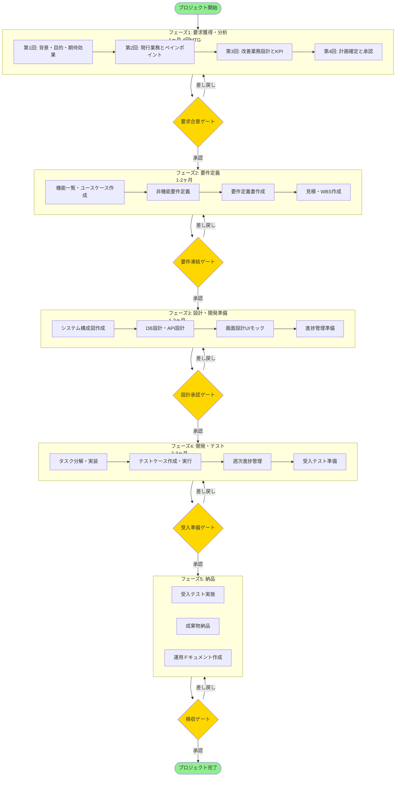
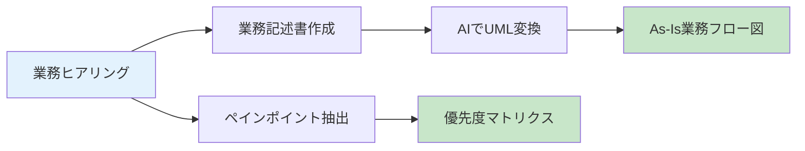
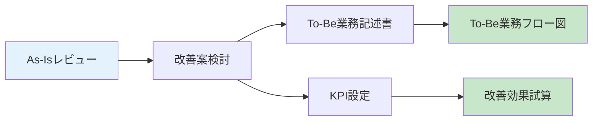
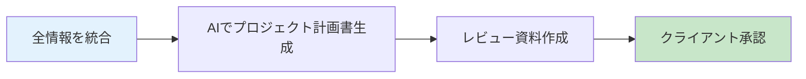
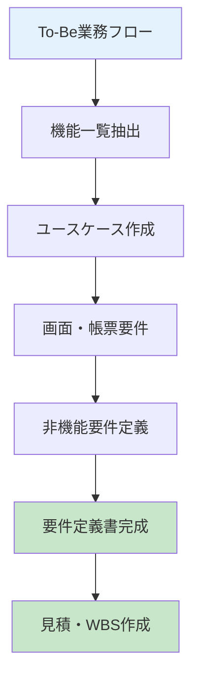
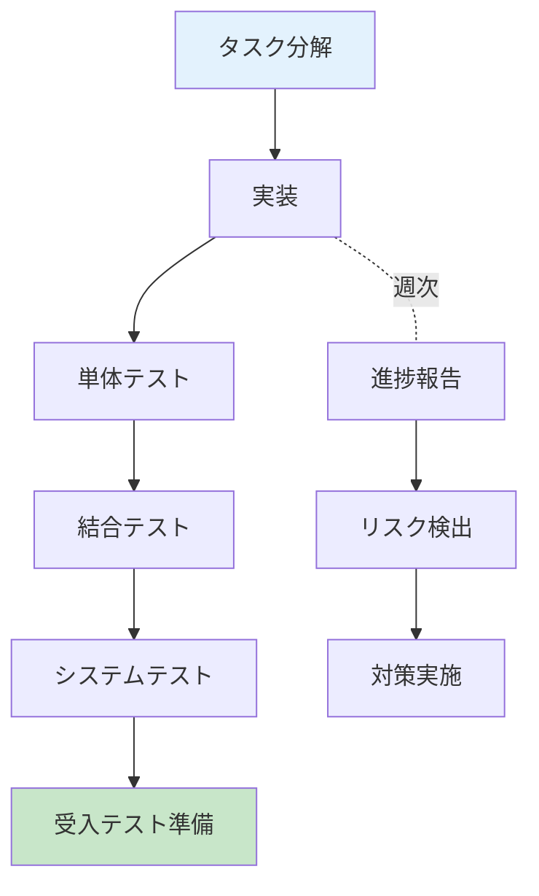

# AI駆動型プロジェクト管理ツールキット

BPR（業務プロセス改革）プロジェクトのための、AIを活用したプロジェクト管理テンプレート・プロンプト集です。

## 🎯 プロジェクト概要

### 対象プロジェクト
- **規模**: 500〜1000万円（小〜中規模）
- **期間**: 3〜6ヶ月
- **種類**: B2B業務システム（業務改善・コスト削減）
- **体制**: PM 1名 + エンジニア 1名 + 営業 1名（全員AI活用）
- **開発手法**: ウォーターフォール中心
- **契約形態**: エンドクライアントと直接契約

### 解決する課題
- ❌ 人によって要件・業務ヒアリングに抜け漏れがある
- ❌ チームやクライアントとの理解を一致させるのに時間がかかる
- ❌ 経験不足だと進行管理がうまくできずスケジュール遅延が発生

### ソリューション
- ✅ 体系的なヒアリング計画とテンプレート
- ✅ AIプロンプトによる議事録からの自動抽出・整理
- ✅ 業務フローの可視化（マークダウン → UML自動変換）
- ✅ 進捗管理とリスク検出の自動化

---

## 📊 全体ワークフロー



---

## 🚀 クイックスタート

### フェーズ1: 要求獲得・分析（1ヶ月）

#### 1週目: プロジェクト背景・目的のヒアリング


**使用するもの:**
- テンプレート: `テンプレート/ヒアリング議事録.md`
- プロンプト: `プロンプト/議事録から要点抽出プロンプト.md`
- プロンプト: `プロンプト/議事録から不明点抽出プロンプト.md`

**手順:**
1. `00_docs/ヒアリングマイルストーン_プロジェクト立ち上げフェーズ.md` の質問リストに沿ってヒアリング
2. 議事録を作成
3. AIプロンプトに議事録を入力 → 課題・目的・制約を自動抽出
4. 不明点リストを作成 → 次回MTGで確認

#### 2週目: 現行業務（As-Is）とペインポイントの分析



**使用するもの:**
- テンプレート: `テンプレート/業務記述書_テンプレート.md`
- プロンプト: `プロンプト/業務記述書作成プロンプト.md`
- プロンプト: `プロンプト/業務フロー図作成プロンプト.md`
- プロンプト: `プロンプト/ペインポイント整理プロンプト.md`

**手順:**
1. 現場の業務をヒアリング（実際の作業を見学）
2. 業務記述書テンプレートに記入（マークダウン形式）
3. AIプロンプトでPlantUML/Mermaid図に変換
4. ペインポイントを抽出し、影響度×改善容易さでマッピング

#### 3週目: 改善業務（To-Be）設計とKPI設定



**使用するもの:**
- テンプレート: `テンプレート/業務記述書_テンプレート.md`（To-Be版）
- プロンプト: `プロンプト/業務フロー図作成プロンプト.md`

**手順:**
1. ペインポイントの優先順位に基づき改善案を提示（A案・B案・C案）
2. To-Be業務記述書を作成
3. UML図に変換
4. KPIと目標値を設定（処理時間30%削減等）
5. 改善効果を試算（ROI計算）

#### 4週目: プロジェクト計画書の確定と承認



**使用するもの:**
- テンプレート: `テンプレート/プロジェクト計画書.md`
- プロンプト: `プロンプト/プロジェクト計画書作成プロンプト.md`

**成果物:**
- ✅ プロジェクト計画書（承認版）
- ✅ As-Is業務フロー図
- ✅ To-Be業務フロー図
- ✅ ペインポイント一覧（優先度付き）
- ✅ 改善効果試算

---

### フェーズ2: 要件定義（1-2ヶ月）



**使用するもの:**
- テンプレート: `テンプレート/要件定義書_テンプレート.md`
- テンプレート: `テンプレート/WBS_テンプレート.md`
- テンプレート: `テンプレート/見積書_テンプレート.md`
- テンプレート: `テンプレート/合意事項・未決事項管理表.md`
- プロンプト: `プロンプト/機能一覧作成プロンプト.md`

**手順:**
1. To-Be業務フローから必要な機能を抽出
2. 機能を優先度付け（必須・重要・任意）
3. ユースケースを記述
4. 画面・帳票の要件を定義
5. 非機能要件（性能・セキュリティ等）を定義
6. 要件定義書を完成させる
7. 機能別に工数見積もり → WBS作成
8. 見積書作成

**成果物:**
- ✅ 要件定義書（承認版）
- ✅ 機能一覧
- ✅ WBS
- ✅ 見積書

---

### フェーズ3: 設計・開発準備（1-2ヶ月）

**使用するもの:**
- テンプレート: `テンプレート/質問管理表_テンプレート.md`
- テンプレート: `テンプレート/進捗報告書_テンプレート.md`

**手順:**
1. システム構成図作成
2. DB設計（テーブル定義、ER図）
3. API設計（エンドポイント、リクエスト/レスポンス）
4. 画面設計（Figma/v0でモックアップ）
5. 進捗管理の準備（KPI設定、報告テンプレート）

**成果物:**
- ✅ システム構成図
- ✅ DB設計書
- ✅ API設計書
- ✅ 画面モックアップ

---

### フェーズ4: 開発・テスト（2-3ヶ月）



**使用するもの:**
- テンプレート: `テンプレート/テストケース_テンプレート.md`
- テンプレート: `テンプレート/進捗報告書_テンプレート.md`
- テンプレート: `テンプレート/質問管理表_テンプレート.md`

**週次進捗管理:**
1. 今週の優先順位確認
2. ブロッカー検出と解消
3. タスク消化率の報告（Gitコミット分析）
4. 残タスクと残期間から遅延リスク判定
5. クライアント向け進捗報告書の自動生成

**成果物:**
- ✅ 動作するシステム
- ✅ テスト結果報告書
- ✅ ソースコード

---

### フェーズ5: 納品（1ヶ月）

**使用するもの:**
- テンプレート: `テンプレート/受入基準書_テンプレート.md`

**手順:**
1. 受入基準書作成
2. 受入テスト実施（クライアント）
3. 不具合修正
4. 成果物目録作成
5. 運用マニュアル作成
6. 検収会議
7. 納品

**成果物:**
- ✅ 受入テスト報告書
- ✅ 成果物一式
- ✅ 運用マニュアル

---

## 📁 ディレクトリ構造

```
ai-driven-pm-project/
├── README.md                    # このファイル
├── CLAUDE.md                    # Claude Code向けガイド
├── 全体の流れ（受託開発）.md    # ワークフロー概要
│
├── 00_docs/                     # プロジェクトガイド
│   ├── ヒアリングマイルストーン_プロジェクト立ち上げフェーズ.md
│   └── テンプレート準備チェックリスト.md
│
├── テンプレート/                # ドキュメントテンプレート
│   ├── プロジェクト計画書.md
│   ├── 業務記述書_テンプレート.md
│   ├── 要件定義書_テンプレート.md
│   ├── WBS_テンプレート.md
│   ├── 見積書_テンプレート.md
│   ├── テストケース_テンプレート.md
│   ├── 受入基準書_テンプレート.md
│   ├── 進捗報告書_テンプレート.md
│   ├── 質問管理表_テンプレート.md
│   └── 合意事項・未決事項管理表.md
│
├── プロンプト/                  # AI生成用プロンプト
│   ├── 議事録から要点抽出プロンプト.md
│   ├── 議事録から不明点抽出プロンプト.md
│   ├── 業務記述書作成プロンプト.md
│   ├── 業務フロー図作成プロンプト.md
│   ├── ペインポイント整理プロンプト.md
│   ├── プロジェクト計画書作成プロンプト.md
│   └── 機能一覧作成プロンプト.md
│
├── 10_ヒアリング/               # 実プロジェクトの議事録格納先
├── 11_現行業務分析/             # As-Is分析成果物格納先
└── 12_課題と要求整理/           # To-Be設計成果物格納先
```

---

## 🔑 重要なコンセプト

### 1. マークダウンファースト

業務フローは **マークダウン形式** で記述 → AIプロンプトで **UML図に自動変換**

**メリット:**
- バージョン管理が容易
- AIでの処理がしやすい
- 修正が簡単（図を直接編集する必要なし）

### 2. ペインポイント優先度マトリクス

```
影響度大 │  A: 段階的対応  │  S: 最優先  │
        │                │            │
        │----------------│------------│
        │                │            │
影響度小 │  C: 後回し      │  B: クイックウィン │
        └────────────────┴────────────┘
          困難          容易
           （改善の容易さ）
```

- **S（最優先）**: 影響大 × 改善容易 → すぐに取り組む
- **A（高）**: 影響大 × 改善困難 → 段階的に対応
- **B（中）**: 影響小 × 改善容易 → 早期に成果を出す
- **C（低）**: 影響小 × 改善困難 → 後回し

### 3. クライアントコミュニケーション

**専門用語を避ける:**
- ❌ 「UMLのアクティビティ図でAs-Isを可視化」
- ✅ 「今の業務の流れを図にまとめます」

**選択肢を提示:**
- ❌ 「どうしますか？」
- ✅ 「A案・B案・C案があります。それぞれのメリット・デメリットは...」

**視覚化:**
- Miro/FigJam: リアルタイム共同編集
- Figma: 画面イメージ作成
- 比較表: ビフォー・アフター

---

## 🛠️ 推奨ツール

| 用途 | ツール | 備考 |
|------|--------|------|
| オンラインホワイトボード | Miro, FigJam, Mural | 業務フロー作成、付箋ブレスト |
| UIモックアップ | Figma | 画面イメージ作成 |
| UML図生成 | PlantUML, Mermaid | マークダウンから自動生成 |
| フローチャート | Lucidchart, draw.io | 清書用 |
| 動画キャプチャ | Loom | 操作デモ録画 |
| コミュニケーション | Slack, Teams | 日常連絡 |
| ドキュメント共有 | Google Drive, SharePoint | 成果物管理 |

---

## 📝 使い方の例

### 例1: ヒアリング議事録から課題を自動抽出

1. ヒアリング実施 → 議事録作成
2. `プロンプト/議事録から要点抽出プロンプト.md` を開く
3. プロンプトの `{ここに議事録を貼り付け}` 部分に議事録を貼り付け
4. AIに実行させる
5. 課題・目的・制約が自動的に整理される

### 例2: 業務フローをマークダウンからUMLに変換

1. `テンプレート/業務記述書_テンプレート.md` を埋める
2. `プロンプト/業務フロー図作成プロンプト.md` を開く
3. 業務記述書の内容をプロンプトに貼り付け
4. PlantUMLまたはMermaid形式で図が生成される
5. PlantUML/Mermaid対応ツールで可視化

### 例3: ペインポイントを優先度付け

1. ヒアリング結果からペインポイントをリストアップ
2. `プロンプト/ペインポイント整理プロンプト.md` を使用
3. 影響度と改善の容易さで自動分類
4. 優先度マトリクスが生成される
5. クライアントと一緒に優先順位を確認

---

## 🎯 5つのゲートレビュー

### Gate 1: 要求合意ゲート
**判定基準:**
- [ ] プロジェクト計画書が承認されている
- [ ] As-Is/To-Be業務フローが確定している
- [ ] ペインポイントの優先順位が合意されている
- [ ] 未決事項がリスト化され、解消計画がある

### Gate 2: 要件凍結ゲート
**判定基準:**
- [ ] 要件定義書 v1.0 が承認されている
- [ ] 非機能要件が合意されている
- [ ] 見積・WBSが承認されている
- [ ] 開発契約が締結されている

### Gate 3: 設計承認ゲート
**判定基準:**
- [ ] システム構成図が承認されている
- [ ] DB設計・API設計が承認されている
- [ ] 画面モックアップが承認されている
- [ ] 要件と設計の整合性が確認されている

### Gate 4: 受入準備ゲート
**判定基準:**
- [ ] テストケースがすべて作成されている
- [ ] 要件トレーサビリティマトリクスが完成している
- [ ] 受入基準書が合意されている
- [ ] 移行計画が承認されている

### Gate 5: 検収ゲート
**判定基準:**
- [ ] 受入基準がすべて満たされている
- [ ] 重大な不具合がゼロ
- [ ] 成果物がすべて納品されている
- [ ] 運用ドキュメントが整備されている

---

## 📚 参考資料

- `全体の流れ（受託開発）.md`: ワークフロー全体像
- `00_docs/ヒアリングマイルストーン_プロジェクト立ち上げフェーズ.md`: 4週間のヒアリング計画
- `00_docs/テンプレート準備チェックリスト.md`: 事前準備チェックリスト
- `CLAUDE.md`: Claude Code向けの詳細ガイド

---

## 🤝 コントリビューション

テンプレートやプロンプトの改善提案は歓迎します。

---

## 📄 ライセンス

このリポジトリのテンプレートとプロンプトは自由に使用できます。

---

**作成日**: 2024年10月
**対象**: IT企業のPM、コンサルタント、エンジニア
**想定プロジェクト**: 小〜中規模BPRプロジェクト（500〜1000万円、3〜6ヶ月）
