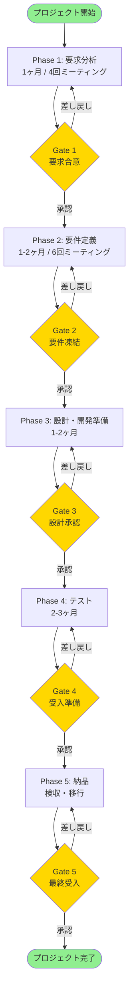

# AI駆動型プロジェクト管理ツールキット

BPR（業務プロセス改革）プロジェクトのための、AIを活用したプロジェクト管理テンプレート・プロンプト集です。

## 🎯 プロジェクト概要

### 対象プロジェクト

- **規模**: 500〜1000万円（小〜中規模）
- **期間**: 3〜6ヶ月
- **種類**: B2B業務システム（業務改善・コスト削減）
- **体制**: PM 1名 + エンジニア 1名 + 営業 1名（全員AI活用）
- **開発手法**: ウォーターフォール中心
- **契約形態**: エンドクライアントと直接契約

### 解決する課題

- ❌ 人によって要件・業務ヒアリングに抜け漏れがある
- ❌ チームやクライアントとの理解を一致させるのに時間がかかる
- ❌ 経験不足だと進行管理がうまくできずスケジュール遅延が発生

### ソリューション

- ✅ 体系的なヒアリング計画とテンプレート
- ✅ AIプロンプトによる議事録からの自動抽出・整理
- ✅ 業務フローの可視化（マークダウン → UML自動変換）
- ✅ 進捗管理とリスク検出の自動化

---

## 📊 プロジェクトの進め方

このツールキットは、**5つのフェーズ**と**5つのゲートレビュー**で構成されています。

### プロジェクト全体フロー



---

## 🚪 5つのゲートレビュー

プロジェクトの品質を担保するため、各フェーズの終了時に**ゲートレビュー**を実施します。ゲートレビューでは、次のフェーズに進むための条件が満たされているかを確認します。

### Gate 1: 要求合意ゲート（Phase 1 → Phase 2）

**タイミング**: 要求分析フェーズ完了時（Week 4終了時）

**判定基準**:
- [ ] ペインポイント認識の合意: 顧客とペインポイントの優先順位について合意している
- [ ] 要求リストv1作成: To-Beフローから機能要求の概要が抽出されている
- [ ] 未決事項の優先順位付け: オープンイシューが整理され、Phase 2で詳細化する順序が決まっている
- [ ] プロジェクト計画書承認: 目的・スコープ・体制・スケジュールが承認されている
- [ ] 概算見積もり了承: ±50%精度の概算で顧客の予算感と合致している

**成果物**:
- プロジェクト計画書
- As-Is/To-Be業務フロー
- ペインポイントリスト（S/A/B/Cランク付き）
- 概算マイルストーン

---

### Gate 2: 要件凍結ゲート（Phase 2 → Phase 3）

**タイミング**: 要件定義フェーズ完了時（Week 6終了時）

**判定基準**:
- [ ] 要件定義書v1承認: 機能要件・非機能要件が承認されている
- [ ] 非機能要件合意: 性能・セキュリティ・運用要件が合意されている
- [ ] 見積・WBS承認: コスト・スコープ・スケジュールが承認されている
- [ ] トレーサビリティ確認: 業務フロー→機能→ユースケースの紐付けが明確
- [ ] 未決事項の優先順位付け: オープンイシューが整理され、Phase 3で解決する順序が決まっている

**成果物**:
- 要件定義書v1
- 機能一覧
- ユースケース
- 画面遷移図
- 非機能要件
- 見積書（±30%精度）
- WBS

---

### Gate 3: 設計承認ゲート（Phase 3 → Phase 4）

**タイミング**: 設計・開発準備フェーズ完了時

**判定基準**:
- [ ] IF・DB・UIサンプル承認: インターフェース、データベース、画面の設計が承認されている
- [ ] 要件-設計の整合性確認: 全ての要件が設計にトレースできる
- [ ] 技術的実現可能性の確認: 選定技術で実装可能であることが確認されている
- [ ] 性能要件の達成見込み: 設計が性能要件を満たすことが確認されている
- [ ] 運用設計の承認: 運用手順が明確で実行可能であることが確認されている

**成果物**:
- システム構成図
- DB設計書
- API設計書
- 画面設計書
- 帳票設計書
- 運用設計書

---

### Gate 4: 受入準備ゲート（Phase 4 → Phase 5）

**タイミング**: テストフェーズ完了時

**判定基準**:
- [ ] テストカバレッジ完了: 機能要件・非機能要件のテストが完了している
- [ ] トレーサビリティ検証: 要件→設計→テストケースの紐付けが確認されている
- [ ] 致命的バグゼロ: 重要度高のバグが全て修正されている
- [ ] 性能要件達成: 非機能要件（性能）が満たされている
- [ ] 受入基準合意: 顧客と受入基準について合意している

**成果物**:
- テスト計画書
- テストケース（機能・非機能）
- テスト結果報告書
- 受入基準書
- 検収計画書

---

### Gate 5: 最終受入ゲート（Phase 5 → 完了）

**タイミング**: 受入テスト完了時

**判定基準**:
- [ ] 受入基準達成: 全ての受入基準が満たされている
- [ ] 成果物確認: 成果物一式が納品されている
- [ ] 運用ドキュメント確認: 運用マニュアル・保守手順が整備されている
- [ ] データ移行完了: 既存データの移行が完了している（該当する場合）
- [ ] 運用体制確立: 運用チームが稼働可能な状態にある

**成果物**:
- 受入テスト報告書
- 成果物一式（ソースコード、設定ファイル等）
- 運用マニュアル
- 保守手順書

---

## 📁 ディレクトリ構成

```
ai-driven-pm-project/
├── README.md                          # このファイル
├── CLAUDE.md                          # Claude Code向けガイド
├── document-dependencies.md           # ドキュメント依存関係
│
├── 00_docs/                           # プロジェクト方法論・ガイド
│   ├── README.md
│   ├── 全体の流れ（受託開発）.md
│   ├── ヒアリングマイルストーン_プロジェクト立ち上げフェーズ.md
│   └── 要件定義フェーズ_顧客コミュニケーションマイルストーン.md
│
├── 01_要求分析/                       # Phase 1: Requirements Analysis
│   ├── README.md                      # フェーズガイド
│   ├── プロンプト/v1/
│   │   ├── 議事録から不明点抽出.md
│   │   ├── プロジェクト計画書作成.md
│   │   ├── ペインポイント整理.md
│   │   ├── 概算マイルストーン作成.md
│   │   └── 使用システム・帳票リスト作成.md
│   └── テンプレート/
│       ├── プロジェクト計画書.md
│       └── 業務フロー作成テンプレートパック/
│
├── 02_要件定義/                       # Phase 2: Requirements Definition
│   ├── README.md
│   ├── プロンプト/
│   │   ├── 00_既存システムデータヒアリング整理.md
│   │   ├── 01_要件定義書作成.md
│   │   ├── 02_機能一覧作成.md
│   │   ├── 03_ユースケース作成.md
│   │   ├── 04_画面遷移IF作成.md
│   │   ├── 05_非機能要件チェックリスト作成.md
│   │   ├── 07_見積書作成.md
│   │   └── 08_WBS作成.md
│   └── テンプレート/
│       ├── 00_既存システム構成整理.md
│       ├── 00_既存データ整理.md
│       ├── 00_外部IF一覧.md
│       ├── 01_要件定義書.md
│       ├── 02_機能一覧.md
│       ├── 03_ユースケース.md
│       ├── 04_画面遷移.md
│       ├── 05_非機能要件.md
│       ├── 07_見積書.md
│       └── 08_WBS.md
│
├── 03_開発工程/                       # Phase 3: Design & Development Prep
│   ├── README.md
│   ├── プロンプト/
│   │   ├── システム構成図.md
│   │   ├── DB設計.md
│   │   ├── API設計.md
│   │   ├── 画面設計.md
│   │   ├── 帳票設計.md
│   │   └── 運用設計.md
│   └── テンプレート/
│       └── (同名のテンプレート)
│
├── 04_テスト/                         # Phase 4: Testing
│   ├── README.md
│   ├── プロンプト/
│   │   ├── テスト計画書.md
│   │   ├── テスト観点一覧.md
│   │   ├── 機能テストケース.md
│   │   ├── 非機能テストケース.md
│   │   ├── テスト結果報告書.md
│   │   └── 検収計画書作成.md
│   └── テンプレート/
│       └── (同名のテンプレート)
│
├── 05_進捗報告/                       # Progress Tracking
│   ├── README.md
│   ├── プロンプト/
│   │   ├── 進捗報告書自動生成.md
│   │   ├── Git履歴から進捗レポート自動生成.md
│   │   ├── 遅延リスク判定.md
│   │   ├── 課題リスク分析.md
│   │   └── 次週計画生成.md
│   └── テンプレート/
│       └── 週次進捗報告書.md
│
└── 99_プロジェクト全体/               # Project-wide documents
    ├── 質問管理表.md
    ├── 変更管理表.md
    └── リスク管理表_テンプレート.md
```

各フェーズのディレクトリには **README.md** が含まれており、そのフェーズの詳細な進め方、使用するプロンプト・テンプレート、成果物などが記載されています。

---

## 🚀 クイックスタート

### Step 1: フェーズガイドを読む

各フェーズの **README.md** を読んで、全体の流れを把握します。

1. [00_docs/README.md](./00_docs/README.md) - プロジェクト方法論
2. [01_要求分析/README.md](./01_要求分析/README.md) - Phase 1ガイド
3. [02_要件定義/README.md](./02_要件定義/README.md) - Phase 2ガイド
4. [03_開発工程/README.md](./03_開発工程/README.md) - Phase 3ガイド
5. [04_テスト/README.md](./04_テスト/README.md) - Phase 4ガイド
6. [05_進捗報告/README.md](./05_進捗報告/README.md) - 進捗管理ガイド

### Step 2: ヒアリング計画を立てる

Phase 1では、4週間で4回のミーティングを実施します。

**参考資料**:
- [ヒアリングマイルストーン_プロジェクト立ち上げフェーズ.md](./00_docs/ヒアリングマイルストーン_プロジェクト立ち上げフェーズ.md)

**Week 1**: プロジェクト背景・目的・期待効果のヒアリング
**Week 2**: 現状業務とペインポイントのヒアリング
**Week 3**: 改善後業務フローとKPI設定
**Week 4**: 最終確認と承認（Gate 1: 要求合意）

### Step 3: プロンプトとテンプレートを使う

各フェーズのREADMEに記載されている順序で、プロンプトとテンプレートを使用します。

**基本的な流れ**:
1. テンプレートを開く
2. ヒアリング内容やインプットを埋める
3. プロンプトを使ってAIに処理させる
4. 出力を確認・調整する
5. 成果物として保存する

**例: ペインポイント整理**
```bash
# 1. テンプレートの確認
cat 01_要求分析/テンプレート/業務フロー作成テンプレートパック/業務詳細書.md

# 2. プロンプトを開く
cat 01_要求分析/プロンプト/v1/ペインポイント整理.md

# 3. ヒアリング内容をプロンプトに貼り付けてAI実行
# → ペインポイントがS/A/B/Cランクで整理される
```

---

## 🔑 重要なコンセプト

### 1. フェーズベースの体系的アプローチ

プロジェクトを **5つの明確なフェーズ** に分割し、各フェーズで必要な成果物を定義します。ゲートレビューにより、次のフェーズに進む前に品質を担保します。

### 2. AIプロンプトによる効率化

各ドキュメント作成には **専用のAIプロンプト** が用意されています。議事録やヒアリング内容を入力するだけで、構造化されたドキュメントが生成されます。

### 3. トレーサビリティの確保

```
ペインポイント → 業務フロー → 機能一覧 → ユースケース → 設計 → テストケース
```

すべての成果物は **依存関係** で結ばれており、要件の変更が設計やテストにどう影響するかが追跡できます。

### 4. マークダウンファースト

業務フローやドキュメントは **マークダウン形式** で記述します。

**メリット**:
- バージョン管理が容易（Git対応）
- AIでの処理がしやすい
- 修正が簡単（図を直接編集する必要なし）
- 必要に応じてPlantUML/Mermaidで図に変換可能

### 5. ペインポイント優先度マトリクス

課題を **影響度 × 改善容易性** の2軸で評価します。

```
影響度大 │  A: 段階的対応  │  S: 最優先  │
        │                │            │
        │----------------│------------│
        │                │            │
影響度小 │  C: 後回し      │  B: クイックウィン │
        └────────────────┴────────────┘
          困難          容易
           （改善の容易さ）
```

- **S（最優先）**: 影響大 × 改善容易 → すぐに取り組む
- **A（段階的）**: 影響大 × 改善困難 → 計画的に対応
- **B（クイックウィン）**: 影響小 × 改善容易 → 早期に成果
- **C（保留）**: 影響小 × 改善困難 → 後回し

### 6. クライアントコミュニケーション

**専門用語を避ける**:
- ❌ 「UMLのアクティビティ図でAs-Isを可視化」
- ✅ 「今の業務の流れを図にまとめます」

**選択肢を提示**:
- ❌ 「どうしますか？」
- ✅ 「A案・B案・C案があります。それぞれのメリット・デメリットは...」

**視覚化**:
- Miro/FigJam: リアルタイム共同編集
- Figma: 画面イメージ作成
- 比較表: ビフォー・アフター

---

## 🛠️ 推奨ツール

| 用途 | ツール | 備考 |
|------|--------|------|
| オンラインホワイトボード | Miro, FigJam | 業務フロー作成、付箋ブレスト |
| UIモックアップ | Figma | 画面イメージ作成 |
| UML図生成 | PlantUML, Mermaid | マークダウンから自動生成 |
| フローチャート | draw.io, Lucidchart | 清書用 |
| ドキュメント管理 | Notion, Confluence | 成果物の一元管理 |
| バージョン管理 | Git, GitHub | マークダウンファイルの管理 |
| コミュニケーション | Slack, Teams | 日常連絡 |

---

## 📚 詳細ガイド

### プロジェクト全体を理解する

- [全体の流れ（受託開発）.md](./00_docs/全体の流れ（受託開発）.md) - プロジェクト全体のフロー
- [CLAUDE.md](./CLAUDE.md) - Claude Code向けの詳細ガイド
- [document-dependencies.md](./document-dependencies.md) - ドキュメント間の依存関係

### 各フェーズの詳細

- [Phase 1: 要求分析](./01_要求分析/README.md) - 1ヶ月、4回ミーティング
- [Phase 2: 要件定義](./02_要件定義/README.md) - 1-2ヶ月、6回ミーティング
- [Phase 3: 設計・開発準備](./03_開発工程/README.md) - 1-2ヶ月
- [Phase 4: テスト](./04_テスト/README.md) - 2-3ヶ月
- [Phase 5: 進捗報告](./05_進捗報告/README.md) - 全フェーズで継続使用

---

## 🤝 コントリビューション

テンプレートやプロンプトの改善提案は歓迎します。IssueやPull Requestをお送りください。

---

## 📄 ライセンス

このリポジトリのテンプレートとプロンプトは自由に使用できます。

---

**作成日**: 2024年10月
**最終更新**: 2025年10月
**対象**: IT企業のPM、コンサルタント、エンジニア
**想定プロジェクト**: 小〜中規模BPRプロジェクト（500〜1000万円、3〜6ヶ月）
