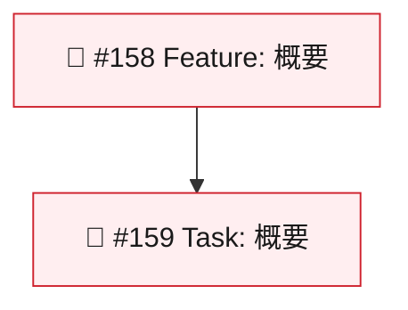

# Epic Management Rules (Always Applied)

## Mermaid Node ID (MUST)

Epic の Mermaid グラフではノード ID に **Issue 番号**を使う。文字（A, B, C）は禁止。

**理由**: `epic-status-manager` の自動ステータス更新 regex がノード ID = Issue 番号を前提とする。

## Epic Body (MUST)

| MUST                                | Why                                  |
|-------------------------------------|--------------------------------------|
| テーブル行にステータス絵文字（🔴🟡📝🟢） | 自動更新のマッチング対象             |
| Mermaid に `classDef` + `class` 割り当て | ステータス色の自動反映               |
| 子 Issue Body に `Part of #<epic>`  | 親 Epic 自動検出に必須               |

## SSOT (MUST follow)

**`epic-status-manager` スキルがステータスポリシーの唯一の定義元。**
Emoji mapping, classDef 色, ステータス遷移を独自定義してはならない。

## Detailed Reference

→ `.claude/skills/epic-status-manager/SKILL.md` (SSOT)
→ `.claude/skills/issue-creation/SKILL.md` (Epic 作成テンプレート)
→ `.claude/agents/issue-project-manager.md` (ステータス更新エージェント)
