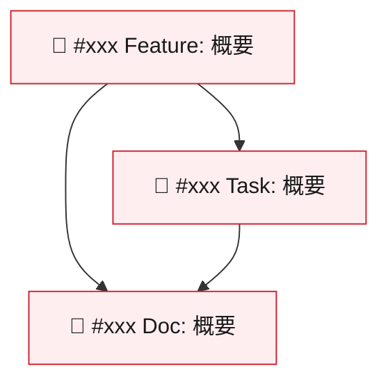
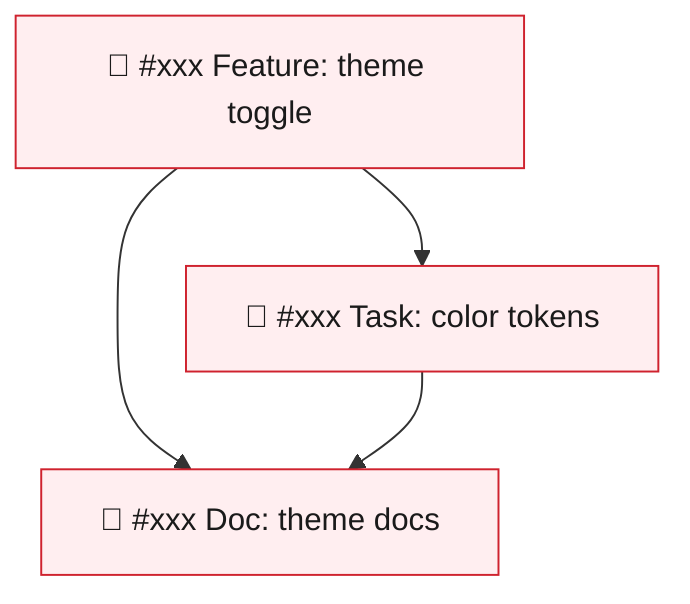
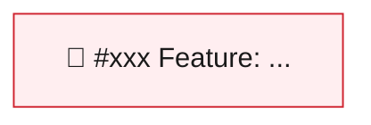

# Issue Creation from Product Feedback

フリーフォーマットのアイディア/フィードバックから GitHub Issue を作成するスキル。

## Workflow Overview

```
Input (free-form feedback)
    ↓
1. Idea Map (MECE)           ← 必ず整理
    ↓
2. Impact Points (Repo)      ← 影響範囲 + Master Docs 検出
    ↓
3. Issue Plan (Split)        ← 実装単位に分割（Master Docs参照を含む）
    ↓
4. Confirmation              ← 一括提示して確認
    ↓
5. Creation Result           ← gh issue create
```

**原則**: 不明は `Unknown` で継続。止めずに進む。

---

## Step 0: Pre-flight & Input Validation

### Pre-flight Check

```bash
# Check gh CLI and authentication
if ! command -v gh &> /dev/null; then
    echo "❌ gh CLI not found. Install: https://cli.github.com/"
    exit 1
fi

if ! gh auth status &> /dev/null; then
    echo "❌ Not authenticated. Run: gh auth login"
    exit 1
fi

# Read labels.yml (SSOT) to confirm available labels
if [ -f ".github/labels.yml" ]; then
    echo "✅ Available labels (SSOT: .github/labels.yml):"
    grep "^- name:" .github/labels.yml | sed 's/^- name: /  /'
else
    echo "⚠️ .github/labels.yml not found. Verify labels manually."
fi
```

### Input Validation

```bash
# Size check (max 100KB)
feedback_size=${#feedback}
if [[ $feedback_size -gt 102400 ]]; then
    echo "❌ Input too large (max 100KB)"
    exit 1
fi

# Secrets/PII detection - redact and continue
feedback=$(echo "$feedback" | sed -E 's/(ghp_|gho_|sk-|AKIA)[a-zA-Z0-9]+/[REDACTED]/g')
feedback=$(echo "$feedback" | sed -E 's/-----BEGIN [A-Z ]+ KEY-----/[REDACTED_KEY]/g')
```

---

## Step 1: Idea Map (MECE)

フリーフォーマットから以下の枠で**必ず**整理する。不明な枠は `Unknown` で埋める（空欄禁止）。

### Output Format

```markdown
## 1. Idea Map (MECE)

| Section | Content |
|---------|---------|
| **User Value** | 誰がどう嬉しくなるか |
| **Problem** | 解決したい課題・背景 |
| **Solution** | 提案する解決策 |
| **Scope** | 対象範囲（In Scope） |
| **Constraints** | 制約事項 |
| **Risks/Unknowns** | 不確実な点・未確認事項 |
| **Non-goals** | 対象外（Out of Scope） |
```

### Example

Input: `ダークモードが欲しい。目が疲れる。`

Output:
```markdown
## 1. Idea Map (MECE)

| Section | Content |
|---------|---------|
| **User Value** | ユーザーが長時間使用しても目が疲れにくくなる |
| **Problem** | 現状は明るいテーマのみで、長時間使用時に目が疲れる |
| **Solution** | ダークモード（暗い背景のテーマ）を選択できるようにする |
| **Scope** | Web UI のカラーテーマ切り替え機能 |
| **Constraints** | Unknown |
| **Risks/Unknowns** | デザインシステムへの影響が不明 |
| **Non-goals** | モバイルアプリは対象外 |
```

---

## Step 2: Impact Points (Repo) + Master Docs Detection

影響がありそうな領域を列挙する。推定の場合は `(推定)` を付ける。

### 2.1 Code Impact Categories

| Category | Description | 探索パターン |
|----------|-------------|-------------|
| UI/Frontend | 画面、コンポーネント | `projects/apps/web/src/` |
| API/Backend | エンドポイント、ビジネスロジック | `projects/apps/api/src/` |
| Auth/Permissions | 認証、認可、権限 | `auth`, `permission`, `role` |
| Data/DB | データベース、スキーマ | `prisma/`, `schema`, `migration` |
| Observability | ログ、メトリクス、監視 | `logger`, `metrics`, `sentry` |
| Testing | テストコード | `*.test.ts`, `*.spec.ts` |
| Docs | ドキュメント | `docs/`, `README`, `*.md` |
| Release/Config | 設定、デプロイ | `.env`, `config`, `docker` |

### 2.2 Master Docs Detection (NEW)

MECE の Problem/Solution/Scope からキーワードを抽出し、マスタードキュメントを探索する。

**対象ディレクトリ:**
- `docs/01_product/**` - プロダクト仕様/意思決定/方針
- `.github/ISSUE_TEMPLATE/**` - Issue テンプレート仕様
- `.specify/specs/**` - 機能仕様
- `docs/**` - その他ドキュメント

**探索コマンド（軽量・5秒タイムアウト）:**

```bash
# キーワードで docs/01_product/ を探索
timeout 5s rg -l "<keyword>" docs/01_product/ --max-count=3 2>/dev/null | head -5

# Issue テンプレートも確認
ls .github/ISSUE_TEMPLATE/*.yml 2>/dev/null
```

### 2.3 DevContainer Auto-Judgment

Impact Points の組み合わせから、DevContainer 要否を自動判定し Issue Body に記載する。

**判定ルール:**

| 影響範囲の組み合わせ | DevContainer | 理由 |
|---------------------|-------------|------|
| 「ドキュメント」のみ | `required: false` | ファイル編集のみ |
| 「CI/ビルド/インフラ」のみ | `required: false` | 設定ファイル編集のみ |
| 「ドキュメント」+「CI/ビルド/インフラ」のみ | `required: false` | 設定/ドキュメント編集のみ |
| 上記以外（UI/API/Auth/DB/テスト含む） | `required: true` | 実行環境が必要 |
| 「不明」/ 判定不能 | `required: true` | **安全側フォールバック** |

**出力フォーマット（Issue Body に追記）:**

```markdown
### 🐳 DevContainer

`required: false`
<!-- 判定理由: 影響範囲が「ドキュメント」のみ -->
```

**注意:**
- `/kickoff` コマンドがこのセクションをパースして `--no-devcontainer` フラグを自動適用する
- セクションが存在しない場合（既存 Issue）は `required: true`（安全側）として扱われる
- `documentation.yml` テンプレートの Issue はデフォルトで `required: false`

### 2.4 Output Format

```markdown
## 2. Impact Points (Repo)

### Code Impact

| Category | Impact | Related Files |
|----------|--------|---------------|
| UI/Frontend | ✅ High | `src/shared/ui/`, `tailwind.config.js` |
| API/Backend | ❌ None | - |
| Auth/Permissions | ❌ None | - |
| Data/DB | ⚠️ Low (推定) | ユーザー設定保存が必要かも |
| Testing | ✅ Medium | テーマ切り替えのテスト追加 |
| Docs | ⚠️ Low | 使い方ドキュメント更新 |
| Release/Config | ❌ None | - |

### マスタードキュメント（確認済み）

| ドキュメント | 関連理由 |
|-------------|---------|
| `docs/01_product/design_system/README.md` | デザインシステムの仕様が記載 |
| `.github/ISSUE_TEMPLATE/feature_request.yml` | Feature Request のテンプレート |

### マスタードキュメント（要確認）⚠️

| ドキュメント | 理由（推定） |
|-------------|-------------|
| `docs/01_product/requirements/ui.md` | UI要件が記載されている可能性（要確認） |
```

---

## Step 3: Issue Plan (Split)

1つの大きなアイディアを、実装しやすい単位に分割する。

### Splitting Rules

- **1 Issue = 1責務**: 単一の目的に絞る
- **サイズ目安**: 0.5〜1日で終わる粒度
- **依存関係**: Blocked by / Blocking を明示
- **不確実性が高い場合**: Spike（調査 Issue）を先に切る

### When to Create an Epic

| Condition | Action |
|-----------|--------|
| 1 Issue | 単独 Issue を作成（Epic 不要） |
| 2+ Related Issues | Epic を作成し、子 Issue で参照する |
| 不確実性が高い | まず Spike Issue を単独で作成し、結果を見て Epic 化を検討 |

**Epic 作成の判断基準:**
- 共通のゴール/目的を持つ複数の Issue がある
- 実装順序に依存関係がある
- 進捗を全体として追跡したい

**Epic 作成時の必須ルール（MUST）:**
- `type:epic` ラベルを**必ず**付与する（`--label "type:epic,role:*,priority:*"`）
- `role:*` と `priority:*` も必須（3 グループすべて必須。詳細は `.github/labels.yml` 参照）
- Child Issues 間の依存関係を Mermaid `graph TD` で可視化する
- `type:epic` ラベルがないと Epic のフィルタリング・追跡ができなくなる

### Child Issue Reference Format

子 Issue の Body には、Epic を参照するセクションを**必ず**含める：

```markdown
### 🔗 Parent Epic

Part of #xxx
```

**書式ルール:**
- `Part of #xxx` は Epic の Issue 番号に置き換える
- 作成時点では `#xxx` はプレースホルダー（Epic 作成後に実番号に置換）
- GitHub は `#xxx` を自動リンク化する

### Issue Types

| Type | 用途 | Title Prefix | Labels (type:*) |
|------|------|--------------|-----------------|
| Feature | 新機能 | `[Feature]` | `type:feature` |
| Bug | バグ修正 | `[Bug]` | `type:bug` |
| Architect | アーキテクチャ・構造変更 | `[Architect]` | `type:architect` |
| Improvement | 既存機能の改善 | `[Improvement]` | `type:improvement` |
| Chore | 雑用・メンテナンス・依存更新 | `[Chore]` | `type:chore` |
| Doc | ドキュメント | `[Doc]` | `type:doc` |
| Spike | 調査・検証 | `[Spike]` | `type:spike` |
| Epic | 大規模機能/複数Issue集約 | `[Epic]` | `type:epic` |

> **SSOT**: ラベル定義の正規情報源は `.github/labels.yml`。全 Issue に type/role/priority の 3 グループが必須。
> → `.claude/rules/08-issue-labels.md` 参照

### Issue Body Template (MUST include Master Docs section)

各 Issue の Body には以下のセクションを**必ず**含める：

```markdown
### 背景（Context）
[なぜこの Issue が必要か。MECE から抽出]

### ベネフィット（Expected Benefit）
[誰がどう嬉しくなるか。MECE から抽出]

### 提案/解決策（Solution）
[MECE から抽出]

### 影響範囲（Impact Points）
- [x] UI / フロントエンド
- [ ] API / バックエンド
- [ ] 認証 / 認可（Auth）
- [ ] データベース / データ構造
- [x] テスト
- [ ] ドキュメント

### 🐳 DevContainer

`required: <true|false>`
<!-- 判定理由: Impact Points から自動判定 -->

### 受け入れ条件（Acceptance Criteria）
- [ ] [AC-001] 条件1
- [ ] [AC-002] 条件2
- [ ] [AC-003] 条件3

### リスク/未確認事項（Risks/Unknowns）
[MECE から抽出]

---

### 📚 Master Docs / Spec References

**関連ドキュメント（確認済み）:**
- `docs/01_product/xxx.md` - [何が書いてある/なぜ関係する]
- `.github/ISSUE_TEMPLATE/feature_request.yml` - Feature Request テンプレート

**関連ドキュメント（要確認）:** ⚠️
- `docs/01_product/yyy.md` - (推定: [理由]。後で差し替え前提)

### 🧭 Impacted Documentation Updates (if needed)
- [ ] マスタードキュメントの更新が必要か確認する
- [ ] 必要なら、どのドキュメントをどう更新するかを追記する

### 🔗 Linear

Linear Issue: COD-XX
<!-- 対応する Linear Issue キーを記載（例: COD-7）。
     Linear Issue がない場合はこのセクションを削除する。
     autopilot はこのキーをパースして PR 本文に自動追記する。 -->

### 🔗 Parent Epic

Part of #xxx

> ⚠️ このセクションは **子 Issue のみ** に含める。単独 Issue や Epic 自体には不要。

---

### 確認事項
- [x] 既存の Issue を検索し、重複がないことを確認しました
```

### Epic Issue Body Template

Epic は複数の Issue を束ねる親 Issue。以下のセクションを**必ず**含める：

```markdown
### Epic の目的（Purpose/Goal）
[この Epic で達成したい大きな目標・ビジョン]

### スコープ（Scope）
[この Epic に含まれる範囲]

### 背景（Background）
[なぜこの Epic が必要か、課題や動機]

### Child Issues

| # | Title | Status | Assignee |
|---|-------|--------|----------|
| #xxx | [Feature] ... | 🔴 Open | - |
| #xxx | [Task] ... | 🟢 Closed | @user |

### 依存関係（Dependencies）



> **MUST**: ノード ID は Issue 番号を使う（`epic-status-manager` の自動更新に必須）。文字（A, B, C）は使わない。
> ノードラベルには `🔴 #Issue番号 タイトル概要` を記載。矢印は「先に完了すべき → 後続」の方向。
> `classDef open` と `class` 割り当てを必ず含める。
> 子 Issue 作成後、`#xxx` を実 Issue 番号で置換する（例: `158["🔴 #158 Feature: 概要"]`）。
>
> → ステータス色定義の SSOT: `.claude/skills/epic-status-manager/SKILL.md`

### 完了条件（Definition of Done）
- [ ] すべての Child Issues が完了している
- [ ] [その他の Epic レベルの完了条件]

### リスク/未確認事項（Risks/Unknowns）
[Epic 全体に関わるリスク]

---

### 📚 Master Docs / Spec References

**関連ドキュメント（確認済み）:**
- `docs/01_product/xxx.md` - [関連するプロダクト仕様]

---

### 確認事項
- [x] 既存の Issue を検索し、重複がないことを確認しました
```

### 出力フォーマット

```markdown
## 3. Issue Plan (Split)

**Epic 作成**: ✅（2件以上の関連 Issue のため）

### Epic: [Epic] ダークモード対応
- **種別**: Epic
- **ラベル**: `type:epic`, `role:frontend`, `priority:medium`
- **依存関係**: なし
- **完了条件**:
  - [ ] すべての子 Issue が完了している
  - [ ] ダークモードが利用可能になっている
- **影響範囲**: UI/Frontend, Testing, Docs
- **マスタードキュメント**:
  - 確認済み: `docs/01_product/design_system/README.md`

### 子 Issue #1: [Feature] テーマ切り替えコンポーネント追加
- **種別**: Feature
- **ラベル**: `type:feature`, `role:frontend`, `priority:medium`
- **依存関係**: なし
- **親 Epic**: Epic (↑)
- **完了条件**:
  - [ ] テーマ切り替えボタンが表示される
  - [ ] クリックでダーク/ライト切り替え
  - [ ] 選択状態が保持される
- **影響範囲**: UI/Frontend, Testing
- **マスタードキュメント**:
  - 確認済み: `docs/01_product/design_system/README.md`
  - 要確認: `docs/01_product/requirements/ui.md`

### 子 Issue #2: [Improvement] ダークモード用カラートークン追加
- **種別**: Improvement
- **ラベル**: `type:improvement`, `role:frontend`, `priority:medium`
- **依存関係**: 子 Issue #1 完了後
- **親 Epic**: Epic (↑)
- **完了条件**:
  - [ ] ダークモード用のカラートークンが定義されている
  - [ ] Tailwind config に適用されている
- **影響範囲**: UI/Frontend
- **マスタードキュメント**:
  - 確認済み: `design/tokens/README.md`

### 子 Issue #3: [Doc] テーマ切り替え機能のドキュメント作成
- **種別**: Doc
- **ラベル**: `type:doc`, `role:frontend`, `priority:low`
- **依存関係**: 子 Issue #1, #2 完了後
- **親 Epic**: Epic (↑)
- **完了条件**:
  - [ ] ユーザーガイドにテーマ切り替え方法が記載されている
- **影響範囲**: Docs
- **マスタードキュメント**:
  - 要確認: `docs/01_product/screens/README.md`
```

---

## Step 4: Confirmation

作成予定の Issue を一覧で提示し、ユーザーの確認を得る。

### 出力フォーマット

```markdown
## 4. Confirmation

以下の Issue を作成します：

### Epic と子 Issue の構造

```
[Epic] ダークモード対応
├── [Feature] テーマ切り替えコンポーネント追加
├── [Task] ダークモード用カラートークン追加
└── [Doc] テーマ切り替え機能のドキュメント作成
```

### 作成予定 Issue 一覧

| # | タイトル | 種別 | ラベル | 親 | 依存関係 | マスタードキュメント |
|---|---------|------|--------|-----|----------|---------------------|
| E | [Epic] ダークモード対応 | Epic | type:epic,role:frontend,priority:medium | - | - | 確認済み 1件 |
| 1 | [Feature] テーマ切り替え | Feature | type:feature,role:frontend,priority:medium | Epic E | - | 確認済み 2件, 要確認 1件 |
| 2 | [Improvement] カラートークン追加 | Improvement | type:improvement,role:frontend,priority:medium | Epic E | #1 完了後 | 確認済み 1件 |
| 3 | [Doc] テーマドキュメント | Doc | type:doc,role:frontend,priority:low | Epic E | #1, #2 完了後 | 要確認 1件 |

**作成順序**: E (Epic) → 1 → 2 → 3（Epic を先に作成、その後依存関係順）

⚠️ **注意**: 子 Issue の `Part of #xxx` は Epic 作成後に実際の Issue 番号に置き換わります。

---

**選択してください:**
- `OK` / `all` - すべて作成（Epic 先行）
- `1,2` - 指定した番号のみ作成（Epic なしの場合）
- `dry-run` - 作成せずに終了
- `cancel` - キャンセル
```

---

## Step 5: Creation (gh issue create)

### Epic-First Creation Order

Epic と子 Issue がある場合、以下の順序で作成する：

1. **Epic を最初に作成** → Issue 番号を取得
2. **子 Issue を作成** → `Part of #<epic-number>` を Body に含める
3. **Sub-Issues API で子 Issue を Epic に紐づけ** → 正式な親子関係を構築
4. **Epic Body を実 Issue 番号で更新** → Child Issues テーブル + Mermaid グラフに実番号を反映

```bash
# Step 1: Create Epic first
EPIC_URL=$(cat << 'EPIC_BODY_EOF' | gh issue create \
    --title "[Epic] Dark mode support" \
    --body-file - \
    --label "type:epic,role:frontend,priority:medium" \
    2>&1)
### Epic の目的（Purpose/Goal）

ユーザーがダークモードを選択できるようにする

### スコープ（Scope）

Web UI のカラーテーマ切り替え機能

### 背景（Background）

長時間使用時の目の疲れを軽減する

### Child Issues

| # | Title | Status | Assignee |
|---|-------|--------|----------|
| TBD | [Feature] Add theme toggle component | 🔴 Open | - |
| TBD | [Task] Add dark mode color tokens | 🔴 Open | - |
| TBD | [Doc] Document theme switching | 🔴 Open | - |

### 依存関係（Dependencies）



> **MUST**: ノード ID は Issue 番号を使う。子 Issue 作成後に `xxx1` → `158`, `#xxx` → `#158` 等を実番号で置換する。Step 5.4 参照。
> → ステータス色定義の SSOT: `.claude/skills/epic-status-manager/SKILL.md`

### 完了条件（Definition of Done）

- [ ] すべての Child Issues が完了している
- [ ] ダークモードが利用可能になっている

### リスク/未確認事項（Risks/Unknowns）

デザインシステムへの影響が不明

---

### 📚 Master Docs / Spec References

**関連ドキュメント（確認済み）:**
- `docs/01_product/design_system/README.md` - デザインシステムの仕様

---

### 確認事項

- [x] 既存の Issue を検索し、重複がないことを確認しました
EPIC_BODY_EOF

# Extract Epic number from URL
EPIC_NUMBER=$(echo "$EPIC_URL" | grep -oE '[0-9]+$')
echo "✅ Epic created: $EPIC_URL (Issue #$EPIC_NUMBER)"
```

```bash
# Step 2: Create child issue with Parent Epic reference
cat << CHILD_BODY_EOF | gh issue create \
    --title "[Feature] Add theme toggle component" \
    --body-file - \
    --label "type:feature,role:frontend,priority:medium" \
    2>&1
### ユーザー価値（User Value）

ユーザーがテーマを切り替えられるようになる

### 課題/背景（Problem）

現状はテーマ切り替え機能がない

### 提案/解決策（Solution）

テーマ切り替えボタンを追加する

### 影響範囲（Impact Points）

- [x] UI / フロントエンド
- [ ] API / バックエンド
- [ ] 認証 / 認可（Auth）
- [ ] データベース / データ構造
- [x] テスト
- [ ] ドキュメント

### 完了条件（Definition of Done）

- [ ] テーマ切り替えボタンが表示される
- [ ] クリックでダーク/ライト切り替え
- [ ] 選択状態が保持される
- [ ] テストが追加されている

### リスク/未確認事項（Risks/Unknowns）

デザインシステムへの影響が不明

---

### 📚 Master Docs / Spec References

**関連ドキュメント（確認済み）:**
- \`docs/01_product/design_system/README.md\` - デザインシステムの仕様

### 🧭 Impacted Documentation Updates (if needed)

- [ ] マスタードキュメントの更新が必要か確認する

### 🔗 Parent Epic

Part of #$EPIC_NUMBER

---

### 確認事項

- [x] 既存の Issue を検索し、重複がないことを確認しました
CHILD_BODY_EOF

# Extract child issue number from URL
CHILD_NUMBER=$(echo "$CHILD_URL" | grep -oE '[0-9]+$')
echo "✅ Child issue created: $CHILD_URL (Issue #$CHILD_NUMBER)"
```

### Step 5.3: Sub-Issues API Linking

子 Issue 作成後、GitHub Sub-Issues API で Epic との正式な親子関係を構築する。

**MUST**: `Part of #xxx` テキスト参照は**フォールバックとして維持**する。API 紐づけが成功しても Body 内の参照は残す。

```bash
# Step 3: Link child issue to Epic via Sub-Issues API

# 3a. Get child issue's database ID (integer, not issue number)
CHILD_DB_ID=$(gh api "/repos/{owner}/{repo}/issues/${CHILD_NUMBER}" --jq '.id' 2>&1)

# 3b. Validate DB ID is numeric (security: prevent injection)
if ! [[ "${CHILD_DB_ID}" =~ ^[0-9]+$ ]]; then
    SAFE_ERROR=$(echo "${CHILD_DB_ID}" | sed -E 's/(ghp_|gho_|sk-|AKIA)[a-zA-Z0-9]+/[REDACTED]/g')
    echo "⚠️ Failed to get DB ID for Issue #${CHILD_NUMBER}: ${SAFE_ERROR}"
    echo "   Falling back to 'Part of #${EPIC_NUMBER}' text reference."
else
    # 3c. POST to Sub-Issues API
    SUB_ISSUE_RESULT=$(gh api \
        --method POST \
        "/repos/{owner}/{repo}/issues/${EPIC_NUMBER}/sub_issues" \
        -F sub_issue_id="${CHILD_DB_ID}" 2>&1)

    if [ $? -ne 0 ]; then
        SAFE_ERROR=$(echo "${SUB_ISSUE_RESULT}" | sed -E 's/(ghp_|gho_|sk-|AKIA)[a-zA-Z0-9]+/[REDACTED]/g')
        echo "⚠️ Sub-Issues API failed for #${CHILD_NUMBER}: ${SAFE_ERROR}"
        echo "   'Part of #${EPIC_NUMBER}' text reference is maintained as fallback."
    else
        echo "✅ Linked #${CHILD_NUMBER} as sub-issue of Epic #${EPIC_NUMBER}"
    fi
fi
```

**エラーハンドリング方針:**
- API 失敗時は**警告を出して処理を継続**する（作成済みの Issue は無効にしない）
- `Part of #xxx` テキスト参照がフォールバックとして機能する
- エラー出力は必ずトークンを除去する（`sed` でサニタイズ）

### Safe Creation Pattern

```bash
# 必ず stdin で body を渡す（コマンドインジェクション対策）
cat << 'ISSUE_BODY_EOF' | gh issue create \
    --title "[Feature] Add theme toggle component" \
    --body-file - \
    --label "type:feature,role:frontend,priority:medium" \
    2>&1
### ユーザー価値（User Value）

ユーザーが長時間使用しても目が疲れにくくなる

### 課題/背景（Problem）

現状は明るいテーマのみで、長時間使用時に目が疲れる

### 提案/解決策（Solution）

ダークモード（暗い背景のテーマ）を選択できるようにする

### 影響範囲（Impact Points）

- [x] UI / フロントエンド
- [ ] API / バックエンド
- [ ] 認証 / 認可（Auth）
- [ ] データベース / データ構造
- [x] テスト
- [ ] ドキュメント

### 完了条件（Definition of Done）

- [ ] テーマ切り替えボタンが表示される
- [ ] クリックでダーク/ライト切り替え
- [ ] 選択状態が保持される
- [ ] テストが追加されている

### リスク/未確認事項（Risks/Unknowns）

デザインシステムへの影響が不明

---

### 📚 Master Docs / Spec References

**関連ドキュメント（確認済み）:**
- `docs/01_product/design_system/README.md` - デザインシステムの仕様
- `.github/ISSUE_TEMPLATE/feature_request.yml` - Feature Request テンプレート

**関連ドキュメント（要確認）:** ⚠️
- `docs/01_product/requirements/ui.md` - (推定: UI要件。後で差し替え前提)

### 🧭 Impacted Documentation Updates (if needed)
- [ ] マスタードキュメントの更新が必要か確認する
- [ ] 必要なら、どのドキュメントをどう更新するかを追記する

---

### 確認事項

- [x] 既存の Issue を検索し、重複がないことを確認しました
ISSUE_BODY_EOF
```

### Error Handling

```bash
# エラー出力をサニタイズ（トークン漏洩防止）
if [ $? -ne 0 ]; then
    SAFE_ERROR=$(echo "$output" | sed -E 's/(ghp_|gho_)[a-zA-Z0-9]+/[REDACTED]/g')
    echo "❌ Failed: $SAFE_ERROR"
fi
```

### Step 5.4: Epic Body Update

すべての子 Issue 作成・紐づけ完了後、Epic Body の `TBD` / `#xxx` を実 Issue 番号で更新する。

**更新対象:**
1. **Child Issues テーブル**: `TBD` → `#実番号`
2. **Mermaid 依存関係グラフ**: ノード ID の `xxx1` → `158`（実 Issue 番号）、ラベル内の `#xxx` → `#158`
3. **Mermaid class 割り当て**: `class xxx1,xxx2,xxx3 open` → `class 158,159,160 open`

**⚠️ MUST: Empty Body Guard（空 Body PATCH 禁止）**

Issue body を PATCH する前に、**必ず更新後の body が空でないことを検証**する。
この検証を省略すると、置換処理の失敗時に空 body で上書きし、Issue 本文が消失する。

```text
検証ルール:
1. 更新後 body の文字数が 100 文字未満なら PATCH を中止する
2. Python で置換する（sed は macOS/Linux 互換性問題があり NG）
3. 置換前後で TBD / #xxx の残存数を検証する
4. 一時ファイル経由で PATCH する（シェル変数展開によるバッククォート等の破壊を防止）
```

```bash
# Step 4: Update Epic body with actual issue numbers

# 4a. Get current Epic body to file (not shell variable — avoids expansion issues)
gh api "/repos/{owner}/{repo}/issues/${EPIC_NUMBER}" --jq '.body' > /tmp/epic-body-raw.txt

RAW_SIZE=$(wc -c < /tmp/epic-body-raw.txt)
if [ "$RAW_SIZE" -lt 100 ]; then
    echo "⚠️ Epic body is too small or empty (${RAW_SIZE} bytes). Skipping update."
    echo "   Please update Epic #${EPIC_NUMBER} manually."
else
    # 4b. Replace placeholders using Python (NOT sed — macOS/Linux compatible)
    python3 << 'PYEOF'
import sys

with open('/tmp/epic-body-raw.txt', 'r') as f:
    body = f.read()

# Define replacements: (old_string, new_string)
# CHILD_NUMBERS should be set as env vars or hardcoded here
import os
replacements = []  # Populate with actual (old, new) pairs

for old, new in replacements:
    body = body.replace(old, new, 1)

# Verify no TBD or #xxx remain
tbd_count = body.count('TBD')
xxx_count = body.count('#xxx')
if tbd_count > 0 or xxx_count > 0:
    print(f"⚠️ Remaining placeholders: TBD={tbd_count}, #xxx={xxx_count}")

with open('/tmp/epic-body-updated.txt', 'w') as f:
    f.write(body)

print(f"✅ Body updated: {len(body)} chars")
PYEOF

    # 4c. ⚠️ EMPTY BODY GUARD — MUST check before PATCH
    UPDATED_SIZE=$(wc -c < /tmp/epic-body-updated.txt)
    if [ "$UPDATED_SIZE" -lt 100 ]; then
        echo "❌ ABORT: Updated body is too small (${UPDATED_SIZE} bytes)."
        echo "   Refusing to PATCH to prevent body erasure."
        echo "   Please update Epic #${EPIC_NUMBER} manually."
    else
        # 4d. PATCH using file content (safe from shell expansion)
        gh api --method PATCH \
            "/repos/{owner}/{repo}/issues/${EPIC_NUMBER}" \
            -f body="$(cat /tmp/epic-body-updated.txt)" 2>&1 \
            | jq -r '.html_url'

        if [ $? -ne 0 ]; then
            echo "⚠️ Failed to update Epic body."
            echo "   Please update Epic #${EPIC_NUMBER} manually."
        else
            echo "✅ Epic #${EPIC_NUMBER} body updated with actual issue numbers"
        fi
    fi
fi
```

**エラーハンドリング方針:**
- **MUST**: PATCH 前に body サイズが 100 bytes 以上であることを検証する
- **MUST**: 置換処理は Python で行う（`sed` は macOS BSD 互換性問題あり）
- **MUST**: 一時ファイル経由で API に渡す（シェル変数展開を回避）
- Epic Body 更新失敗時は**手動更新の案内を出力**して処理を完了する
- 子 Issue は既に作成済みなので、Body 更新失敗は致命的ではない

### ⚠️ Issue Body PATCH 安全規則（全ステップ共通）

**以下のルールは Step 5.4 に限らず、`gh api --method PATCH` で Issue body を更新するすべての場面に適用する。**

| # | ルール | 理由 |
|---|--------|------|
| 1 | PATCH 前に body が 100 chars 以上であることを検証 | 空 body による本文消失防止 |
| 2 | 文字列置換は Python で行う（sed 禁止） | macOS BSD sed 互換性問題 |
| 3 | body は一時ファイル経由で渡す | バッククォート・Mermaid 等のシェル展開破壊防止 |
| 4 | 置換前後で placeholder 残存数を検証 | 置換漏れ検出 |
| 5 | 失敗時は手動更新案内を出力して続行 | 子 Issue は既に作成済みなので body 更新失敗は致命的ではない |

### 出力フォーマット

```markdown
## 5. 作成結果

### Epic
| タイトル | URL | ステータス |
|---------|-----|-----------|
| [Epic] ダークモード対応 | https://github.com/.../issues/157 | ✅ 作成完了 |

### 子 Issues (Part of #157)
| # | タイトル | URL | Sub-Issue 紐づけ | ステータス |
|---|---------|-----|-----------------|-----------|
| 1 | [Feature] テーマ切り替えコンポーネント追加 | https://github.com/.../issues/158 | ✅ Linked | ✅ 作成完了 |
| 2 | [Task] ダークモード用カラートークン追加 | https://github.com/.../issues/159 | ✅ Linked | ✅ 作成完了 |
| 3 | [Doc] テーマ切り替えドキュメント | https://github.com/.../issues/160 | ⚠️ Fallback | ✅ 作成完了 |

### Epic Body 更新
| 対象 | ステータス |
|------|-----------|
| Child Issues テーブル | ✅ 実 Issue 番号で更新済み |
| Mermaid 依存関係グラフ | ✅ 実 Issue 番号で更新済み |

**結果**: Epic 1件 + 子 Issue 3件を作成しました。Sub-Issue API 紐づけ: 2/3 成功, 1/3 フォールバック。

**Sub-Issue 紐づけステータス凡例:**
- ✅ Linked: Sub-Issues API で正式に紐づけ済み
- ⚠️ Fallback: API 失敗、`Part of #xxx` テキスト参照で代替
```

---

## Step 5.5: Status Management Linkage (Post-Creation)

Epic + 子 Issue 作成後に、ステータス追跡を設定する。このステップはスキップ可能だが、**autopilot 以外の手動運用では特に重要**。

### 5.5.1 Epic Initial Status の確認

Epic 作成直後、ステータスが `🔴 Open` で初期化されていることを確認する。

```bash
# Verify Epic initial status in body
gh issue view "$EPIC_NUMBER" --json body --jq '.body' \
  | grep -E '🔴|🟡|📝|🟢' | head -5

# Expected: 各子 Issue の行に "🔴 Open" が含まれていること
```

**Epic Body テーブルの初期状態（必須）:**

| # | Title | Status | Assignee |
|---|-------|--------|----------|
| #xxx | [Feature] ... | 🔴 Open | - |
| #xxx | [Task] ... | 🔴 Open | - |

**Mermaid グラフの初期 classDef（必須）:**



> **MUST**: ノード ID は Issue 番号（文字 A, B, C は使わない）。`epic-status-manager` の自動更新に必須。

もし Epic Body にステータス絵文字が含まれていない場合は、Epic Body を直接編集して追加する（`gh issue edit $EPIC_NUMBER`）。Step 5.4 はプレースホルダー置換のみでステータス絵文字の付与は対象外であることに注意。

### 5.5.2 autopilot フロー（自動ステータス管理）

autopilot (`/autopilot` または `/epic-autopilot`) 経由で Issue を実装する場合、ステータス管理は自動化される。

**自動で発生するステータス遷移:**

```
ブランチ作成直後（Step 3.5）  → issue-project-manager が 🟡 In Progress に更新
PR 作成・利用可能時           → issue-project-manager が 📝 In Review に更新
実装完了・承認時              → issue-project-manager が 🟢 Done に更新
```

**autopilot での実際の起動方法（参照）:**

autopilot は `Task(...)` で `issue-project-manager` を直接起動する（hooks キーワードは使わない）:

```
# autopilot.md Step 3.5 — ブランチ(worktree)作成直後に起動 (参照: .claude/commands/autopilot.md)
Task(
  subagent_type: "issue-project-manager",
  prompt: "Update status for Issue #<N> to in_progress. TARGET_STATUS=in_progress"
)

# PR 作成後の in_review 更新（autopilot Step 5.5 相当）
Task(
  subagent_type: "issue-project-manager",
  prompt: "Update status for Issue #<N> to in_review. TARGET_STATUS=in_review PR_URL=<url>"
)
```

詳細は `.claude/commands/autopilot.md` を参照。

autopilot 外の手動フローでは 5.5.3 の手順に従う。

### 5.5.3 手動運用フロー（manual status update）

autopilot を使わない場合、以下の手順でステータスを手動更新する。

#### 実装開始時 → In Progress

```bash
# epic-status-manager スクリプトを直接実行
ISSUE_NUMBER=<子IssueNumber>
TARGET_STATUS=in_progress

# 子 Issue の Body から親 Epic を特定
PARENT_EPIC=$(gh issue view "$ISSUE_NUMBER" --json body --jq '.body' \
  | grep -oE 'Part of #[0-9]+' | head -1 | grep -oE '[0-9]+')

echo "Parent Epic: #$PARENT_EPIC"

# epic-status-manager スキルの Combined Execution Script を実行
# → .claude/skills/epic-status-manager/SKILL.md 参照
```

#### PR 作成時 → In Review

```bash
ISSUE_NUMBER=<子IssueNumber>
TARGET_STATUS=in_review
PR_URL=<PRのURL>  # 例: https://github.com/owner/repo/pull/123

# 同様に epic-status-manager を実行（PR_URL を渡す）
```

#### 実装完了時 → Done

```bash
ISSUE_NUMBER=<子IssueNumber>
TARGET_STATUS=completed
PR_URL=<PRのURL>

# 同様に epic-status-manager を実行
```

#### issue-project-manager エージェントを使う場合

```bash
# エージェントを直接呼び出してステータス更新
# プロンプト例:
# "Update Issue #123 to in_progress status (Part of Epic #100)"
# エージェントが epic-status-manager スキルを使って自動更新する
```

### 5.5.4 ステータス管理チェックリスト

Epic + 子 Issue 作成後に確認する項目:

```markdown
- [ ] Epic Body の Child Issues テーブルに全子 Issue が `🔴 Open` で記載されている
- [ ] Epic Body の Mermaid グラフに `classDef open fill:#ffeef0,...` が含まれている
- [ ] 各子 Issue の Body に `Part of #<epic-number>` が含まれている（epic-status-manager が親を検出できる）
- [ ] autopilot フロー: /autopilot または /epic-autopilot でステータス自動更新が有効
- [ ] 手動フロー: 実装開始/PR作成/完了 の各タイミングで issue-project-manager またはスクリプトを実行する計画がある
```

### 5.5.5 出力フォーマット

```markdown
## 5.5 ステータス管理連携

### Epic 初期ステータス確認
| 子 Issue | 期待ステータス | 確認結果 |
|---------|---------------|---------|
| #158 [Feature] テーマ切り替え | 🔴 Open | ✅ OK |
| #159 [Task] カラートークン | 🔴 Open | ✅ OK |
| #160 [Doc] ドキュメント | 🔴 Open | ✅ OK |

### ステータス管理方針
- **フロー**: autopilot / 手動
- **担当**: issue-project-manager エージェント / 手動スクリプト
- **参照**: `.claude/skills/epic-status-manager/SKILL.md`

次のステータス遷移はこの方針に従って実施してください。
```

---

## Dry Run Mode

`--dry-run` フラグが指定された場合は Step 4 で終了し、Issue を作成しない。

```markdown
## DRY RUN

Issue は作成されませんでした。上記の内容を確認し、問題なければ `--dry-run` なしで再実行してください。
```

---

## Master Docs Detection Rules

### キーワード抽出

MECE の以下のフィールドからキーワードを抽出：
- Problem
- Solution
- Scope

### 探索優先順位

1. `docs/01_product/` - プロダクト仕様（最重要）
2. `.github/ISSUE_TEMPLATE/` - Issue テンプレート
3. `.specify/specs/` - 機能仕様
4. `docs/` - その他ドキュメント

### 探索コマンド例

```bash
# Problem/Solution からキーワード抽出して探索
keywords="theme dark mode UI"

for kw in $keywords; do
    timeout 3s rg -l -i "$kw" docs/01_product/ 2>/dev/null | head -3
done | sort -u | head -5

# Issue テンプレートの確認
ls -la .github/ISSUE_TEMPLATE/*.yml 2>/dev/null
```

### 結果の分類

- **確認済み**: 探索でヒットし、内容を確認したもの
- **要確認**: 探索でヒットしたが未確認、または推定のみ（⚠️マーク付き）

---

## Quick Reference

### Classification Keywords

| Type | Keywords |
|------|----------|
| Feature | 欲しい, 追加, できるように, want, add, new |
| Bug | 動かない, エラー, バグ, 落ちる, broken, error, crash |
| Task | リファクタ, 改善, パフォーマンス, refactor, improve, 遅い |
| Doc | ドキュメント, README, 説明, document, explain |
| Spike | 調査, 検証, わからない, investigate, unknown |

### Template Sections (matching `.github/ISSUE_TEMPLATE/`)

Feature/Task:
- ユーザー価値（User Value）
- 課題/背景（Problem）
- 提案/解決策（Solution）
- 影響範囲（Impact Points）
- 完了条件（Definition of Done）
- リスク/未確認事項（Risks/Unknowns）
- 📚 Master Docs / Spec References ← **NEW**
- 🧭 Impacted Documentation Updates ← **NEW**
- 🔗 Parent Epic ← **NEW** (子 Issue のみ、`Part of #xxx` 形式)

Bug:
- バグの内容（Problem）
- 期待する動作（Expected）
- 再現手順（Reproduction Steps）
- 発生頻度（Frequency）
- 影響度（User Impact）
- 完了条件（Definition of Done）
- 📚 Master Docs / Spec References ← **NEW**
- 🧭 Impacted Documentation Updates ← **NEW**

Epic:
- Epic の目的（Purpose/Goal）
- スコープ（Scope）
- 背景（Background）
- Child Issues（子 Issue テーブル）
- 依存関係（Dependencies）← **NEW** (Mermaid `graph TD` で可視化)
- 完了条件（Definition of Done）← すべての Child Issues 完了が必須
- リスク/未確認事項（Risks/Unknowns）
- 📚 Master Docs / Spec References

**Label Assignment (MUST):**

全 Issue に以下の 3 グループのラベルを必ず付与する（`.github/labels.yml` が SSOT）:

| グループ | 例 | ルール |
|---------|-----|--------|
| `type:*` | `type:feature`, `type:bug`, `type:epic`, ... | 必須・排他（1 つのみ） |
| `role:*` | `role:frontend`, `role:backend`, ... | 必須・排他（1 つのみ） |
| `priority:*` | `priority:must`, `priority:medium`, ... | 必須・排他（1 つのみ） |

```bash
# ラベル付与の例（gh issue create）
--label "type:feature,role:frontend,priority:medium"

# labels.yml を確認する
cat .github/labels.yml | grep "^- name:"
```

> ラベル定義の SSOT: `.github/labels.yml`
> 運用ルールの詳細: `.claude/rules/08-issue-labels.md`
> 運用ルールドキュメント: `docs/00_process/issue-operation-rules.md`

**Epic ラベルルール（MUST）:**
- `type:epic` ラベルは Epic 作成時に**必須**（`--label "type:epic,role:*,priority:*"`）

### Status Management (Post-Creation)

→ `.claude/skills/epic-status-manager/SKILL.md` (SSOT: ステータス遷移・Emoji・classDef)
→ `.claude/agents/issue-project-manager.md` (実行エージェント)

### GitHub Sub-Issues API (Epic-Child Linking)

子 Issue 作成後に正式な親子関係を構築する：

```bash
# 1. 子 Issue の DB ID を取得
CHILD_DB_ID=$(gh api "/repos/{owner}/{repo}/issues/${CHILD_NUMBER}" --jq '.id')

# 2. Sub-Issues API で紐づけ
gh api --method POST "/repos/{owner}/{repo}/issues/${EPIC_NUMBER}/sub_issues" \
    -F sub_issue_id="${CHILD_DB_ID}"
```

**エラー時**: 警告を出力し `Part of #xxx` テキスト参照をフォールバックとして利用。

### Epic Body 更新（MUST）

すべての子 Issue 作成後に Epic Body を更新する：

- Child Issues テーブル: `TBD` → `#実番号`
- Mermaid グラフ: ノード ID + ラベルの `#xxx` → `#実番号`（例: `158["🔴 #158 Feature: 概要"]`）

```bash
# Epic Body を取得して更新
EPIC_BODY=$(gh api "/repos/{owner}/{repo}/issues/${EPIC_NUMBER}" --jq '.body')
# ... TBD/#xxx を実番号に置換 ...
echo "${UPDATED_BODY}" | gh api --method PATCH \
    "/repos/{owner}/{repo}/issues/${EPIC_NUMBER}" --input - -f body=@-
```

---

## See Also

- Issue Templates: `.github/ISSUE_TEMPLATE/`
- Product Docs: `docs/01_product/`
- Spec: `.specify/specs/issue-creation-skill/spec.md`
- Security: `.claude/skills/security-baseline/SKILL.md`
- Status Management: `.claude/skills/epic-status-manager/SKILL.md`
- Status Agent: `.claude/agents/issue-project-manager.md`
