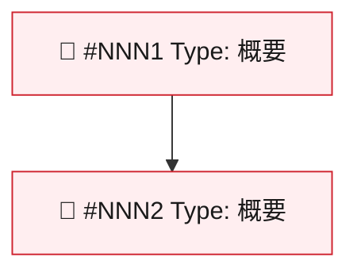

# Issue 運用ルール

このドキュメントは、リポジトリにおける GitHub Issue のネーミング・ラベル・マイルストーン・本文フォーマット・Linear
連携を定義します。AI による自律作業の再現性と、人間にとっての分かりやすさを両立することを目的としています。

**GitHub と Linear の棲み分け**: GitHub Issue が SSOT（実装・バグ・コードレビュー）、Linear が PM/PO 計画ツール（機能企画・スプリント計画・進捗管理）です。詳細は [Section 5.0](#50-棲み分け方針) を参照してください。

**SSOT ポリシー**: ラベル定義の正規情報源は `.github/labels.yml` です。このドキュメントはラベルの
_運用ルール_ を定義しますが、ラベルの色・説明・グループ定義は `.github/labels.yml` を参照してください。

---

## 目次

1. [Issue タイトル命名規則](#1-issue-タイトル命名規則)
2. [ラベル運用ルール](#2-ラベル運用ルール)
3. [マイルストーン命名規則](#3-マイルストーン命名規則)
4. [Issue 本文フォーマット](#4-issue-本文フォーマット)
5. [Linear 連携](#5-linear-連携)
   - [5.0 棲み分け方針](#50-棲み分け方針)
   - [5.0.5 GitHub ↔ Linear Integration](#505-github--linear-integrationgithub-integration)
   - [5.1 ラベル対応表](#51-ラベル対応表)
   - [5.2 マイルストーン対応表](#52-マイルストーン対応表)
   - [5.3 同期方針](#53-同期方針)
   - [5.4 同期トリガー・タイミング](#54-同期トリガータイミング)
6. [Linear MCP 必須手順](#6-linear-mcp-必須手順)
   - [6.1 セットアップ方法](#61-セットアップ方法)
   - [6.2 動作確認](#62-動作確認)
   - [6.3 主な使用例](#63-主な使用例)

---

## 1. Issue タイトル命名規則

### フォーマット

```
[Type] 簡潔な説明
```

- `[Type]` は角括弧付きで Type 名を記載（英語・先頭大文字）
- 説明は日本語または英語。動詞または名詞句で簡潔に
- 末尾にピリオドを付けない

### Type 一覧と対応ラベル

| Type | ラベル | 用途 | タイトル例 |
|------|--------|------|-----------|
| `Feature` | `type:feature` | 新機能の追加 | `[Feature] ユーザー認証機能を追加` |
| `Bug` | `type:bug` | バグ修正 | `[Bug] ログイン時にNullPointerが発生する` |
| `Architect` | `type:architect` | アーキテクチャ・構造の変更 | `[Architect] DBレイヤーをClean Architectureに移行` |
| `Improvement` | `type:improvement` | 既存機能の改善 | `[Improvement] 検索APIのレスポンス速度を改善` |
| `Chore` | `type:chore` | 雑用・依存更新・設定 | `[Chore] ESLintを最新バージョンに更新` |
| `Doc` | `type:doc` | ドキュメントの追加・更新 | `[Doc] API 運用ガイドを作成` |
| `Spike` | `type:spike` | 調査・技術検証 | `[Spike] gRPC導入の技術調査` |
| `Epic` | `type:epic` | 複数 Issue を束ねる大規模機能 | `[Epic] ユーザー認証システム全体対応` |

### 命名ガイドライン

- Type は正確に一致させる（`[feat]` や `[feature]` ではなく `[Feature]`）
- 説明は 50 文字以内を目安にする
- GitHub Issue 番号は **タイトルに含めない**（自動付与される）
- Linear の Issue ID を含める場合はタイトル末尾に `(LIN-XXX)` を付ける

---

## 2. ラベル運用ルール

ラベルは 3 つの必須グループと 2 つのオプショングループで構成されます。
各グループの詳細定義は **`.github/labels.yml` を SSOT** として参照してください。

### 必須グループ（全 Issue に必ず付与する）

#### 2.1 Type ラベル（`type:*`）

- **必須**: 1 Issue に 1 つのみ（排他的）
- Issue の作業種別を表す

| ラベル | 説明 |
|--------|------|
| `type:feature` | 新機能の追加 |
| `type:bug` | バグ修正 |
| `type:architect` | アーキテクチャ・構造変更 |
| `type:improvement` | 既存機能の改善 |
| `type:chore` | 雑用・メンテナンス |
| `type:doc` | ドキュメントの追加・更新 |
| `type:spike` | 調査・技術検証 |
| `type:epic` | Epic（複数 Issue の束） |

**選択基準:**

```
新しく機能が生まれる        → type:feature
壊れているものを直す        → type:bug
構造・設計を変える          → type:architect
今ある機能をより良くする    → type:improvement
保守・設定・依存更新        → type:chore
ドキュメントのみ            → type:doc
わからないから調べる        → type:spike
複数 Issue をまとめる       → type:epic
```

#### 2.2 Role ラベル（`role:*`）

- **必須**: 1 Issue に 1 つのみ（排他的）
- 主担当職種を表す

| ラベル | 説明 |
|--------|------|
| `role:designer` | デザイナー担当 |
| `role:frontend` | フロントエンド担当 |
| `role:backend` | バックエンド担当 |
| `role:infra` | インフラ担当 |
| `role:ops` | オペレーション担当 |

**選択基準:**

```
UI/UX デザイン変更が主体    → role:designer
フロントエンド実装が主体    → role:frontend
バックエンド/API が主体     → role:backend
インフラ/CI/CD が主体       → role:infra
運用・デプロイ・監視        → role:ops
```

複数職種にまたがる場合は、**主となる職種**を選択する。

#### 2.3 Priority ラベル（`priority:*`）

- **必須**: 1 Issue に 1 つのみ（排他的）
- 優先度を表す

| ラベル | 説明 | 目安 |
|--------|------|------|
| `priority:must` | 必須（Must） | ブロッカー・今スプリント内に完了必須 |
| `priority:nice` | Nice to Have | 今スプリント希望・できれば対応 |
| `priority:medium` | 中優先度 | バックログ上位・次スプリント候補 |
| `priority:low` | 低優先度 | バックログ下位・いつか対応 |

### オプショングループ

#### 2.4 Status ラベル（`status:*`）

- **オプション**: 必要に応じて付与（排他的）
- Issue のライフサイクル上の特殊ステータス

| ラベル | 説明 |
|--------|------|
| `status:duplicate` | 重複 Issue |
| `status:invalid` | 無効な Issue |
| `status:wontfix` | 対応しないと決定した Issue |

#### 2.5 Contrib ラベル

- **オプション**: コントリビューション促進用（排他的でない、複数付与可）

| ラベル | 説明 |
|--------|------|
| `good first issue` | 初心者向け（GitHub 標準） |
| `help wanted` | ヘルプ募集（GitHub 標準） |

### ラベル付与チェックリスト

Issue 作成・更新時に確認:

```
- [ ] type:* が 1 つだけ付いている
- [ ] role:* が 1 つだけ付いている
- [ ] priority:* が 1 つだけ付いている
- [ ] status:* は必要な場合のみ（排他的に 1 つ）
- [ ] .github/labels.yml の定義と一致している
```

### ラベル変更時の注意

ラベルの追加・削除・変更は **`.github/labels.yml` を先に更新**し、GitHub に適用する。
ラベル定義ファイルがない状態での手動変更は禁止する（定義とのドリフトが発生する）。

---

## 3. マイルストーン命名規則

### バージョンリリース

```
vX.Y - 概要
```

| 項目 | ルール | 例 |
|------|--------|-----|
| バージョン | `vX.Y` 形式（メジャー.マイナー） | `v1.0`, `v1.1`, `v2.0` |
| 区切り | ` - `（スペースハイフンスペース） | `v1.0 - MVP リリース` |
| 概要 | 10 文字以内の日本語または英語 | `MVP リリース`, `認証機能` |

例:
- `v1.0 - MVP リリース`
- `v1.1 - 認証機能`
- `v2.0 - フルリニューアル`

### スプリント

> **Note**: スプリント命名規則の SSOT は `docs/00_process/project_management.md` です。
> 以下は参考情報です。

```
Sprint N
```

| 項目 | ルール | 例 |
|------|--------|-----|
| 接頭辞 | `Sprint` （固定） | `Sprint` |
| 番号 | プロジェクト開始からの通し番号 | `1`, `2`, `3` |

**起算**: 2026年3月第1週（ISO W10）= Sprint 1。`Sprint N = ISO Week - 9`。

例:
- `Sprint 1`（ISO W10: 2026-03-02 〜 2026-03-08）
- `Sprint 2`（ISO W11: 2026-03-09 〜 2026-03-15）

詳細な運用ルール: `docs/00_process/project_management.md`

### Linear マイルストーンとの対応

| GitHub マイルストーン | Linear サイクル / プロジェクト | 備考 |
|-----------------------|-------------------------------|------|
| `vX.Y - 概要` | Linear Project として管理 | 長期リリース計画 |
| `Sprint N` | Linear Cycle として管理 | 1 週間単位のスプリント |

**同期ルール:**

- GitHub マイルストーン名と Linear Cycle/Project 名を揃える
- Linear でスプリントを作成した場合、同名の GitHub マイルストーンを作成する
- 担当者が Linear と GitHub の両方を更新するか、Linear MCP で同期する

---

## 4. Issue 本文フォーマット

### 4.1 必須セクション（全 Type 共通）

全 Issue の本文には以下のセクションを含める:

| セクション | 必須度 | 内容 |
|-----------|--------|------|
| 背景（Context） | 必須 | なぜこの Issue が必要か |
| ベネフィット（Expected Benefit） | 必須 | 誰がどう嬉しくなるか |
| 受け入れ条件（Acceptance Criteria） | 必須 | 何ができたら完了か（チェックリスト形式） |

### 4.2 種別ごとのテンプレート

#### Feature（新機能）

```markdown
### 背景（Context）

[なぜこの機能が必要か。課題・動機を記載]

### ベネフィット（Expected Benefit）

[誰がどう嬉しくなるか]

### 提案/解決策（Solution）

[どのような機能・変更を想定しているか]

### 影響範囲（Impact Points）

- [ ] UI / フロントエンド
- [ ] API / バックエンド
- [ ] 認証 / 認可（Auth）
- [ ] データベース / データ構造
- [ ] テスト
- [ ] ドキュメント

### 受け入れ条件（Acceptance Criteria）

- [ ] [AC-001] ...
- [ ] [AC-002] ...

### 非対象（Non-goals）

[この Issue では対応しない範囲]

### リスク/未確認事項（Risks/Unknowns）

[不確実な点、確認が必要な点]
```

#### Bug（バグ修正）

```markdown
### 背景（Context）

[バグの内容と発生状況]

### ベネフィット（Expected Benefit）

[修正によってどう改善されるか]

### 再現手順（Reproduction Steps）

1. ...
2. ...
3. ...

**期待する動作**: [本来どうなるべきか]
**実際の動作**: [実際に何が起きるか]
**発生頻度**: [常に/高頻度/時々/稀に]
**影響度**: [Critical/High/Medium/Low]

### 受け入れ条件（Acceptance Criteria）

- [ ] バグが修正されている
- [ ] 再発防止のテストが追加されている

### リスク/未確認事項（Risks/Unknowns）

[原因が不明な場合、影響範囲が不明な場合など]
```

#### Architect（アーキテクチャ変更）

```markdown
### 背景（Context）

[なぜアーキテクチャ変更が必要か。現状の課題]

### ベネフィット（Expected Benefit）

[変更によって何が改善されるか]

### 提案アーキテクチャ（Proposed Architecture）

[変更後の構造・設計を記載。図・ADR リンクがあれば記載]

### 影響範囲（Impact Points）

- [ ] ドメイン層
- [ ] ユースケース層
- [ ] インフラ層
- [ ] プレゼンテーション層
- [ ] データベース / スキーマ
- [ ] API 仕様

### 受け入れ条件（Acceptance Criteria）

- [ ] ADR が作成・承認されている
- [ ] 既存テストが全て通る
- [ ] ...

### マイグレーション計画（Migration Plan）

[移行手順・ロールバック計画]

### リスク/未確認事項（Risks/Unknowns）

[影響範囲の不確実性など]
```

#### Improvement（既存機能の改善）

```markdown
### 背景（Context）

[現状の課題・改善したい点]

### ベネフィット（Expected Benefit）

[改善後にどう良くなるか]

### 提案/解決策（Solution）

[どのような改善を想定しているか]

### 影響範囲（Impact Points）

- [ ] UI / フロントエンド
- [ ] API / バックエンド
- [ ] パフォーマンス
- [ ] テスト
- [ ] ドキュメント

### 受け入れ条件（Acceptance Criteria）

- [ ] ...

### リスク/未確認事項（Risks/Unknowns）

[改善による副作用・影響範囲の不確実性]
```

#### Chore（雑用・メンテナンス）

```markdown
### 背景（Context）

[なぜこのタスクが必要か]

### ベネフィット（Expected Benefit）

[誰がどう嬉しくなるか（開発者体験の改善も可）]

### 提案/解決策（Solution）

[どのような変更・対応を想定しているか]

### 受け入れ条件（Acceptance Criteria）

- [ ] ...
- [ ] テストが通る

### リスク/未確認事項（Risks/Unknowns）

[互換性リスク、影響範囲など]
```

#### Doc（ドキュメント）

```markdown
### 背景（Context）

[ドキュメントの何が問題か。存在しない・古い・分かりにくい等]

### ベネフィット（Expected Benefit）

[誰がどう嬉しくなるか]

### 提案/解決策（Solution）

[どのようなドキュメント変更を想定しているか]

### 対象ドキュメント（Target Documents）

- [ ] `docs/` の新規作成: [ファイルパス]
- [ ] `docs/` の更新: [ファイルパス]
- [ ] README
- [ ] その他: [ファイルパス]

### 受け入れ条件（Acceptance Criteria）

- [ ] [ドキュメントが作成/更新されている]
- [ ] レビューを受けている

### リスク/未確認事項（Risks/Unknowns）

[仕様が不明な部分、確認が必要な部分]
```

#### Spike（調査・技術検証）

```markdown
### 背景（Context）

[なぜこの調査が必要か。何が不明で何を解決したいか]

### ベネフィット（Expected Benefit）

[調査結果によって何が意思決定できるようになるか]

### 調査スコープ（Investigation Scope）

[何を調べるか。In Scope / Out of Scope を明確にする]

### 調査項目（Investigation Items）

- [ ] ...
- [ ] ...

### 受け入れ条件（Acceptance Criteria）

- [ ] 調査結果がドキュメントにまとめられている（`docs/` または Issue コメント）
- [ ] 次の意思決定に必要な情報が揃っている
- [ ] 後続 Issue が作成されている（実装が必要な場合）

### タイムボックス（Timebox）

[最大調査時間: X 時間 / X 日]

### リスク/未確認事項（Risks/Unknowns）

[調査前の前提・不確実な点]
```

#### Epic（複数 Issue の束）

```markdown
### 背景（Context）

[なぜこの Epic が必要か。課題・動機]

### ベネフィット（Expected Benefit）

[この Epic で達成したい大きな目標・ビジョン]

### スコープ（Scope）

[この Epic に含まれる範囲]

### Child Issues

| # | Title | Status | Assignee |
|---|-------|--------|----------|
| #xxx | [Type] ... | 🔴 Open | - |
| #xxx | [Type] ... | 🔴 Open | - |

### 依存関係（Dependencies）



> ノード ID は Issue 番号を使う（`epic-status-manager` の自動更新に必須）。

### 受け入れ条件（Acceptance Criteria）

- [ ] すべての Child Issues が完了している
- [ ] ...

### リスク/未確認事項（Risks/Unknowns）

[Epic 全体に関わるリスク]
```

### 4.3 共通フッターセクション

Type に関わらず、以下を必要に応じて含める:

```markdown
---

### 📚 関連ドキュメント（References）

- `docs/xxx.md` - [関連するドキュメント]
- 関連 Issue: #123

### 🔗 Linear

Linear Issue: COD-XX
<!-- Linear GitHub Integration が有効な場合、PR 本文に "Linear: COD-XX" を含めると
     Linear Issue に自動リンクされ、PR マージ時にステータスが自動追従する。
     COD-XX は対応する Linear Issue キーに置き換える。
     Linear Issue がない場合はこのセクションを削除する。 -->

### 🔗 Parent Epic

Part of #xxx
<!-- Epic の子 Issue の場合のみ記載 -->

---

### 確認事項

- [x] 既存の Issue を検索し、重複がないことを確認しました
```

---

## 5. Linear 連携

### 5.0 棲み分け方針

GitHub Issue と Linear はそれぞれ異なる役割を持ちます。**どちらに何を書くか** を以下の対応表と判断フローで確認してください。

#### 棲み分け対応表

| 用途 | GitHub Issue | Linear |
|------|-------------|--------|
| **実装タスク** | SSOT（起票・管理・クローズ） | ミラー（参照用） |
| **バグ修正** | SSOT（起票・管理・クローズ） | ミラー（参照用） |
| **コードレビュー** | SSOT（PR コメント・承認） | 使用しない |
| **機能企画・要件定義** | 起票して紐付ける | SSOT（詳細計画・議論） |
| **進捗管理・ステータス追跡** | GitHub Project Board で補完 | SSOT（ダッシュボード） |
| **スプリント計画** | マイルストーンで対応 | SSOT（Cycle・スプリントボード） |
| **PM/PO 向けロードマップ** | 使用しない | SSOT（Project・Timeline） |
| **技術的負債・Spike** | SSOT（起票・管理） | ミラー（優先度設定のみ） |

**原則:**

- **GitHub が SSOT**: すべての実装・バグ・コードレビューは GitHub で管理する。Linear はその反映先
- **Linear は PM/PO のホーム**: スプリント計画・機能ロードマップ・ビジネス優先度は Linear で管理する
- **重複記入を避ける**: 同じ情報を両方に手動で書かない。Linear MCP 経由で同期する（→ [Section 6](#6-linear-mcp-必須手順)）

#### 判断フロー

チケットを起票する前に、以下のフローで「どちらに切るか」を判断してください:

```
チケット起票時の判断フロー
───────────────────────────────────────────────────────────────
コードの変更 or バグ修正を伴うか？
├─ YES → GitHub Issue を起票する（SSOT）
│         ├─ 実装タスク/バグ修正/技術的負債/Spike
│         └─ スプリント管理が必要なら Linear MCP で Cycle に追加する
└─ NO  → 目的は何か？
          ├─ 機能企画・要件定義      → Linear Issue を起票し、GitHub Issue に紐付ける
          ├─ 進捗・ステータス更新    → Linear でステータスを更新し、MCP で GitHub を同期する
          └─ スプリント計画・優先度  → Linear Cycle / Project を更新する
───────────────────────────────────────────────────────────────
```

**迷ったときの原則**: コードを書く必要があるなら GitHub Issue。コードを書かずに計画・管理するなら Linear。

### 5.0.5 GitHub ↔ Linear Integration（GitHub Integration）

> **注意**: このセクションでは Linear の GitHub Integration（GitHub App ベースの公式インテグレーション）を設定する手順を定義する。
> 設定は Linear 管理画面での手動操作が必要（コードで自動化不可）。

#### GitHub Integration の有効化

Linear の GitHub Integration を有効化すると、PR 本文に `Linear: COD-XX` を含めるだけで
Linear Issue に自動リンクされ、PR マージ時にステータスが自動追従する。

**設定手順（Linear 管理者が実施）:**

1. Linear にログインし、Workspace Settings に移動する
2. **Integrations → GitHub** を選択する
3. `Connect GitHub` をクリックし、GitHub App として認可する
4. 対象リポジトリ（`CoDaMa-LDH-Funs/codama-ldh`）へのアクセスを許可する
5. 設定を保存する

**動作確認:**

```
1. テスト用 PR を作成し、PR 本文に以下を記載する:

   Linear: COD-XX

2. Linear の該当 Issue に GitHub PR が自動リンクされていることを確認する
3. PR をマージし、Linear Issue のステータスが "Done"（または設定済みのステータス）
   に自動遷移することを確認する
```

> **重要**: GitHub Integration が有効化されるまでは、PR 本文の `Linear: COD-XX` は
> 表示されるが自動リンクは発生しない。有効化後に作成された PR から自動リンクが機能する。

#### PR タイトルへの Linear キー付与

GitHub Issue body に `### 🔗 Linear` セクションがある場合、PR タイトルの subject 先頭に `[COD-XX]` を付与する：

```
feat(auth): [COD-7] add token rotation support
fix: [COD-42] resolve null pointer in login flow
```

- Conventional Commits の subject 内に `[COD-XX]` を含めるため、commitlint の設定変更は不要
- Linear Issue がない場合は省略可
- autopilot 経由の PR では自動付与される

#### PR 本文への Linear キー記載規則

PR 本文にも Linear Issue キーを含める（Linear GitHub Integration の自動リンク用）：

```markdown
Linear: COD-XX
```

- `COD-XX` は Linear の Issue キー（例: `COD-7`, `COD-42`）
- PR 本文の任意の位置に記載してよいが、末尾のリンクセクションへの記載を推奨する
- autopilot 経由の PR では、Issue body に `### 🔗 Linear` セクションがあれば自動的に含まれる
  （詳細: `.claude/commands/autopilot.md` Phase 5）

**autopilot 自動連携フロー:**

```
GitHub Issue body に「### 🔗 Linear」セクション + 「Linear Issue: COD-XX」を記載
    ↓
/autopilot #<issue> を実行
    ↓
autopilot が Issue body から Linear キーを自動パース
    ↓
作成する PR 本文に「Linear: COD-XX」を自動追記
    ↓
Linear GitHub Integration が PR と Linear Issue を自動リンク
    ↓
PR マージ時に Linear Issue ステータスが自動遷移
```

また `/autopilot COD-XX` のように Linear Issue キーを直接渡すことも可能:

```
/autopilot COD-7
```

この場合、autopilot は GitHub Issues を検索し、`### 🔗 Linear` セクションに `Linear Issue: COD-7`
を含む Issue を特定して自動実行する（詳細: `.claude/commands/autopilot.md` Step 0）。

### 5.1 ラベル対応表

| GitHub ラベル | Linear ラベル / 属性 | 備考 |
|--------------|---------------------|------|
| `type:feature` | Label: `Feature` または Priority 外 | Linear では Type が Priority/Project で表現されることも |
| `type:bug` | Label: `Bug` | Linear 標準 |
| `type:architect` | Label: `Architecture` | Linear カスタムラベル |
| `type:improvement` | Label: `Improvement` | Linear カスタムラベル |
| `type:chore` | Label: `Chore` | Linear カスタムラベル |
| `type:doc` | Label: `Documentation` | Linear 標準またはカスタム |
| `type:spike` | Label: `Spike` | Linear カスタムラベル |
| `type:epic` | Linear Project（Epic） | Linear では Project として管理 |
| `role:designer` | Assignee または Team: Design | |
| `role:frontend` | Assignee または Team: Frontend | |
| `role:backend` | Assignee または Team: Backend | |
| `role:infra` | Assignee または Team: Infra | |
| `role:ops` | Assignee または Team: Ops | |
| `priority:must` | Priority: Urgent | |
| `priority:nice` | Priority: High | |
| `priority:medium` | Priority: Medium | |
| `priority:low` | Priority: Low | |
| `status:duplicate` | Status: Cancelled (Duplicate) | |
| `status:invalid` | Status: Cancelled | |
| `status:wontfix` | Status: Cancelled (Won't Fix) | |

### 5.2 マイルストーン対応表

| GitHub マイルストーン | Linear 管理単位 | 同期方法 |
|----------------------|----------------|---------|
| `vX.Y - 概要` | Linear Project | Linear MCP（必須） |
| `Sprint N` | Linear Cycle | Linear MCP（必須） |

### 5.3 同期方針

- **GitHub が SSOT**: すべての Issue は GitHub で管理する
- **Linear は PM/PO のホーム**: Linear は機能企画・進捗管理・スプリント計画のホームとして使用する
- **Linear MCP 経由で同期（必須）**: GitHub ↔ Linear の同期は Linear MCP 経由を標準とする（→ [Section 6](#6-linear-mcp-必須手順)）
- **手動での重複記入を避ける**: 同じ情報を GitHub と Linear の両方に手動で書かない。Linear MCP 経由で同期する

### 5.4 同期トリガー・タイミング

同期は以下のイベントを **トリガー** として Linear MCP 経由で実行します。

> **注意**: これらは自動実行されるイベントフックではありません。開発者が Claude Code セッション内で Linear MCP に対してコマンド（プロンプト）を発行して実行します。具体例は「同期コマンド例」を参照してください。

#### GitHub → Linear（実装側から計画側へ）

| トリガーイベント | 同期内容 | 実行タイミング |
|----------------|---------|--------------|
| GitHub Issue 作成 | Linear Issue を作成し、対応する Cycle/Project に追加する | Issue 作成直後 |
| GitHub Issue ステータス変更（In Progress） | Linear Issue を "In Progress" に更新する | PR 作成時 |
| GitHub Issue クローズ（Merged/Closed） | Linear Issue を "Done" または "Cancelled" に更新する | PR マージ時 |
| GitHub マイルストーン作成（`Sprint N`） | Linear Cycle を作成する（同名） | マイルストーン作成後 |
| GitHub マイルストーン作成（`vX.Y`） | Linear Project を作成する（同名） | マイルストーン作成後 |

#### Linear → GitHub（計画側から実装側へ）

| トリガーイベント | 同期内容 | 実行タイミング |
|----------------|---------|--------------|
| Linear で優先度変更 | GitHub Issue の `priority:*` ラベルを更新する | スプリント計画後 |
| Linear Cycle（スプリント）開始 | 対応 GitHub Issue を当該マイルストーンに割り当てる | スプリント開始時 |
| Linear で担当者変更 | GitHub Issue の Assignee を更新する | 担当変更後 |
| Linear Issue キャンセル | GitHub Issue を `status:wontfix` または `status:invalid` でクローズする | PM 判断後 |

#### 同期コマンド例（Linear MCP）

```
# GitHub Issue を Linear に同期する（Issue 作成後）
GitHub Issue #123 の内容で Linear Issue を作成し、現在のスプリント Cycle に追加してください

# スプリント計画後に GitHub マイルストーンを更新する
Linear Cycle "Sprint 5" に含まれる Issue を GitHub マイルストーン "Sprint 5" に割り当ててください

# PR マージ後に Linear を更新する
GitHub Issue #123 がクローズされました。対応する Linear Issue を Done に更新してください

# 優先度変更を GitHub に反映する
Linear で Priority が Urgent になった Issue に対応する GitHub Issue のラベルを priority:must に変更してください
```

---

## 6. Linear MCP 必須手順

Linear MCP は **必須** です。GitHub ↔ Linear の同期を標準化し、手動での重複記入を避けるために使用します。

**なぜ必須か:**

- GitHub ↔ Linear の手動同期は漏れ・齟齬を生む
- Linear MCP 経由で同期することで情報の一元管理が実現できる
- スプリント計画・優先度変更を GitHub に反映できる

### 6.1 セットアップ方法

本プロジェクトでは以下の 2 つの方法で Linear MCP を利用できます。

#### 方法 A: プロジェクト `.mcp.json`（プロジェクト標準・設定済み）

リポジトリルートの `.mcp.json` に `linear-server` エントリが設定済みです。Linear 公式のリモート MCP エンドポイント（`https://mcp.linear.app/mcp`）を使用しており、ローカルに `@linear/mcp-server` パッケージをインストールする必要はありません。

**`.mcp.json` の該当エントリ（設定済み）:**

```json
"linear-server": {
  "type": "http",
  "url": "https://mcp.linear.app/mcp"
}
```

初回接続時にブラウザで Linear の OAuth 認証が求められます。認証後は自動的にトークンが管理されるため、API キーの手動設定は不要です。

#### 方法 B: ユーザーレベル MCP 設定（個人設定）

個人設定として管理したい場合は `~/.claude/mcp_settings.json` に追加する（git 管理外・全プロジェクトで共有）:

```json
{
  "mcpServers": {
    "linear": {
      "type": "http",
      "url": "https://mcp.linear.app/mcp"
    }
  }
}
```

> この方法でも初回接続時に OAuth 認証が求められます。

### 6.2 動作確認

Claude Code を再起動し、以下のプロンプトで確認する:

```
Linear の Issue 一覧を見せてください
```

または:

```
Linear で現在のスプリント（Cycle）に含まれる Issue を表示してください
```

### 6.3 主な使用例

```
# GitHub Issue から Linear Issue を作成する（Issue 作成後に必須）
GitHub Issue #123 の内容で Linear Issue を作成し、Sprint 5 Cycle に追加してください

# スプリントに Issue を追加する
Sprint 5 のサイクルに Issue #123, #124, #125 を追加してください

# Linear と GitHub のステータスを同期する（PR マージ後に必須）
Linear で完了した Issue に対応する GitHub Issue をクローズしてください

# マイルストーンとプロジェクトを同期する
GitHub マイルストーン v1.0 に対応する Linear プロジェクトを作成してください

# 優先度変更を GitHub に反映する
Linear で Urgent になった Issue の GitHub ラベルを priority:must に変更してください
```

### 6.4 セキュリティ注意事項

- リモート MCP エンドポイント（`https://mcp.linear.app/mcp`）は OAuth 認証を使用するため、API キーの手動管理は不要
- **`.mcp.json` にシークレットを直接記載しない**（`.mcp.json` は git で追跡されている）
- OAuth トークンが不正利用された場合は Linear 側（Settings → Authorized applications）でアクセスを取り消す

### 6.5 トラブルシューティング

| 症状 | 対処法 |
|------|--------|
| `Linear MCP is not configured` | 方法 A（`.mcp.json`）の設定を確認する |
| OAuth 認証画面が表示されない | ブラウザのポップアップブロックを確認する。Claude Code を再起動する |
| `Unauthorized` エラー | Linear の Settings → Authorized applications でアクセスを再認可する |
| Issue が同期されない | `Linear の Issue 一覧を見せてください` で疎通確認する |

---

## 関連ファイル

| ファイル | 説明 |
|----------|------|
| `.github/labels.yml` | ラベル定義の SSOT |
| `.github/ISSUE_TEMPLATE/feature_request.yml` | Feature Issue テンプレート |
| `.github/ISSUE_TEMPLATE/bug_report.yml` | Bug Issue テンプレート |
| `.github/ISSUE_TEMPLATE/task.yml` | Task Issue テンプレート |
| `.github/ISSUE_TEMPLATE/documentation.yml` | Doc Issue テンプレート |
| `.github/ISSUE_TEMPLATE/epic.yml` | Epic Issue テンプレート |
| `.claude/skills/issue-creation/SKILL.md` | Issue 作成ワークフロー |
| `.claude/skills/epic-status-manager/SKILL.md` | Epic ステータス管理 SSOT |
| `docs/00_process/git_and_pr_governance.md` | Git/PR 運用ルール |
| `AGENTS.md` | エージェント向け規約（canonical） |
