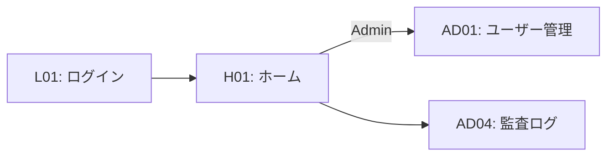

# 画面仕様 - 統合仕様書（スケルトン）

**この仕様書は、認証・ユーザー管理・監査ログの画面仕様を定義します。**

- **更新日**: 2026-02-24
- **バージョン**: 2.0 (skeleton)
- **構成**: 1 画面 1 ファイル + 共通仕様

---

## 📋 目次

1. [共通仕様](#共通仕様) - 前提・RBAC
2. [画面一覧](#画面一覧)
3. [ルート-画面対応表](#ルート-画面対応表)
4. [画面遷移図](#画面遷移図)
5. [実装優先順位（Golden Route）](#実装優先順位golden-route)
6. [参考資料](#参考資料)

---

## 共通仕様

全画面で遵守する基本ルールと技術仕様。

### 前提と固定ルール

**ファイル**: [common/PREREQUISITES.md](./common/PREREQUISITES.md)

- **出力ポリシー**: 社外向けは内部メモ・担当者名を除外
- **推奨機能**: 掘り起こしレコメンド非対応（ただしリスク可視化）

### 権限管理仕様（RBAC）

**ファイル**: [common/RBAC.md](./common/RBAC.md)

- **ロール**: USER, ADMIN
- **権限マトリクス**: 各機能についてロールごとの権限を定義

### 画面構成・ナビゲーション設計

**ファイル**: [common/SCREEN_LAYOUT.md](./common/SCREEN_LAYOUT.md)

- **2 カラムレイアウト**: 左サイドバー（ナビゲーション）+ メインエリア
- **グローバルナビゲーション**: 権限に応じたメニュー表示制御
- **レスポンシブ対応**: デスクトップ / タブレット / モバイル

---

## 画面一覧

### 共通層（全ロール）

| 画面ID  | 画面名   | 説明                   | 詳細                           |
| ------- | -------- | ---------------------- | ------------------------------ |
| **L01** | ログイン | 認証画面               | [L01-login.md](./L01-login.md) |
| **H01** | ホーム   | ロール別ダッシュボード | [H01-home.md](./H01-home.md)   |

### Admin 向け（管理）

| 画面ID   | 画面名              | 説明                               | 詳細                                                                 |
| -------- | ------------------- | ---------------------------------- | -------------------------------------------------------------------- |
| **AD01** | ユーザー/ロール管理 | ユーザー・権限管理                 | [admin/AD01-user-management.md](./admin/AD01-user-management.md)     |
| **AD04** | 監査ログ            | 操作履歴の管理・閲覧               | [admin/AD04-audit-logs.md](./admin/AD04-audit-logs.md)               |

### 共通（全ロール - 認証後）

| 画面ID   | 画面名           | 説明                     | 詳細                                   |
| -------- | ---------------- | ------------------------ | -------------------------------------- |
| **R01**  | 新規登録         | ユーザーアカウント作成   | [R01-register.md](./R01-register.md)   |
| **P01**  | プロフィール編集 | 表示名など個人情報の編集 | [P01-profile.md](./P01-profile.md)     |
| **ST01** | 設定             | アカウント情報・外観設定 | [ST01-settings.md](./ST01-settings.md) |

---

## ルート-画面対応表

`projects/apps/web/src/app/` の全ルートと画面仕様のマッピング。

### 凡例

| ステータス | 意味                                            |
| ---------- | ----------------------------------------------- |
| 仕様あり   | 画面仕様ドキュメントが存在する                  |
| 仕様不要   | ユーティリティ/リダイレクト用のルートで仕様不要 |
| 未実装     | 仕様はあるがルートが存在しない（未実装）        |

### 認証前ルート

| ルート      | 画面ID | 画面仕様                             | ステータス | 備考                                                         |
| ----------- | ------ | ------------------------------------ | ---------- | ------------------------------------------------------------ |
| `/`         | -      | -                                    | 仕様不要   | 認証状態に応じて `/dashboard` または `/login` にリダイレクト |
| `/login`    | L01    | [L01-login.md](./L01-login.md)       | 仕様あり   |                                                              |
| `/register` | R01    | [R01-register.md](./R01-register.md) | 仕様あり   |                                                              |
| `/ping`     | -      | -                                    | 仕様不要   | フロントエンド-バックエンド疎通確認用ユーティリティ          |

### 共通ルート（全ロール）

| ルート                 | 画面ID | 画面仕様                               | ステータス | 備考                         |
| ---------------------- | ------ | -------------------------------------- | ---------- | ---------------------------- |
| `/dashboard`           | H01    | [H01-home.md](./H01-home.md)           | 仕様あり   | ロール別ダッシュボード       |
| `/profile`             | P01    | [P01-profile.md](./P01-profile.md)     | 仕様あり   |                              |
| `/settings`            | ST01   | [ST01-settings.md](./ST01-settings.md) | 仕様あり   | 設定ハブ（サブページへ誘導） |
| `/settings/account`    | ST01   | [ST01-settings.md](./ST01-settings.md) | 仕様あり   | アカウント情報確認           |
| `/settings/appearance` | ST01   | [ST01-settings.md](./ST01-settings.md) | 仕様あり   | テーマ設定                   |

### Admin 向けルート

| ルート                   | 画面ID | 画面仕様                                                             | ステータス | 備考                                 |
| ------------------------ | ------ | -------------------------------------------------------------------- | ---------- | ------------------------------------ |
| `/admin`                 | -      | -                                                                    | 仕様不要   | Admin ハブページ（サブページへ誘導） |
| `/admin/users`           | AD01   | [admin/AD01-user-management.md](./admin/AD01-user-management.md)     | 仕様あり   |                                      |
| `/admin/audit-logs`      | AD04   | [admin/AD04-audit-logs.md](./admin/AD04-audit-logs.md)               | 仕様あり   |                                      |

### 仕様不要ルート一覧

以下のルートは画面仕様不要として明示的に除外する。

| ルート   | 理由                                                                   |
| -------- | ---------------------------------------------------------------------- |
| `/`      | リダイレクトのみ。認証状態確認後に `/dashboard` または `/login` へ転送 |
| `/ping`  | 開発・運用用の疎通確認ユーティリティ。エンドユーザー向け機能ではない   |
| `/admin` | Admin サブページへのナビゲーションハブ。独立した機能なし               |

---

## 画面と要件のマッピング

### 関連要件（Requirements）

各画面が実装する機能要件（FR）の対応関係：

| 画面              | 関連 FR                           | 説明                             |
| ----------------- | --------------------------------- | -------------------------------- |
| L01 ログイン      | FR-14                             | 認証・権限の基盤                 |
| H01 ホーム        | 全般                              | ロール別ダッシュボード           |
| AD01 ユーザー管理 | FR-14, FR-15                      | 権限管理・監査ログ               |
| AD04 監査ログ     | FR-15                             | 操作履歴の記録・閲覧             |

**詳細**: [../requirements/README.md](../requirements/README.md)

---

## 画面遷移図



---

## 実装優先順位（Golden Route）

**目標**: 認証・ユーザー管理・監査ログの動作確認

| 優先順 | 画面          | 理由                            | 期間              |
| ------ | ------------- | ------------------------------- | ----------------- |
| **1**  | L01, H01      | 基盤（認証・ロール別メニュー）  | Phase 0（1 週）   |
| **2**  | AD01          | ユーザー管理                    | Phase 1（3 日）   |
| **3**  | AD04          | 監査ログ閲覧                    | Phase 1（2 日）   |

---

## ディレクトリ構成

```
docs/01_product/screens/
├── README.md (このファイル)
├── common/                        # 共通仕様
│   ├── PREREQUISITES.md           # 前提・固定ルール
│   ├── RBAC.md                   # 権限管理仕様
│   └── SCREEN_LAYOUT.md          # 画面構成・ナビゲーション設計
├── L01-login.md                  # ログイン
├── R01-register.md               # 新規登録
├── H01-home.md                   # ホーム（ダッシュボード）
├── P01-profile.md                # プロフィール編集
├── ST01-settings.md              # 設定（アカウント・外観）
└── admin/                        # Admin 向け画面
    ├── AD01-user-management.md
    └── AD04-audit-logs.md
```

---

## 参考資料

| ドキュメント                                                      | 説明                                 |
| ----------------------------------------------------------------- | ------------------------------------ |
| [requirements/README.md](../requirements/README.md)               | 機能要件（FR/NFR）インデックス       |
| [requirements/admin.md](../requirements/admin.md)                 | 権限・監査ログ要件                   |
| [prd.md](../prd.md)                                               | プロダクト概要・ゴール               |

---

**版履歴**

- v2.0 (2026-02-24): skeleton 化。auth/user-management/audit-log のみ残す
- v1.1 (2026-02-21): ルート-画面対応表を追加
- v1.0 (2026-01-27): 初版
