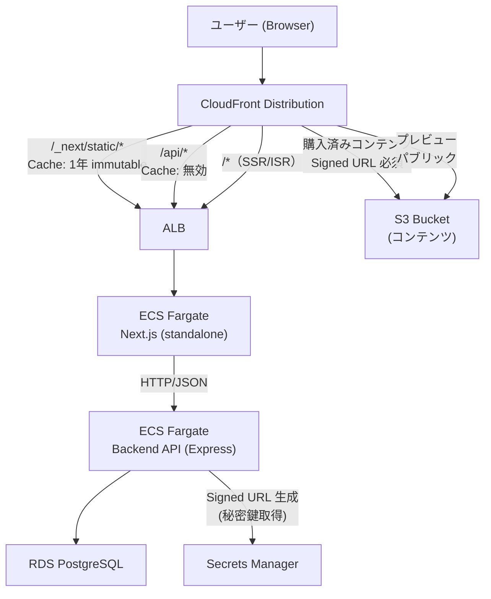
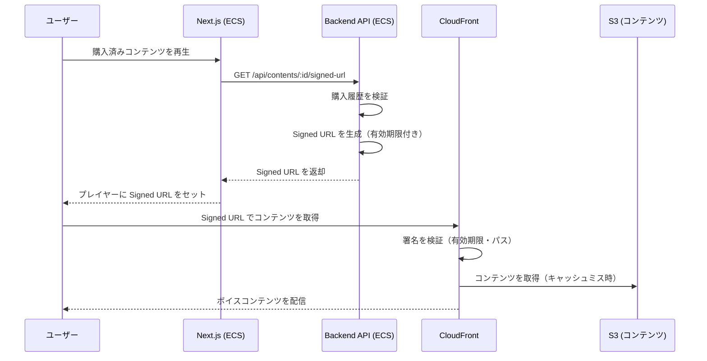

# ADR-0015: CDN方式（CloudFront構成・署名URL戦略）

## ステータス

Proposed

## 背景

### 問題

CloudFront のコスト見積もり（COD-71/COD-104）は完了しており、3つの構成案（ALB origin / OpenNext / Static Export）の比較資料（`docs/02_architecture/cloudfront-cost-estimation.md`）が整備済みである。しかし、正式な ADR として意思決定が記録されておらず、後続タスク INF-022（Terraform CloudFront 定義）がブロックされている。

本 ADR は CDN 方式を確定し、Terraform 実装に必要な設計基盤を提供する。

### システム前提

本プロジェクトの Next.js フロントエンド（`@monorepo/web`）は以下の構成で動作する：

- `output: 'standalone'`（Docker コンテナとしてビルド）
- App Router + Server Components（SSR/ISR を多用）
- Backend API（Express）とは HTTP/JSON で通信
- AWS ECS（Fargate）+ ALB でホスティング

### サービス特性

本サービスは **EC（電子商取引）+ ボイスコンテンツコンテンツ配信** プラットフォームである。ユーザーはボイスコンテンツコンテンツを購入し、購入済みコンテンツのみを再生できる。この特性から CDN には以下の要件がある：

- パブリックコンテンツ（カタログ、プレビュー、静的アセット）の高速配信
- **購入済みコンテンツ（ボイスコンテンツ）のアクセス制御**（購入者のみ閲覧可能）
- コンテンツの不正共有・直リンク防止

### CDN 導入の目的

| 目的                       | 説明                                                               |
| -------------------------- | ------------------------------------------------------------------ |
| グローバルエッジ配信       | 静的アセット（JS/CSS/Media）のキャッシュ配信によるレイテンシ削減   |
| コンテンツアクセス制御     | 購入済みボイスコンテンツを Signed URL で保護し、購入者のみに配信   |
| オリジン負荷軽減           | キャッシュヒット率向上による ECS オリジンへのリクエスト削減       |
| セキュリティ強化           | WAF・DDoS 保護、OAC による S3 直接アクセス防止                    |
| コスト最適化               | 静的アセットの高キャッシュヒット率（99%+）による転送量削減         |

### AWS インフラ構成

本プロジェクトのインフラは AWS で完結する。各レイヤの責務は以下のとおり：

| レイヤ             | AWS サービス             | 役割                                                    |
| ------------------ | ------------------------ | ------------------------------------------------------- |
| CDN / エッジ       | CloudFront               | コンテンツ配信最適化、キャッシュ、WAF、DDoS 保護       |
| コンテンツ保存     | S3                       | ボイスコンテンツ・プレビュー等のオブジェクトストレージ  |
| ロードバランシング | ALB                      | ヘルスチェック、ルーティング、SSL 終端                  |
| アプリホスティング | ECS (Fargate)            | Next.js フロントエンド・Express バックエンドの実行環境  |
| データベース       | RDS (PostgreSQL)         | データ永続化                                            |
| シークレット管理   | Secrets Manager          | 接続情報・JWT シークレット・CloudFront Key Pair 等      |

## 決定内容

### Option A: ALB origin（ECS/EC2 セルフホスト Next.js）を本採用

CloudFront Distribution を前段に配置し、AWS ALB + ECS (Fargate) をオリジンとして、コンテンツ種別ごとのキャッシュ戦略を適用する。

### 採用根拠

| 観点                 | 根拠                                                                    |
| -------------------- | ----------------------------------------------------------------------- |
| 移行コストゼロ       | 現在の `output: 'standalone'` + Docker/ECS 構成をそのまま利用できる      |
| Next.js 全機能対応   | SSR/ISR/Middleware/Streaming/Server Actions が制約なしで動作する         |
| コールドスタートなし | ECS Fargate タスクは常時起動のため初回レスポンスレイテンシが安定する    |
| WebSocket 対応       | ALB の WebSocket サポートにより将来のリアルタイム通知に対応可能          |
| デバッグ容易性       | ECS タスクのログは CloudWatch Logs で直接確認できる                      |
| 月次コストの許容     | MVP 初期フェーズでは月 ~$87 の固定コストは事業リスクに比して許容可能    |

### 署名URL（CloudFront Signed URL / Signed Cookies）の採否

**決定: 購入済みコンテンツの配信に CloudFront Signed URL を採用する。**

本サービスは EC（電子商取引）とボイスコンテンツコンテンツの配信を行うプラットフォームである。購入済みコンテンツ（ボイスコンテンツ等）は購入者のみがアクセスできる必要があり、URL の直接共有による不正アクセスを防止しなければならない。

#### 署名方式の選定

| 方式 | 用途 | 採否 |
|------|------|------|
| **CloudFront Signed URL** | 個別コンテンツ（ボイスコンテンツファイル）への時限アクセス | **採用** |
| CloudFront Signed Cookies | 複数コンテンツへの一括アクセス制御 | 将来検討（サブスクリプション型プランの導入時） |

**Signed URL を優先する理由:**

- ボイスコンテンツは個別ファイル単位で購入されるため、ファイル単位のアクセス制御が自然
- URL ごとに有効期限を設定でき、リンク共有による不正アクセスを防止できる
- Signed Cookies は複数リソースへのアクセスを一括制御する場合に有効だが、初期フェーズでは個別購入モデルのため不要

#### Signed URL の発行フロー

#### セキュリティ要件

| 要件 | 設定 |
|------|------|
| Signed URL 有効期限 | 短時間（15〜60 分）。再生開始時に都度発行する |
| Key Pair 管理 | CloudFront Key Group + 秘密鍵は AWS Secrets Manager で管理 |
| S3 バケットポリシー | CloudFront OAC（Origin Access Control）経由のみ許可。S3 直接アクセスはブロック |
| IP 制限 | Signed URL にはオプション。初期フェーズでは IP 制限なし（モバイル回線の IP 変動を考慮） |

#### コンテンツ種別と署名の要否

| コンテンツ種別 | 署名 | 理由 |
|--------------|------|------|
| ボイスコンテンツ（購入済み） | **Signed URL 必須** | 購入者のみアクセス可能にする |
| 試聴用プレビュー | 不要（パブリック） | マーケティング目的で自由にアクセス可能 |
| 商品サムネイル・画像 | 不要（パブリック） | EC カタログとして公開 |
| サイト静的アセット（JS/CSS） | 不要（パブリック） | アプリケーション動作に必要 |

### キャッシュ戦略

コンテンツ種別ごとの Cache-Control 設定と CloudFront TTL を以下のとおり定める。

> **注:** 以下のパスパターン（`/contents/*`, `/previews/*` 等）は方針を示すための例示であり、実際のパス設計は実装担当者が決定する。本 ADR が定めるのは「コンテンツ種別ごとのキャッシュポリシーと署名要否」の方針である。

#### Cache Behavior 優先順位設定

| 優先順位 | パスパターン        | オリジン  | キャッシュポリシー                        | 推奨 TTL                              |
| -------- | ------------------- | --------- | ----------------------------------------- | ------------------------------------- |
| 1        | `/contents/*`       | S3 (OAC)  | Signed URL 必須、キャッシュ有効           | 1時間（Signed URL の有効期限と整合）  |
| 2        | `/previews/*`       | S3 (OAC)  | CachingOptimized（パブリック）            | 7日                                   |
| 3        | `/_next/static/*`   | ALB       | CachingOptimized（カスタム）              | 1年（`max-age=31536000, immutable`）  |
| 4        | `/_next/image*`     | ALB       | カスタム（Query Strings: All を Forward） | 1日〜7日                              |
| 5        | `/api/*`            | ALB       | CachingDisabled                           | 0（POST/PUT/DELETE はキャッシュ禁止） |
| 6        | `/*`（デフォルト）  | ALB       | カスタム                                  | SSR: 0〜60秒、ISR: revalidate 秒      |

#### コンテンツ種別ごとの Cache-Control

| コンテンツ種別                       | Cache-Control ヘッダー                          | CloudFront TTL      | 備考                                                        |
| ------------------------------------ | ----------------------------------------------- | ------------------- | ----------------------------------------------------------- |
| 購入済みコンテンツ（`/contents/*`）  | `private, max-age=3600`                         | 1時間               | Signed URL 必須。OAC 経由で S3 から配信。TTL を Signed URL 有効期限（15〜60 分）と整合させ、権利失効後の不正アクセスウィンドウを最小化 |
| 試聴プレビュー（`/previews/*`）      | `public, max-age=604800`                        | 7日                 | パブリック。OAC 経由で S3 から配信                           |
| `/_next/static/chunks/*.js`          | `public, max-age=31536000, immutable`           | 1年                 | Next.js が自動設定。コンテンツハッシュ付きファイル名        |
| `/_next/static/css/*.css`            | `public, max-age=31536000, immutable`           | 1年                 | 同上                                                        |
| `/_next/static/media/*`              | `public, max-age=31536000, immutable`           | 1年                 | 同上                                                        |
| `/_next/image`                       | `public, max-age=86400`                         | 1日                 | `images.minimumCacheTTL` で変更可能                         |
| ISR ページ                           | `s-maxage=<revalidate>, stale-while-revalidate` | revalidate 秒       | `s-maxage` を CloudFront が認識                             |
| SSR ページ（パブリック）             | `public, max-age=0, s-maxage=60`                | 60秒                | 短い TTL でオリジン負荷を軽減                               |
| SSR ページ（認証あり）               | `private, no-store, no-cache`                   | 0（キャッシュ禁止） | CloudFront は `private` ヘッダーを尊重                      |
| `/api/*` GET（静的データ）           | `public, s-maxage=300`                          | 5分                 | リスト系 API など                                           |
| `/api/*`（副作用あり）               | `no-store`                                      | 0                   | POST/PUT/DELETE は必ずキャッシュ禁止                        |

**重要:** CloudFront の minimum TTL は 0 に設定し、Next.js の `s-maxage` ヘッダーを CloudFront が尊重するよう設定すること。

### Invalidation 戦略

> **TTL 短縮による権利失効ウィンドウの最小化:**
> `/contents/*` の TTL を 1 時間に設定したことで、コンテンツアクセス権が失効した場合でもキャッシュは最長 1 時間以内に自然失効する。多くのアカウントライフサイクルシナリオ（アカウント停止・削除等）では追加の CloudFront Invalidation が不要となり、運用コストと複雑性を削減できる。

#### 1. 定期デプロイ（Routine Deployment）

| シナリオ                 | Invalidation 対象                              | コスト                      |
| ------------------------ | ---------------------------------------------- | --------------------------- |
| 定期デプロイ（月 30 回） | `/*`（1 パスとしてカウント）                   | $0（無料枠 1,000 パス以内） |
| `_next/static/*`         | 不要（ハッシュベースのキャッシュバスティング） | $0                          |

#### 2. コンテンツ権利の無効化（Content Rights Invalidation）

| シナリオ                        | 対応手順                                                                                             | Invalidation 対象            | 緊急度   |
| ------------------------------- | ---------------------------------------------------------------------------------------------------- | ---------------------------- | -------- |
| コンテンツ譲渡（権利移転）      | 1. S3 オブジェクト削除 or 移動 2. CloudFront Invalidation を発行                                 | `/contents/<content-id>/*`   | 中       |
| DMCA / 権利取消                 | 1. S3 オブジェクトを即時削除 2. 緊急 Invalidation を発行                                         | `/contents/<content-id>/*`   | 緊急     |
| ライセンス期限切れ               | バッチ処理で S3 バケットポリシー / ACL を更新。TTL 1 時間のため追加 Invalidation は基本不要          | 不要（TTL で自然失効）        | 低       |
| 誤配布リカバリー                | 1. 緊急 `/*` Invalidation を発行 2. S3 オブジェクトを差し替え                                    | `/*`                         | 緊急     |
| コンテンツリコール              | 1. 対象パスの Invalidation を発行 2. S3 オブジェクトを削除                                       | `/contents/<content-id>/*`   | 高       |

#### 3. アカウントライフサイクル（Account Lifecycle）

> **設計原則:** Signed URL の有効期限（15〜60 分）と TTL（1 時間）を短く保つことで、アカウント状態変更の多くは追加 Invalidation なしで安全に処理できる。

| シナリオ                        | 対応手順                                                                                             | Invalidation     | 根拠                                       |
| ------------------------------- | ---------------------------------------------------------------------------------------------------- | ---------------- | ------------------------------------------ |
| アカウント削除                  | 新規 Signed URL 発行を即時停止。既存 Signed URL は有効期限（最長 60 分）で自然失効                   | 不要             | TTL 1 時間以内にキャッシュも自然失効        |
| アカウント停止（Suspension）     | 新規 Signed URL 発行を即時停止。既存 URL は 1 時間以内に失効                                         | 不要（通常）     | 短 TTL の恩恵。緊急時は特定パスを Invalidate |
| アカウント BAN                  | 新規 Signed URL 発行を即時停止。必要に応じてコンテンツ Invalidation を追加                           | 必要に応じて     | `/contents/<content-id>/*`                 |
| アカウント無効化（Deactivation）| 新規 Signed URL 発行を停止。既存 URL は TTL 内に自然失効                                             | 不要             | TTL 1 時間以内に自然失効                   |

#### 4. 緊急コンテンツ修正（Emergency Fix）

| シナリオ               | Invalidation 対象 | コスト                 |
| ---------------------- | ----------------- | ---------------------- |
| 緊急コンテンツ修正     | 特定パスのみ      | $0（無料枠内で収める） |

## 結果

### ポジティブな影響

- 購入済みボイスコンテンツを Signed URL で保護し、購入者のみに安全に配信できる
- Next.js の全機能（SSR/ISR/Middleware/Streaming/Server Actions）を制約なく利用できる
- `output: 'standalone'` の既存設定をそのまま維持できるため、移行コストがゼロ
- `/_next/static/*` のキャッシュヒット率 99%+ により、オリジンへのリクエストを大幅削減できる
- S3 + OAC によりコンテンツの直接アクセスを遮断し、CloudFront 経由のみに限定できる
- ECS Fargate は常時起動のため、コールドスタートによるレイテンシ悪化がない
- ALB の WebSocket サポートにより、将来的なリアルタイム通知の追加に対応可能

### ネガティブな影響

- ALB 固定コスト（~$18/月）+ ECS Fargate コスト（~$45/月）の固定費が発生する
- Signed URL の発行・Key Pair 管理の運用負荷が追加される
- SSR ページの CloudFront キャッシュ設計が静的エクスポートに比べて複雑
- ECS タスクのスケーリング設定・管理が必要

### 緩和策

- AWS Cost Explorer + Budget アラート（月次予算の 80%/100%）で費用を継続監視する
- Signed URL の Key Pair ローテーションを定期的に実施し、Secrets Manager で自動管理する
- ISR の `revalidate` 設定と CloudFront minimum TTL の整合を CI チェックで担保する
- 認証が必要なページには必ず `Cache-Control: private, no-store` を設定し、ステージング環境でキャッシュ動作を検証する
- `/_next/image*` の Cache Behavior で `Query Strings: All` を Forward する設定を忘れない

## 検討した代替案

### 代替案 B: S3 + Lambda@Edge / OpenNext（サーバーレス Next.js）

- **概要**: [OpenNext](https://open-next.js.org/) を使い、Next.js を Lambda@Edge + S3 構成にアダプトするサーバーレス方式。ALB/ECS の固定コストがなく、月次 ~$20〜 のトラフィック従量制コスト構造になる。
- **長所**: 月次コスト削減（Option A の約 1/4）、自動スケーリング、ISR S3 キャッシュによる高キャッシュヒット率
- **現時点での却下理由**: `output: 'standalone'` から OpenNext への移行作業（ビルドパイプライン変更・IaC 書き換え・Streaming 設定・検証）に 12〜22 日の工数が必要。MVP 初期フェーズでは移行コストに対してコスト削減メリットが小さい（月次削減 ~$67 × 回収期間 1〜2 年）。

**コスト削減オプションとしての将来移行パス（Future Option）:**

以下のいずれかに該当した場合、Option B（OpenNext）への移行を検討する：

| 移行トリガー                         | 目安の閾値        |
| ------------------------------------ | ----------------- |
| ECS + ALB コストの増大               | 月次コスト > $200 |
| トラフィック急増                     | 月間 50 万 UU 超  |
| 経営判断によるインフラコスト削減要求 | —                 |

移行前の確認事項：

- OpenNext の最新バージョンが Next.js の全機能をサポートしているか
- WebSocket の利用有無（利用中の場合、Lambda@Edge では対応不可）
- Lambda@Edge のコールドスタート許容度（Warmer で軽減可能だが完全排除は不可）

### 代替案 C: S3 Static Export（`output: 'export'`）

- **概要**: Next.js を完全な静的 HTML/JS/CSS にエクスポートし S3 + CloudFront で配信する構成。月次コストは ~$14〜 で最も低い。
- **却下理由**: 本プロジェクトは SSR/ISR/API Routes/Middleware を多用しており、`output: 'export'` への変更はこれらの機能を全廃する必要がある。App Router + Server Components の採用と根本的に矛盾するため、選択しない。

## 参照

- Issue #19: [Task] CDN方式（CloudFront構成・署名URL）を確定しADR化
- `docs/02_architecture/cloudfront-cost-estimation.md` - CloudFront コスト見積もりと構成案比較（本 ADR の一次資料）
- [AWS CloudFront 料金](https://aws.amazon.com/jp/cloudfront/pricing/)
- [AWS ALB 料金](https://aws.amazon.com/jp/elasticloadbalancing/pricing/)
- [AWS ECS Fargate 料金](https://aws.amazon.com/jp/fargate/pricing/)
- [OpenNext ドキュメント](https://open-next.js.org/)
- [Next.js キャッシュドキュメント](https://nextjs.org/docs/app/building-your-application/caching)
