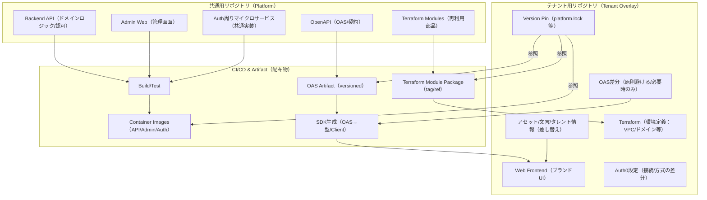

# ADR-0018: テナント切替/OEM方式（共通Repoサイロモデル）

## ステータス

Proposed

## 背景

本プロダクトは複数テナント（LDH グループの各レーベル・アーティスト等）向けに OEM 提供する必要がある。各テナントはブランドアイデンティティ（UI/アセット/文言/タレント情報）を独自に持ちつつ、バックエンドドメインロジック・認可・管理画面・インフラ基盤は共通化したい。

この要件を満たすための「テナント分離方式」を決定する必要があった。主な制約・要件は以下のとおり：

- **データ分離**: テナント間のデータ漏洩を防ぐため、物理的なサイロ分離が必要
- **ブランド差別化**: テナントごとに UI/アセット/文言を差し替え可能にする
- **共通基盤の保守性**: バックエンドロジック・認可ポリシー・インフラモジュールを一元管理し、全テナントへ均一に反映できること
- **段階的更新**: 共通基盤の更新を各テナント環境へ段階的に展開できること（一斉適用ではなく Version Pin による制御）
- **Auth 柔軟性**: テナントごとに Auth0 の接続方式・設定が異なる場合がある

## 決定内容

**共通Repo（Platform）とテナントRepo（Tenant Overlay）の二層構成によるサイロモデルを採用する。**

Terraform によりテナント環境をサイロ起動し、共通コンテナ（API/Admin/Auth）を各テナント環境へデプロイする。テナントRepoは共通Repoのバージョンをピン留めし、段階的に更新する。

### アーキテクチャ全体図



### リポジトリ構成

#### 共通用リポジトリ（Platform）

共通基盤として以下のコンポーネントを集約し、バージョン管理する。

| コンポーネント | 配置場所 | 役割 |
|---|---|---|
| Backend API | `projects/apps/api/` | ドメインロジック・認可・REST API |
| Admin Web | `projects/apps/admin/` | テナント管理画面（共通実装） |
| OpenAPI 仕様 | `docs/02_architecture/api/` | API 契約（SSOT） |
| Terraform Modules | `infra/modules/` | 再利用可能なインフラ部品（VPC/ECS/RDS等） |
| Auth マイクロサービス | `projects/apps/auth/` | Auth0 連携・トークン発行の共通実装 |

共通Repoの CI は以下の成果物を生成・公開する：

- **コンテナイメージ**: API/Admin/Auth の Docker イメージ（バージョンタグ付き）
- **Terraform Module Package**: tag/ref でバージョン管理
- **OAS Artifact**: バージョン付き OpenAPI 仕様ファイル

#### テナント用リポジトリ（Tenant Overlay）

各テナント（レーベル等）ごとに独立したリポジトリを持つ。共通Repoのバージョンをピン留めし、テナント固有の差分のみを管理する。

| コンポーネント | 配置場所 | 役割 |
|---|---|---|
| Web Frontend | `src/` | ブランドUI（共通基盤 + 差替UI/アセット） |
| ブランドアセット | `assets/` | タレント情報・文言・画像・テーマカラー等 |
| Terraform 環境定義 | `infra/env/` | VPC/ドメイン/証明書等のテナント固有設定 |
| Auth0 接続設定 | `auth/config/` | テナント固有の Auth0 接続方式・クライアント設定 |
| OAS 差分 | `api-overrides/` | 原則不要。テナント固有エンドポイントが必要な場合のみ |
| Version Pin | `platform.lock` | 共通Repoの使用バージョンを記録 |

### CI/CD パイプライン概要

```
共通Repo CI:
  1. テスト（unit/integration/e2e）
  2. コンテナイメージビルド → Container Registry へ push（タグ: vX.Y.Z）
  3. Terraform Module Package → Artifact ストレージへ公開
  4. OAS Artifact → Artifact ストレージへ公開

テナントRepo CI:
  1. platform.lock で指定されたバージョンのイメージ・モジュールを参照
  2. OAS Artifact → SDK 生成（型/クライアント）
  3. ブランドUI のビルド（共通 SDK + テナント固有アセット）
  4. Terraform apply → テナント専用環境（サイロ）へデプロイ
```

各テナント環境は独立したインフラ（VPC/サブネット/RDS等）上で動作し、他テナントとリソースを共有しない（サイロモデル）。

### Version Pin による段階更新戦略

テナントRepoは `platform.lock`（または同等のバージョン固定ファイル）によって共通Repoの各成果物バージョンをピン留めする。

```
# platform.lock の例
api_image: v1.2.3
admin_image: v1.2.3
auth_image: v1.2.3
terraform_module_ref: v1.2.3
oas_artifact: v1.2.3
```

**更新フロー:**

1. 共通Repo でリリース（セマンティックバージョニングに従ってタグを付与）
2. リリースノートを通じてテナントRepoオーナーへ更新を通知
3. テナントRepoオーナーが `platform.lock` を新バージョンに変更する PR を作成
4. テナントRepo CI でテスト（ブランドUI の統合テスト等）を実行し、パスを確認
5. テナント環境へデプロイ（ステージング → 本番の段階展開）

**バージョンポリシー:**

- 共通Repo は Semantic Versioning（semver）に従う
- MAJOR バージョン変更はテナントへの破壊的変更を意味し、移行ガイドを提供する
- MINOR/PATCH 変更は後方互換性を保証する

## 結果

### ポジティブな影響

- **強固なデータ分離**: テナントごとに独立したインフラ（VPC/DB等）を持つため、データ漏洩リスクが最小化される
- **共通基盤の一元管理**: バックエンドロジック・認可・インフラモジュールを共通Repoで一元管理できる
- **独立したデプロイサイクル**: 各テナントが Version Pin によって独立したペースで更新できる
- **ブランド差別化**: テナントRepoでUI/アセットを自由にカスタマイズでき、テナントのブランドアイデンティティを保持できる
- **障害影響範囲の限定**: 特定テナント環境の障害が他テナントに影響しない

### ネガティブな影響

- **インフラコストの増大**: テナントごとにサイロ環境を持つため、インフラコストが増大する
- **運用管理の複雑化**: テナント数が増えるほど、デプロイ・監視・証明書更新等の運用タスクが増える
- **バージョン管理の負担**: 各テナントが個別に Version Pin を更新する必要があり、古いバージョンのまま放置されるリスクがある
- **テナントRepo の初期構築コスト**: 新規テナント追加時にテナントRepoの初期セットアップが必要

### 緩和策

- **Terraform Module の活用**: テナント環境のインフラ構築を共通モジュール化することで、新規テナント追加の作業量を最小化する
- **自動更新 PR ツール**: Dependabot や Renovate 相当のツールを利用して `platform.lock` の更新 PR を自動生成し、バージョン陳腐化を防ぐ
- **LTS（Long Term Support）ポリシー**: 共通Repo のサポートバージョン期間を明示し、テナントが更新を後回しにするリスクを低減する
- **テナントテンプレートリポジトリ**: 新規テナント向けの Repo テンプレートを用意し、初期構築コストを削減する

## 検討した代替案

### 代替案 A: 単一モノレポにテナントを収容（テナントブランチ方式）

- **概要**: 共通Repoの単一モノレポ内でテナントごとにブランチを作成し、各ブランチで差分（UI/アセット等）を管理する。共通の更新はトランクから各テナントブランチへマージで反映する
- **却下理由**: テナント数が増えるにつれて共通更新のマージ作業量がテナント数×マージ数に増大し、保守コストが爆発的に増加する。ブランチ間のコンフリクト解消が恒常的に発生し、スケールしない。ブランチモデルはテナント間の独立したデプロイサイクルを実現しにくい

### 代替案 B: マルチテナント単一デプロイ（テナントID論理分離方式）

- **概要**: 単一インフラ環境にデプロイし、テナントID（`tenant_id` カラム等）でデータを論理的に分離する。UI はテナントID に基づいてテーマを切り替える
- **却下理由**: データが物理的に同一 DB に混在するため、DB 設定ミス・バグによるテナント間データ漏洩のリスクが残る。特定テナントの大量トラフィック・障害が全テナントに影響する（ノイジーネイバー問題）。規制対応（個人情報保護法等）におけるデータロケーション要件を満たしにくい。セキュリティ要件とデータ分離要件を満たさないため却下

### 代替案 C: テナントごとにフルスタックをフォーク（完全独立Repo方式）

- **概要**: テナントごとにバックエンド・フロントエンド・インフラを含むフルスタックのリポジトリをフォークし、完全に独立管理する
- **却下理由**: 共通バグ修正・セキュリティパッチを全テナントへ適用するために全フォークへの個別 PR が必要となり、作業量が膨大になる。テナント間でコードの品質・セキュリティレベルに差異が生じるリスクがある。共通基盤の改善が全テナントへ均一に届かなくなり、保守性が著しく低下する
