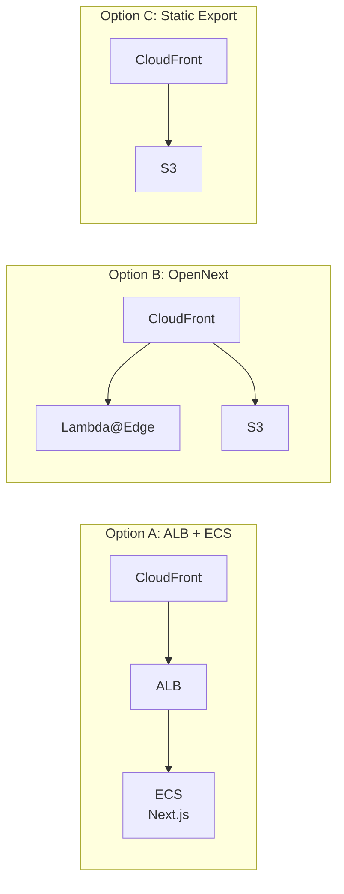
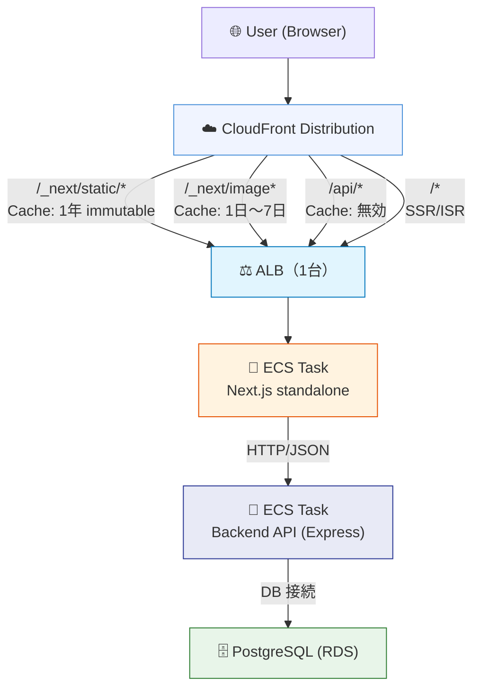
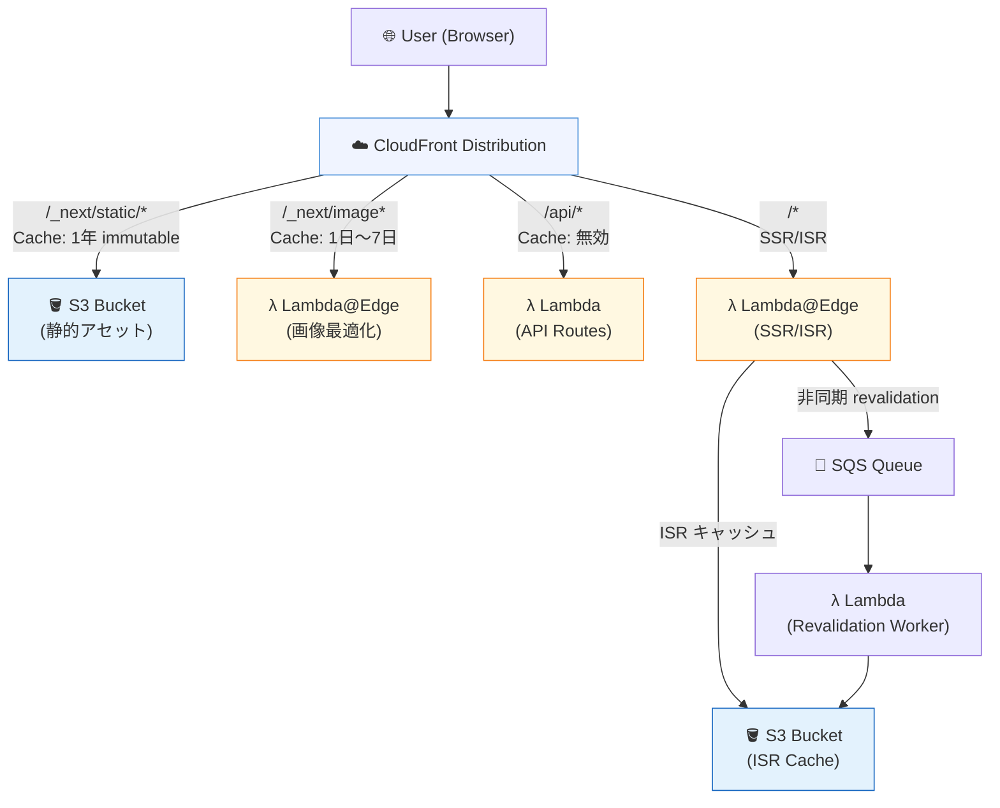
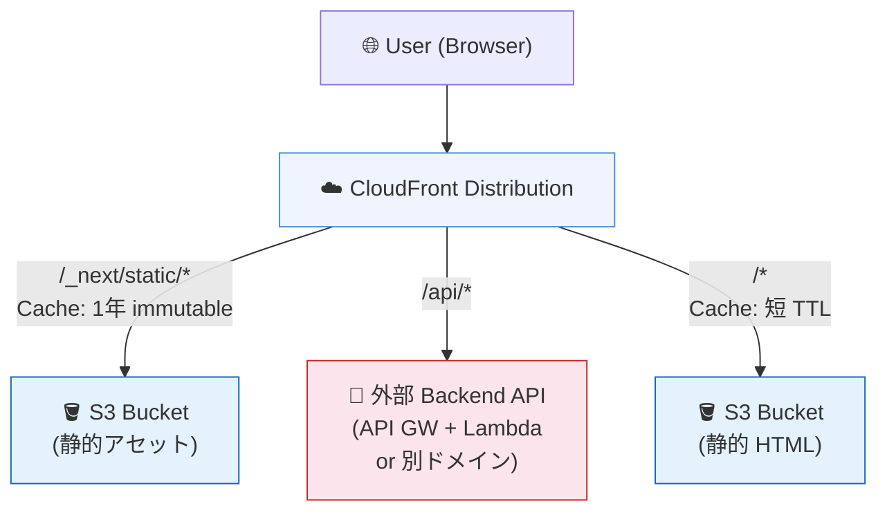

# CloudFront コスト見積もり観点と構成案（Next.js 対応版）

## 概要

このドキュメントは **Next.js をフロントエンドとして採用した場合** の CloudFront コスト構造を整理し、
3 つのデプロイ構成（ALB origin / OpenNext (Lambda@Edge) / S3 Static Export）の比較検討材料を提供する。
ADR: CDN 方式の選定（COD-47）に向けた意思決定を支援することを目的とする。

本プロジェクトの Next.js 16 アプリ（`@monorepo/web`）は `output: 'standalone'` で構成されており、
**App Router + Server Components + Turbopack（デフォルトバンドラー）** を利用する。
Backend API (Express) とは HTTP/JSON で通信し、Next.js が直接 DB にアクセスすることはない。
静的エクスポートは制限事項を把握した上で選択する必要がある。

> **参照料金**: AWS 東京リージョン（ap-northeast-1）の公式料金体系（2026年時点）に基づく概算。
> 実際の料金は AWS Console および [AWS CloudFront 料金ページ](https://aws.amazon.com/jp/cloudfront/pricing/) で確認すること。

---

## 1. コスト見積もりの観点

### 1-1. 転送コスト（データ転送量ベース）

CloudFront からエンドユーザーへのデータ転送量（Egress）に対して課金される。

| 月次転送量（TB） | 料金（ap-northeast-1 単価） |
|---|---|
| 最初の 10 TB | $0.114 / GB |
| 次の 40 TB（10 TB〜50 TB） | $0.089 / GB |
| 次の 100 TB（50 TB〜150 TB） | $0.086 / GB |
| 次の 350 TB（150 TB〜500 TB） | $0.080 / GB |

**Next.js アプリ特有の転送内訳:**

Next.js アプリのトラフィックは以下のカテゴリに分類され、それぞれキャッシュ戦略が異なる。

| コンテンツ種別 | パスパターン | 典型的なサイズ | キャッシュヒット率目標 | 説明 |
|---|---|---|---|---|
| JS バンドル | `/_next/static/chunks/*.js` | 50〜500 KB / ファイル | **99%+** | コンテンツハッシュ付きファイル名。無期限キャッシュ可能 |
| CSS | `/_next/static/css/*.css` | 10〜100 KB / ファイル | **99%+** | 同上 |
| 静的画像・フォント | `/_next/static/media/*` | 数 KB〜数 MB | **99%+** | 同上 |
| SSR HTML レスポンス | `/*`（ページ） | 10〜100 KB / レスポンス | **30〜70%** | TTL 設定に依存。認証が必要なページはキャッシュ不可 |
| ISR HTML レスポンス | `/*`（ISR ページ） | 10〜100 KB / レスポンス | **70〜95%** | `revalidate` 秒数まで CloudFront でキャッシュ可能 |
| 画像最適化 | `/_next/image` | 10〜500 KB / 画像 | **50〜90%** | クエリパラメータ（URL, w, q）ごとにキャッシュ |
| API レスポンス | `/api/*` | 1〜50 KB / レスポンス | **0〜50%** | エンドポイントの性質による（GET は TTL 設定可能） |

**典型的な Next.js アプリの月次転送量推定（月間 10 万 UU）:**

```
_next/static/* (JS/CSS/Media):  ~20 GB  （初回アクセス時のみ転送、以降はブラウザキャッシュ）
SSR/ISR ページ HTML:             ~30 GB  （キャッシュヒット率 60% 仮定）
_next/image:                     ~15 GB  （リサイズ済み画像）
/api/* レスポンス:                ~5 GB   （動的 API）
合計:                            ~70 GB / 月
```

**注意点:**

- CloudFront から AWS オリジン（S3、ALB、EC2 など同一リージョン）へのデータ転送は **無料**
- `_next/static/*` はコンテンツハッシュがファイル名に含まれるため、ビルドごとに異なる URL になる → ブラウザキャッシュとの相乗効果で転送量を大幅削減できる
- `/_next/image` はクエリパラメータ（`url`, `w`, `q`）が異なるとキャッシュミスになるため注意

**見積もり例（月次 70 GB の場合）:**

```
70 GB × $0.114 = $7.98/月
```

---

### 1-2. リクエストコスト（HTTP/HTTPS リクエスト数ベース）

CloudFront が受信したリクエスト数（HTTP / HTTPS）に対して課金される。

| リクエスト種別 | 料金（ap-northeast-1 単価） |
|---|---|
| HTTPS リクエスト | $0.0120 / 10,000 リクエスト |
| HTTP リクエスト | $0.0090 / 10,000 リクエスト |

**Next.js アプリのリクエスト分類と特性:**

| リクエスト種別 | パスパターン | 月次リクエスト比率 | キャッシュ可否 | 備考 |
|---|---|---|---|---|
| 静的アセット取得 | `/_next/static/*` | 25〜35% | キャッシュ可（Cache-Forever） | 初回 or キャッシュ期限切れ時のみ CloudFront まで到達 |
| SSR ページ | `/*`（非 ISR） | 30〜40% | 限定的（パブリックページのみ） | 認証済みページはキャッシュ不可 |
| ISR ページ | `/*`（ISR 設定あり） | 10〜20% | キャッシュ可（TTL = revalidate 秒） | 期限内はオリジン通信なし |
| 画像最適化 | `/_next/image` | 10〜15% | キャッシュ可 | パラメータ組み合わせ依存 |
| API Routes | `/api/*` | 15〜25% | GET のみ TTL 設定可能 | POST/PUT/DELETE はキャッシュ不可 |
| Prefetch リクエスト（RSC Payload） | `/*?__rsc=1` または RSC flight format | ブラウザ挙動による | キャッシュ可（App Router RSC Payload） | `<Link>` によるプリフェッチ。App Router では `/_next/data/*`（Pages Router 専用）ではなく RSC Payload を fetch |

**`next/link` プリフェッチの注意（App Router）:**

`next/link` はビューポートに入ったリンクを自動プリフェッチする。1 ページに多くのリンクがある場合、
意図しないリクエスト数増加につながる。

**App Router（本プロジェクト）では `/_next/data/*` は使用しない。**
代わりに、App Router は **RSC (React Server Component) Payload** を `fetch()` 呼び出しでインラインに取得する。
プリフェッチは `__rsc` クエリパラメータや RSC flight format で識別できる。
CloudFront のリクエストログで RSC Payload リクエストの数を監視することを推奨。
プリフェッチを無効化したい場合は `<Link prefetch={false}>` を使用する。

> **注意:** `/_next/data/*` は **Pages Router 専用**のパターンであり、App Router では発生しない。

**典型的な Next.js アプリのリクエスト分布（月間 10 万 UU）:**

```
月間総リクエスト数（CloudFront 到達分）: ~500 万リクエスト
  └ _next/static/*:  100 万（キャッシュヒット率 99% → S3/ALB 転送は 1 万件）
  └ SSR ページ:      200 万（キャッシュヒット率 50% → ALB 転送は 100 万件）
  └ ISR ページ:       50 万（キャッシュヒット率 80% → ALB 転送は 10 万件）
  └ _next/image:      80 万（キャッシュヒット率 70% → ALB 転送は 24 万件）
  └ /api/*:          100 万（GET 30% キャッシュ可能 → ALB 転送は 70 万件）
```

**見積もり例（月次 500 万 HTTPS リクエストの場合）:**

```
5,000,000 / 10,000 × $0.0120 = $6.00/月
```

---

### 1-3. ログコスト（アクセスログ保存）

CloudFront アクセスログを S3 に保存する場合のコスト。

| コスト要素 | 詳細 |
|---|---|
| CloudFront ログ出力 | **無料**（S3 への書き込みは S3 PUT 料金が発生） |
| S3 ストレージ | $0.025 / GB / 月（ap-northeast-1, Standard） |
| S3 PUT リクエスト | $0.0047 / 1,000 リクエスト |
| S3 GET リクエスト | $0.0037 / 1,000 リクエスト |
| S3 Glacier（ログ長期保存） | $0.005 / GB / 月（コスト削減オプション） |

**Next.js アプリの場合のログ保存量目安（月次）:**

Next.js アプリでは `_next/static/*` への静的アセットリクエストが全体の 30〜40% を占める。
これらはキャッシュヒット率が非常に高く、CloudFront のログには記録されるが実際の転送量は少ない。

| 月次リクエスト数（CloudFront 到達） | 推定ログサイズ |
|---|---|
| 100 万 req/月 | 約 500 MB |
| 500 万 req/月 | 約 2.5 GB |
| 1,000 万 req/月 | 約 5 GB |
| 1 億 req/月 | 約 50 GB |

**コスト最適化:**

- ログが不要な場合はロギングを無効化
- S3 Lifecycle Policy でログを Glacier に移行（30日以降など）
- Athena でログ分析する場合は S3 スキャン量に応じた課金あり（$5 / TB）
- Next.js の `_next/static/*` は静的アセットのため、ログ分析対象から除外することでクエリコスト削減も可能

**見積もり例（月次 500 万リクエスト、ログ 2.5 GB の場合）:**

```
S3 ストレージ: 2.5 GB × $0.025 = $0.063/月
（実質的に微小なコスト）
```

---

### 1-4. 無効化（Invalidation）コスト

CloudFront のキャッシュを強制的に削除する操作に対して課金される。

| 無効化パス数 | 料金 |
|---|---|
| 最初の 1,000 パス/月 | **無料** |
| それ以降 | $0.005 / パス |

**Next.js における Invalidation 設計:**

Next.js はコンテンツハッシュを活用したキャッシュバスティング戦略を採用しており、
Invalidation をほぼ不要にする設計になっている。

| コンテンツ種別 | Invalidation の要否 | 理由 | 推奨戦略 |
|---|---|---|---|
| `_next/static/chunks/*.js` | **不要** | ビルドごとにハッシュがファイル名に含まれる（例: `main-abc123.js`）。新ビルドは新 URL | キャッシュ TTL = 無期限（`max-age=31536000, immutable`） |
| `_next/static/css/*.css` | **不要** | 同上 | 同上 |
| `_next/static/media/*` | **不要** | 同上 | 同上 |
| ISR ページ | **ほぼ不要** | `revalidate` 秒数で自動期限切れ。`stale-while-revalidate` パターンで段階的更新 | TTL = `revalidate` 秒（例: 60秒） |
| SSR ページ（パブリック） | **要検討** | デプロイ後に古い HTML がキャッシュされる場合あり | デプロイ時に `/*` を Invalidation（無料枠内） |
| SSR ページ（認証あり） | **不要** | `Cache-Control: private, no-store` によりキャッシュされない | — |
| 緊急コンテンツ修正 | **必要な場合あり** | ISR の revalidate 時間を待てない場合 | 特定パスの Invalidation（月 1,000 パス以内に収める） |

**推奨: デプロイ時の Invalidation 戦略:**

```
1. _next/static/* → Invalidation 不要（ハッシュベース）
2. ISR ページ     → Invalidation 不要（TTL 自動期限切れ）
3. SSR パブリックページ → デプロイ時に /* を Invalidation（1 パスとしてカウント）
4. 緊急修正時     → 特定パスのみ Invalidation
```

ワイルドカード `/*` は **1 パスとして計算** されるため、デプロイごとに全キャッシュをクリアしても
月 1,000 パスの無料枠を超えにくい（デプロイ頻度が月 1,000 回を超える場合を除く）。

**見積もり例（月次デプロイ 30 回、各回 `/*` Invalidation の場合）:**

```
30 パス ≤ 1,000 → $0/月（無料枠内）
```

---

## 2. 構成案の比較

Next.js アプリのデプロイ構成として、以下の 3 パターンを比較する。

### 構成案 全体比較



### 2-1. Option A: ALB origin（ECS/EC2 でのセルフホスト Next.js）

本プロジェクトの `next.config.js` は `output: 'standalone'` を設定しており、この構成が現在の実装に最も適合する。

#### 構成図



> **補足:** ALB は 1 台。CloudFront の Cache Behavior がパスパターンごとにキャッシュ設定を変えるだけで、
> すべてのリクエストは同じ ALB にルーティングされる。

#### CloudFront Cache Behavior 設定

| 優先順位 | パスパターン | オリジン | キャッシュポリシー | 推奨 TTL |
|---|---|---|---|---|
| 1 | `/_next/static/*` | ALB or S3 | CachingOptimized（カスタム） | 1年（`max-age=31536000, immutable`） |
| 2 | `/_next/image*` | ALB | キャッシュ有効 | 1日〜7日 |
| 3 | `/api/*` | ALB | キャッシュ無効（デフォルト） | 0（POST/PUT/DELETE はキャッシュ禁止） |
| 4 | `/favicon.ico` | ALB or S3 | CachingOptimized | 1日 |
| 5 | `/*`（デフォルト） | ALB | カスタム | SSR: 0〜60秒、ISR: revalidate 秒 |

#### 機能サポート

| 機能 | サポート | 備考 |
|---|---|---|
| SSR（Server-Side Rendering） | ✅ フル対応 | App Router の Server Components 含む |
| ISR（Incremental Static Regeneration） | ✅ フル対応 | Next.js サーバー内でバックグラウンド revalidation |
| API Routes | ✅ フル対応 | `/api/*` → ALB → ECS |
| Middleware | ✅ フル対応 | Next.js Middleware（`middleware.ts`）が動作 |
| Image Optimization | ✅ フル対応 | `/_next/image` → Next.js サーバーが処理 |
| WebSocket | ✅ 対応可 | ALB の WebSocket サポートと組み合わせ |
| Streaming / Server Actions | ✅ フル対応 | Next.js 16 標準機能 |

#### コスト要素

| コスト要素 | 単価 | 月次概算（中規模） | 補足 |
|---|---|---|---|
| ALB 固定コスト | $0.0243/時間 | ~$18/月 | 常時稼働コスト |
| ALB LCU | $0.008/LCU/時間 | $5〜30/月 | トラフィックに応じて変動 |
| ECS（Fargate）: Next.js | vCPU $0.05056/時間, Mem $0.00553/GB/時間 | $30〜100/月 | タスク数・スペックによる |
| CloudFront→ALB 転送 | 無料 | $0 | 同一 AWS アカウント・同一リージョン |
| CloudFront 転送（エンドユーザーへ） | $0.114/GB（最初の 10TB） | ~$8/月（70GB） | |
| CloudFront リクエスト（HTTPS） | $0.0120/10,000 req | ~$6/月（500万 req） | |

**ECS Fargate コスト計算（最小構成: 0.5 vCPU / 1 GB Mem × 2 タスク）:**

```
vCPU: 0.5 × $0.05056/時間 × 730時間 = $18.45/月
Mem:  1 GB × $0.00553/時間 × 730時間 = $4.04/月
1 タスクあたり: $22.49/月
2 タスク合計: ~$45/月
```

#### メリット・デメリット

| メリット | デメリット |
|---|---|
| Next.js の全機能（SSR/ISR/API Routes/Middleware）が使える | ALB 固定コスト（~$18/月）が発生 |
| 現在の `output: 'standalone'` 設定をそのまま活用できる | ECS のタスク管理・スケーリング設定が必要 |
| `middleware.ts` でエッジロジック（認証チェック等）を実装可能 | コールドスタートはないが、ECS 最小タスク数の維持コストがある |
| WAF を ALB に適用してセキュリティを強化できる | SSR ページの CloudFront キャッシュ設計が複雑 |
| デプロイがシンプル（Docker イメージをビルドして ECS にデプロイ） | |

---

### 2-2. Option B: S3 + Lambda@Edge / OpenNext（サーバーレス Next.js）

[OpenNext](https://open-next.js.org/) を使って Next.js アプリを AWS のサーバーレスアーキテクチャにデプロイする構成。
Next.js の全機能を維持しながら、サーバーレス化によりコスト最適化とスケーラビリティを実現する。

#### 構成図



#### OpenNext の役割

[OpenNext](https://open-next.js.org/) (v3, 最新 3.1.x) は Next.js アプリを AWS のサーバーレス環境向けにアダプトするツール。
Next.js 15/16 の機能サポートを目標としており、`next build` の出力を以下のように変換する:

| Next.js 出力 | OpenNext の変換先 |
|---|---|
| SSR ページ | Lambda@Edge 関数（または Lambda + CloudFront Function） |
| ISR ページ | S3 キャッシュ + SQS 経由の非同期 revalidation Lambda |
| API Routes | Lambda 関数（API Gateway または Lambda Function URL） |
| 静的アセット | S3 バケット |
| `_next/image` | Lambda（画像変換処理） |

#### CloudFront Cache Behavior 設定

| 優先順位 | パスパターン | オリジン | キャッシュポリシー | 推奨 TTL |
|---|---|---|---|---|
| 1 | `/_next/static/*` | S3 | CachingOptimized | 1年（immutable） |
| 2 | `/_next/image*` | Lambda@Edge | キャッシュ有効 | 1日〜7日 |
| 3 | `/api/*` | Lambda（API GW） | キャッシュ無効 | 0 |
| 4 | `/favicon.ico` | S3 | CachingOptimized | 1日 |
| 5 | `/*`（デフォルト） | Lambda@Edge（SSR/ISR） | カスタム | SSR: 0〜60秒、ISR: revalidate 秒 |

#### 機能サポート

| 機能 | サポート | 備考 |
|---|---|---|
| SSR（Server-Side Rendering） | ✅ 対応 | Lambda@Edge でサーバーレス実行 |
| ISR（Incremental Static Regeneration） | ✅ 対応 | S3 + SQS パターンで実現 |
| API Routes | ✅ 対応 | Lambda + API Gateway で実行 |
| Middleware | ✅ 対応 | v3 で内部/外部モード選択可能（`middleware.external: true` で Edge 分離）。Node.js API も利用可 |
| Image Optimization | ✅ 対応 | Lambda で画像変換処理 |
| Streaming | ✅ 対応（要設定） | `open-next.config.ts` で `wrapper: "aws-lambda-streaming"` を設定。デフォルトは無効 |
| Server Actions | ✅ 対応 | サーバー関数内で実行 |
| Composable Caching (`'use cache'`) | ✅ 対応 | Next.js 16 で安定化（Cache Components） |
| Warmer（コールドスタート軽減） | ✅ 対応 | Lambda の事前ウォーム機能を内蔵 |
| WebSocket | ❌ 非対応 | Lambda の実行時間制限（最大 15 分）により長時間接続不可 |

#### コスト要素

| コスト要素 | 単価 | 月次概算（中規模） | 補足 |
|---|---|---|---|
| Lambda@Edge: 実行回数 | $0.60/100万リクエスト | ~$1.20/月（200万 SSR req） | SSR/ISR ページリクエスト数 |
| Lambda@Edge: 実行時間 | $0.00005001/GB秒 | ~$5〜20/月 | 実行時間・メモリサイズによる |
| Lambda（API Routes） | $0.20/100万リクエスト | ~$0.10/月（50万 req） | 東京リージョン Lambda 料金 |
| S3 ストレージ（静的アセット） | $0.025/GB/月 | ~$0.025/月（1GB） | ビルドアーティファクトは小さい |
| S3 GET リクエスト | $0.0037/1,000 req | 微小 | キャッシュミス時のみ S3 アクセス |
| SQS（ISR revalidation） | $0.40/100万リクエスト | 微小 | ISR revalidation キュー |
| ALB 固定コスト | 不要 | $0 | サーバーレスのため不要 |
| CloudFront 転送 | $0.114/GB | ~$8/月（70GB） | |
| CloudFront リクエスト | $0.0120/10,000 req | ~$6/月（500万 req） | |

#### メリット・デメリット

| メリット | デメリット |
|---|---|
| ALB/ECS の固定コストが不要（~$18〜50/月の削減） | WebSocket 非対応（Lambda の制約） |
| トラフィックに完全に比例したコスト構造 | Lambda@Edge のコールドスタート（Warmer で軽減可能だが完全には排除不可） |
| 自動スケーリング（バースト対応） | OpenNext のバージョン管理・アップデートが必要 |
| ISR の S3 キャッシュにより高いキャッシュヒット率 | デプロイの複雑さが上がる（OpenNext + CDK/Terraform） |
| Middleware/Streaming/Server Actions をフルサポート（v3） | `output: 'standalone'` から OpenNext への移行作業が必要 |
| サーバー管理不要、Warmer によるコールドスタート軽減 | Streaming はデフォルト無効、明示的な設定が必要 |

---

### 2-3. Option C: S3 Static Export（Next.js `output: 'export'`）

Next.js を完全な静的 HTML/JS/CSS にエクスポートして S3 + CloudFront で配信する構成。

**重要:** 本プロジェクトは現在 `output: 'standalone'` を使用しており、この構成に切り替えるには
**SSR/ISR/API Routes/Middleware の廃止** が前提となる。

#### 構成図



#### `next.config.js` の変更

```javascript
// Option C に切り替える場合の next.config.js 設定（参考）
const nextConfig = {
  output: 'export',  // 'standalone' から変更
  // SSR/ISR/API Routes は使用不可になる
  // rewrites() も使用不可
};
```

#### 機能サポート

| 機能 | サポート | 備考 |
|---|---|---|
| SSR（Server-Side Rendering） | ❌ 非対応 | 静的エクスポートでは実行時サーバーが存在しない |
| ISR（Incremental Static Regeneration） | ❌ 非対応 | ビルド時 SSG のみ（`revalidate` は無視） |
| API Routes | ❌ 非対応 | `pages/api/` または `app/route.ts` は使用不可 |
| Middleware | ❌ 非対応 | `middleware.ts` は使用不可 |
| Image Optimization | ⚠️ 部分対応 | `unoptimized: true` 設定が必要（最適化なし） |
| WebSocket | ❌ 非対応 | — |
| 動的ルーティング | ⚠️ 制限あり | `generateStaticParams` でビルド時に全パスを生成する必要がある |

#### この構成が有効な条件

- ページ数が固定されており、SSG でビルド時に全ページを生成できる
- ユーザー認証がない（または別ドメインの API に委譲できる）
- リアルタイム更新が不要（ビルド + デプロイのサイクルで十分）
- `_next/image` による画像最適化が不要（または CDN 上の変換ツールを別途使用）

#### コスト要素

| コスト要素 | 単価 | 月次概算（中規模） | 補足 |
|---|---|---|---|
| S3 ストレージ | $0.025/GB/月 | ~$0.10/月（4GB） | HTML + 静的アセット全量 |
| S3 GET リクエスト | $0.0037/1,000 req | 微小 | キャッシュミス時のみ S3 アクセス |
| ALB コスト | 不要 | $0 | 静的コンテンツのみ |
| Lambda コスト | 不要 | $0 | サーバーサイド処理なし |
| CloudFront 転送 | $0.114/GB | ~$8/月（70GB） | |
| CloudFront リクエスト | $0.0120/10,000 req | ~$6/月（500万 req） | |

#### メリット・デメリット

| メリット | デメリット |
|---|---|
| 最もシンプルでコストが低い | SSR/ISR/API Routes が使えない（本プロジェクトでは大幅な機能制限） |
| CloudFront キャッシュヒット率が最大（静的コンテンツのみ） | コンテンツ更新のたびにフルビルド + デプロイが必要 |
| サーバーサイドコンポーネントのランニングコストなし | `output: 'standalone'` から変更する移行コストが高い |
| S3 の高可用性・高耐久性 | 動的な個人化（認証後のコンテンツ等）が不可 |

---

## 3. コスト比較サマリー

### 前提条件

| 指標 | 値 |
|---|---|
| 月間ユニークユーザー | 10 万 UU |
| 月次 CloudFront 転送量 | 70 GB |
| 月次 CloudFront リクエスト数（HTTPS） | 500 万 req |
| SSR/ISR ページ比率 | 60% |
| キャッシュヒット率（静的アセット） | 99% |
| キャッシュヒット率（SSR ページ） | 50% |
| キャッシュヒット率（ISR ページ） | 80% |

### コスト比較表

| コスト項目 | Option A: ALB origin (ECS) | Option B: OpenNext (Lambda@Edge) | Option C: Static Export (S3) |
|---|---|---|---|
| CloudFront 転送コスト（70 GB） | $7.98 | $7.98 | $7.98 |
| CloudFront リクエストコスト（500 万 HTTPS） | $6.00 | $6.00 | $6.00 |
| CloudFront→オリジン転送 | $0（無料） | $0（無料） | $0（無料） |
| ALB 固定コスト | ~$18.00 | $0 | $0 |
| ALB LCU（処理量） | ~$10.00 | $0 | $0 |
| ECS Fargate（Next.js サーバー） | ~$45.00 | $0 | $0 |
| Lambda@Edge（SSR/ISR 実行） | $0 | ~$6.20 | $0 |
| Lambda（API Routes） | $0 | ~$0.10 | $0 |
| S3 ストレージ（静的アセット 1 GB） | $0.025 | $0.025 | $0.10 |
| SQS（ISR revalidation） | $0 | 微小 | $0 |
| ログ保存（S3, 2.5 GB） | $0.063 | $0.063 | $0.063 |
| Invalidation（月 30 回 `/*`） | $0（無料枠内） | $0（無料枠内） | $0（無料枠内） |
| **月次合計（CloudFront + インフラ概算）** | **~$87〜** | **~$20〜** | **~$14〜** |
| **SSR/ISR/API Routes** | **フル対応** | **フル対応（制約あり）** | **非対応** |
| **本プロジェクト適合性** | **◎（最適）** | **○（移行要）** | **△（機能削減が前提）** |

> **注意:** ECS Fargate のコストは最小構成（Next.js サーバー: 0.5 vCPU / 1GB Mem × 2 タスク）での推定。
> Backend API サーバーの ECS コストは別途加算。実際のコストは AWS Cost Explorer で監視すること。

### トラフィックスケール別コスト比較（CloudFront 部分のみ）

| 月次トラフィック | 想定規模 | CloudFront 転送コスト | CloudFront リクエストコスト | 合計（CF のみ） |
|---|---|---|---|---|
| 10 GB / 100 万 req | 小規模（スタートアップ） | $1.14 | $1.20 | ~$2.34 |
| 70 GB / 500 万 req | 中規模（10 万 UU） | $7.98 | $6.00 | ~$13.98 |
| 500 GB / 3,000 万 req | 大規模（50 万 UU） | $57.00 | $36.00 | ~$93.00 |
| 5 TB / 2 億 req | 大規模（300 万 UU） | $445.00 | $240.00 | ~$685.00 |

> CloudFront コスト以外に、各構成のオリジン側コスト（ALB/ECS/Lambda）が加算される。

---

## 4. キャッシュ戦略（Cache Strategy）

Next.js アプリを CloudFront で効率的にキャッシュするための設定方針。

### 4-1. コンテンツ種別ごとの Cache-Control 推奨設定

| コンテンツ種別 | Next.js サーバーからの Cache-Control | CloudFront TTL | 備考 |
|---|---|---|---|
| `_next/static/chunks/*.js` | `public, max-age=31536000, immutable` | 1年 | Next.js が自動で設定。変更不要 |
| `_next/static/css/*.css` | `public, max-age=31536000, immutable` | 1年 | 同上 |
| `_next/static/media/*` | `public, max-age=31536000, immutable` | 1年 | 同上 |
| `_next/image` | `public, max-age=86400` （デフォルト） | 1日 | `next.config.js` の `images.minimumCacheTTL` で変更可能 |
| ISR ページ | `s-maxage=<revalidate>, stale-while-revalidate` | `revalidate` 秒 | `s-maxage` を CloudFront が認識する |
| SSR ページ（パブリック） | `public, max-age=0, s-maxage=60` | 60秒 | 短い TTL でオリジン負荷を軽減しつつキャッシュ利用 |
| SSR ページ（認証あり） | `private, no-store, no-cache` | 0（キャッシュ禁止） | CloudFront は `private` ヘッダーを尊重する |
| `/api/*` GET（静的データ） | `public, s-maxage=300` | 5分 | リスト系 API など |
| `/api/*`（副作用あり） | `no-store` | 0 | POST/PUT/DELETE は必ずキャッシュ禁止 |

### 4-2. CloudFront Cache Behavior の優先順位設定

CloudFront のキャッシュ動作はパスパターンの **優先順位** が重要。より具体的なパスを先に設定する。

```
優先度 1: /_next/static/*   → Managed-CachingOptimized + origin: S3 or ALB
優先度 2: /_next/image*     → カスタムポリシー（query string を Forward して cache）
優先度 3: /api/*            → Managed-CachingDisabled（デフォルト）
優先度 4: /favicon.ico      → Managed-CachingOptimized
優先度 5: /*（デフォルト）  → カスタムポリシー（SSR/ISR に応じた TTL）
```

**`/_next/image` の Cache Behavior 設定の注意点:**

`/_next/image` はクエリパラメータ（`url`, `w`, `q`）が異なると別のキャッシュエントリになる。
CloudFront の Cache Behavior で `Query Strings: All` を Forward するよう設定すること。
設定しないとすべての画像が同じキャッシュエントリとして扱われ、意図しないキャッシュが発生する。

### 4-3. ISR と CloudFront TTL の整合

ISR の `revalidate` 設定と CloudFront の TTL は密接に連携させる必要がある。

```typescript
// app/blog/[slug]/page.tsx
export const revalidate = 60; // 60秒でバックグラウンド再生成

// この設定により Next.js は以下の Cache-Control を送信:
// Cache-Control: s-maxage=60, stale-while-revalidate=2592000
```

```
CloudFront の動作:
1. リクエスト受信
2. CloudFront キャッシュ確認（TTL 60秒）
   ├── TTL 内: キャッシュから返す（オリジン通信なし）
   └── TTL 超過: オリジン（Next.js）に転送
       └── stale-while-revalidate: 古いコンテンツを即座に返しつつバックグラウンドで更新
```

**重要:** CloudFront の minimum TTL が `revalidate` 秒より長い場合、ISR の更新がユーザーに届かない。
`minimum TTL = 0` に設定し、`s-maxage` ヘッダーを CloudFront が尊重するよう設定すること。

### 4-4. `stale-while-revalidate` パターン

```
タイムライン:
t=0:    ページビルド（Next.js ISR）
        CloudFront にキャッシュ保存（s-maxage=60）
t=60:   CloudFront の TTL 切れ
        └── 次のリクエスト: stale なレスポンスを返しつつバックグラウンドで Next.js にリクエスト
t=61:   Next.js がバックグラウンドで新しい HTML を生成
t=62:   CloudFront のキャッシュが新しい HTML に更新
t=62+:  以降のリクエストは新しいコンテンツを返す
```

このパターンにより、ユーザーは TTL 切れでもレイテンシなしでレスポンスを受け取れる（`stale` コンテンツを返す）。

---

## 5. 採用方針の判断基準

| 判断ポイント | Option A: ALB (ECS) 推奨 | Option B: OpenNext (Lambda@Edge) 推奨 | Option C: Static Export 推奨 |
|---|---|---|---|
| **レンダリング方式** | SSR/ISR/API Routes を多用 | SSR/ISR を使うがサーバーレス化したい | SSG/CSR のみで十分 |
| **現在の `output: 'standalone'`** | そのまま使用可 | OpenNext への移行が必要 | `output: 'export'` へ変更が必要 |
| **認証・個人化コンテンツ** | フル対応 | フル対応 | 不可（静的のため） |
| **Middleware の利用** | フル対応（`middleware.ts`） | フル対応（v3: 内部/外部モード選択可能） | 非対応 |
| **コスト優先度** | 中〜高（固定コストあり） | 低〜中（従量制） | 最低（静的コストのみ） |
| **スケーラビリティ** | ECS スケーリング設定が必要 | 自動スケーリング（Lambda） | 無限スケール（S3 + CF） |
| **コールドスタート** | なし（ECS は常時起動） | Warmer で軽減可能（完全排除は不可） | なし（静的コンテンツ） |
| **WebSocket** | 対応可 | 非対応（Lambda の制約） | 非対応 |
| **Streaming / Server Actions** | フル対応 | 対応（Streaming は `aws-lambda-streaming` wrapper 設定要） | 非対応 |
| **デプロイの複雑さ** | 中（Docker → ECS） | 高（OpenNext + CDK/Terraform） | 低（S3 sync） |
| **本プロジェクト推奨** | **◎ 移行コスト最小** | **○ 長期的なコスト最適化** | **△ 機能制限のため非推奨** |

### 推奨方針: Option A → コスト増加時に Option B へ移行

本プロジェクト（`@monorepo/web`、Next.js 16、`output: 'standalone'`、App Router + Server Components）に対して、
**まず Option A（ALB + ECS）で運用を開始し、コスト面で課題が生じた段階で Option B（OpenNext）への移行を検討する** 方針とする。

Option C（Static Export）は SSR/API Routes の廃止が前提となるため、本プロジェクトでは選択しない。

---

#### Phase 1（現行）: Option A（ALB + ECS）で運用する理由

| 観点 | 正当性 |
|------|--------|
| **移行コストゼロ** | 現在の `output: 'standalone'` + Docker/ECS 構成をそのまま利用できる。OpenNext への移行作業（ビルドパイプライン変更、IaC 書き換え、テスト）が不要 |
| **Next.js 16 全機能の即時利用** | SSR/ISR/Middleware/Streaming/Server Actions/Cache Components がすべて制約なしで動作する。OpenNext は対応済みだが `aws-lambda-streaming` 等の個別設定が必要 |
| **コールドスタートなし** | ECS タスクは常時起動のため、ユーザーへの初回レスポンスレイテンシが安定する。Lambda@Edge は Warmer で軽減可能だが完全には排除できない |
| **運用ノウハウの蓄積** | Docker + ECS のデプロイ・監視・スケーリングは AWS の標準的なパターンであり、チーム内で運用知見を積みやすい |
| **WebSocket 対応** | 将来的にリアルタイム通知等で WebSocket が必要になった場合、ALB 構成ならそのまま対応可能。Lambda@Edge では不可 |
| **デバッグ容易性** | ECS タスクのログは CloudWatch Logs で直接確認できる。Lambda@Edge はリージョン分散実行のためログが散在し、デバッグが困難 |
| **月次 ~$87 は許容範囲** | MVP/初期フェーズでは月 $87〜の固定コストは事業リスクに比して許容可能。トラフィックが少ない段階では従量制のメリットも小さい |

#### Phase 2（移行検討）: Option B へ移行する判断基準

以下の **いずれか** に該当した場合、Option B（OpenNext）への移行を検討する:

| 移行トリガー | 具体的な閾値（目安） | 根拠 |
|-------------|---------------------|------|
| **ECS コストの増大** | 月次 ECS + ALB コスト > $200 | ECS のスケールアップ/アウトにより固定コストが Lambda@Edge の従量コストを上回るポイント |
| **トラフィック急増** | 月間 50 万 UU 超 | ECS のオートスケーリング設定・管理コストが Lambda の自動スケールに対して不利になる |
| **コスト最適化の要請** | 経営判断によるインフラコスト削減要求 | Option B は月次 ~$20〜 と Option A の約 1/4 のコスト構造 |

**移行判断時の確認事項:**

- OpenNext の最新バージョンが Next.js 16 の全機能をサポートしているか
- WebSocket の利用有無（利用している場合、Option B では対応不可）
- チームに Lambda@Edge / OpenNext の運用知見があるか

#### Option A → B 移行時のリスクと対策

| リスク | 影響度 | 内容 | 対策 |
|--------|--------|------|------|
| **ビルドパイプラインの全面変更** | 高 | `docker build` → `open-next build` への切り替え。CI/CD（GitHub Actions）の書き換えが必要 | 移行ブランチで段階的に検証。ステージング環境で 1 週間以上の並行運用 |
| **IaC の大幅変更** | 高 | ECS/ALB の Terraform 定義 → Lambda@Edge/S3/CloudFront Functions の定義に書き換え。既存 Terraform モジュールの廃止・新規作成 | SST (Serverless Stack) や CDK の OpenNext 公式コンストラクトの活用で IaC 工数を削減 |
| **Middleware の動作差異** | 中 | Next.js の Middleware は ECS 上ではそのまま動作するが、OpenNext では CloudFront Functions またはサーバー関数内で実行される。ネットワーク呼び出しの制約が発生する可能性 | 移行前に `middleware.ts` の処理内容を棚卸し、外部 API 呼び出しの有無を確認 |
| **Streaming の明示的設定** | 中 | OpenNext ではデフォルトで Streaming が無効。`aws-lambda-streaming` wrapper の設定漏れで SSR パフォーマンスが劣化する | `open-next.config.ts` のテンプレートに Streaming 設定を含める |
| **Lambda@Edge コールドスタート** | 中 | 初回リクエストで数百 ms〜数秒の遅延。Warmer で軽減可能だが完全排除は不可。ユーザー体感に影響 | Warmer 設定の最適化。重要なパス（トップページ等）の Provisioned Concurrency 設定 |
| **Lambda@Edge のデバッグ困難** | 中 | Lambda@Edge は CloudFront のエッジロケーションで実行されるため、ログが各リージョンの CloudWatch に分散する | CloudWatch Logs のクロスリージョン集約を設定。X-Ray トレーシングの導入 |
| **ISR revalidation の仕組み変更** | 低 | ECS では Next.js サーバー内でバックグラウンド revalidation が完結するが、OpenNext では S3 + SQS + Lambda の非同期パターンになる。デバッグポイントが増える | SQS Dead Letter Queue の設定、revalidation Lambda のエラー監視 |
| **ロールバックの複雑化** | 低 | ECS は revision ベースの即座ロールバックが可能。OpenNext は Lambda バージョン + S3 アセットの整合性を保つ必要がある | デプロイスクリプトにロールバック手順を組み込む。Blue/Green デプロイの検討 |

#### 移行コスト見積もり（工数の目安）

| 作業項目 | 想定工数 | 備考 |
|---------|---------|------|
| OpenNext のビルド・動作検証 | 2〜3 日 | `open-next build` の実行、ローカルでの動作確認 |
| IaC 書き換え（Terraform / CDK） | 3〜5 日 | Lambda@Edge, S3, CloudFront, SQS の定義作成 |
| CI/CD パイプライン変更 | 1〜2 日 | GitHub Actions の書き換え |
| Middleware / Streaming の検証 | 1〜2 日 | 動作差異の確認、設定調整 |
| ステージング並行運用 | 5〜10 日 | 本番同等トラフィックでの安定性確認 |
| **合計** | **12〜22 日** | チーム 1〜2 名での作業想定 |

> **判断のポイント:** 移行工数 12〜22 日に対して、月次コスト削減額（~$67/月 = $804/年）を考慮すると、
> 約 1〜2 年で移行コストを回収できる計算になる。トラフィック増加でコスト差が拡大すれば回収期間は短縮される。

---

## 6. リスクと注意事項

| リスク | 内容 | 緩和策 |
|---|---|---|
| **SSR ページのキャッシュ設定ミス** | `Cache-Control` が `private` または `no-store` のページを CloudFront がキャッシュすると、別ユーザーへの個人情報漏洩が発生する | 認証が必要なページには必ず `Cache-Control: private, no-store` を設定。ステージング環境で CloudFront のキャッシュ動作を検証する |
| **`/_next/image` のキャッシュ設定漏れ** | CloudFront の Cache Behavior でクエリ文字列を転送しないと、異なるサイズ・品質の画像が同じキャッシュキーになる | `/_next/image*` の Cache Behavior で `Query Strings: All` を設定する |
| **ISR revalidate と CloudFront TTL の不整合** | CloudFront の minimum TTL > ISR の revalidate 秒の場合、コンテンツが期待通りに更新されない | CloudFront の minimum TTL = 0 に設定し、Next.js の `s-maxage` ヘッダーを尊重させる |
| **Lambda@Edge コールドスタート（Option B）** | Lambda@Edge は初回呼び出し時に数百 ms〜数秒の遅延が発生する可能性がある | OpenNext v3 内蔵の Warmer 機能を有効化。または Provisioned Concurrency を設定（追加コスト） |
| **`next/link` プリフェッチによるリクエスト急増** | `<Link>` コンポーネントがビューポートに入ると自動プリフェッチが発生し、月次リクエスト数が想定より増加する | CloudFront ログで RSC Payload リクエスト（App Router: `__rsc` クエリパラメータ付きリクエスト）の数を監視。必要に応じ `<Link prefetch={false}>` を使用 |
| **デプロイ後の Invalidation 忘れ** | SSR パブリックページのキャッシュがデプロイ後も残る場合がある | CI/CD パイプラインにデプロイ後の `/*` Invalidation ステップを自動化する |
| **トラフィック量の不確定性** | 実際のリクエスト数・転送量が未確定のため、見積もりは概算 | AWS Cost Explorer でモニタリング。Budget アラートを設定（月次予算の 80% / 100% でアラート） |
| **AWS 料金体系の変更** | AWS の料金は予告なく変更される場合がある | 四半期ごとに料金ページを確認 |

---

## 7. 関連ドキュメント

- `docs/02_architecture/ARCHITECTURE.md` - システム全体アーキテクチャ
- `projects/apps/web/next.config.js` - Next.js 設定（`output: 'standalone'`）
- COD-47 - CDN 方式の ADR 化（本ドキュメントが整理完了後に着手）
- [AWS CloudFront 料金](https://aws.amazon.com/jp/cloudfront/pricing/)
- [AWS S3 料金](https://aws.amazon.com/jp/s3/pricing/)
- [AWS ALB 料金](https://aws.amazon.com/jp/elasticloadbalancing/pricing/)
- [AWS Lambda 料金](https://aws.amazon.com/jp/lambda/pricing/)（Lambda@Edge を含む）
- [OpenNext ドキュメント](https://open-next.js.org/) - サーバーレス Next.js on AWS
- [Next.js キャッシュドキュメント](https://nextjs.org/docs/app/building-your-application/caching)
