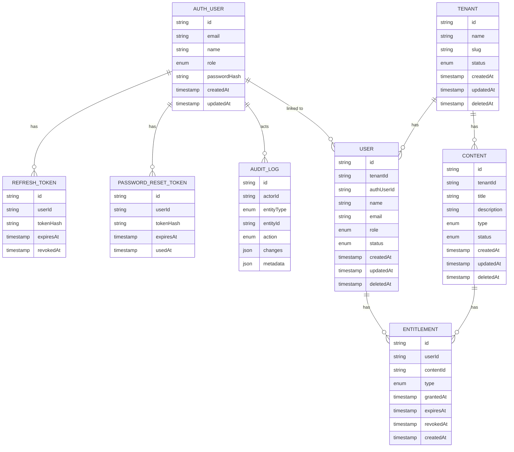

# Entity-Relationship Diagram

## エンティティグループ

### 認証・ユーザー管理 (Authentication & User Management)
- `AUTH_USER`: ロールベースアクセス制御を持つ認証ユーザー
- `REFRESH_TOKEN`: JWT リフレッシュトークンレコード
- `PASSWORD_RESET_TOKEN`: パスワードリセットトークンレコード

### 監査 (Audit)
- `AUDIT_LOG`: トラッキング対象エンティティへの変更の不変監査ログ

### テナント・コンテンツ管理 (Tenant & Content Management)
- `TENANT`: テナント（レーベル等）を管理するエンティティ
- `USER`: テナントに紐づくユーザープロファイル（`AUTH_USER` とは別）
- `CONTENT`: テナント配下のコンテンツ（音楽・動画・画像等）
- `ENTITLEMENT`: コンテンツに対するアクセス権（購入・サブスクリプション等）
