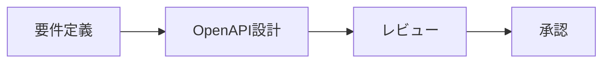
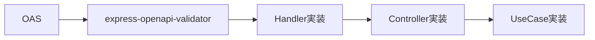
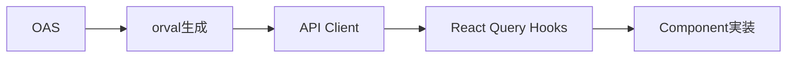

# OpenAPI-Driven Development Workflow

## Overview

このリポジトリでは **OpenAPI (OAS) 駆動** の開発フローを採用しています。
API仕様を Single Source of Truth として、フロントエンドのクライアントコードを生成します。
バックエンドは `express-openapi-validator` によるランタイムバリデーションを使用します（ADR-0013）。

```
┌─────────────────────────────────────────────────────────────────┐
│                    OpenAPI Specification                        │
│              projects/packages/api-contract/openapi.yaml        │
└─────────────────────────────────────────────────────────────────┘
                              │
          ┌───────────────────┼───────────────────┐
          ▼                   ▼                   ▼
   ┌─────────────┐    ┌─────────────┐    ┌─────────────┐
   │   Backend   │    │  Frontend   │    │    Docs     │
   │ (Express +  │    │  (React +   │    │  (Redoc/    │
   │  validator) │    │   orval)    │    │   Swagger)  │
   └─────────────┘    └─────────────┘    └─────────────┘
```

## アーキテクチャの変更点 (ADR-0013)

バックエンドは **hono-takibi によるコード生成から `express-openapi-validator` によるランタイムバリデーションに移行**しました:

| 項目 | 旧 (hono-takibi) | 新 (express-openapi-validator) |
|------|-----------------|-------------------------------|
| バリデーション方式 | コード生成（静的） | ランタイムバリデーション（動的） |
| 生成物 | `src/generated/oas/routes.ts` | なし（生成不要） |
| スクリプト | `generate:openapi`, `check:openapi` | 不要 |

フロントエンドは引き続き **orval** で TypeScript 型を生成します。

## Quick Start

### 1. OpenAPI仕様の確認

```bash
# 現在の仕様を確認
cat projects/packages/api-contract/openapi.yaml

# フロントエンド型の同期確認
./tools/contract openapi-check
```

### 2. コード生成（フロントエンドのみ）

```bash
# フロントエンド (React Query hooks + TypeScript types)
./tools/contract openapi-generate
```

---

## Development Flow

### Phase 1: API 設計 (Spec First)



#### 1.1 OpenAPI仕様の作成/更新

```yaml
# projects/packages/api-contract/openapi.yaml

paths:
  /products:
    get:
      operationId: searchProducts  # ← 必須: operationId
      summary: プロダクト検索
      tags:
        - Products
      parameters:
        - name: keyword
          in: query
          schema:
            type: string
      responses:
        '200':
          description: 検索結果
          content:
            application/json:
              schema:
                $ref: '#/components/schemas/ProductSearchResponse'
        '401':
          $ref: '#/components/responses/Unauthorized'
```

#### 1.2 命名規則

| 項目 | 規則 | 例 |
|------|------|-----|
| `operationId` | camelCase, 動詞+名詞 | `searchProducts`, `createProposal` |
| `tags` | PascalCase, 複数形 | `Products`, `Proposals` |
| Schema名 | PascalCase | `ProductSearchResponse` |
| パスパラメータ | camelCase | `productId`, `proposalId` |

### Phase 2: バックエンド実装



#### 2.1 バリデーション設定

`express-openapi-validator` はミドルウェアとして設定され、OpenAPI仕様に基づいてリクエスト/レスポンスを自動的にバリデーションします。
コード生成は不要です。

```typescript
// src/presentation/server.ts (設定例)
import * as OpenApiValidator from 'express-openapi-validator';

app.use(
  OpenApiValidator.middleware({
    apiSpec: './openapi.yaml',
    validateRequests: true,
    validateResponses: false, // 開発時のみ true
  })
);
```

#### 2.2 Handler実装

```typescript
// src/presentation/handlers/all-handlers.ts

export async function searchProducts(c: Context): Promise<Response> {
  const auth = await authenticate(c);
  if (auth instanceof Response) return auth;

  const ctx = getContext(c);
  return ctx.productController.search(c);
}
```

#### 2.3 Handler Registry登録

```typescript
// src/presentation/handlers/index.ts

export const handlers: HandlerRegistry = {
  searchProducts,
  // ... 他のhandler
} as const;
```

### Phase 3: フロントエンド実装



#### 3.1 コード生成

```bash
./tools/contract openapi-generate
```

生成物:
- `projects/packages/api-contract/src/generated/` - TypeScript types + React Query hooks

#### 3.2 API Client使用

```typescript
// features/product-search/api/use-search-products.ts

import { useSearchProducts } from '@monorepo/api-contract';

export function useProductSearch(params: SearchParams) {
  return useSearchProducts(params, {
    query: {
      enabled: !!params.keyword,
      staleTime: 30_000,
    },
  });
}
```

#### 3.3 Component実装

```tsx
// features/product-search/ui/ProductList.tsx

export function ProductList() {
  const { data, isLoading, error } = useProductSearch({ keyword });

  if (isLoading) return <Skeleton />;
  if (error) return <ErrorMessage error={error} />;

  return (
    <ul>
      {data?.products.map((item) => (
        <ProductCard key={item.id} product={item} />
      ))}
    </ul>
  );
}
```

---

## ファイル構成

### OpenAPI仕様

```
projects/packages/api-contract/
├── openapi.yaml              # メイン仕様 (Single Source of Truth)
├── orval.config.ts           # orval 設定
├── src/generated/            # 生成されたクライアントコード (orval)
└── package.json
```

### バックエンド

```
projects/apps/api/src/
├── presentation/
│   ├── handlers/
│   │   ├── all-handlers.ts   # 全handler実装
│   │   ├── index.ts          # Handler registry
│   │   └── types.ts          # Handler型定義
│   └── controllers/          # Controller実装
├── composition/
│   ├── build-app.ts          # App構成 (express-openapi-validator設定含む)
│   ├── register-generated-routes.ts  # Route登録
│   └── container.ts          # DI container
└── IMPLEMENTATION_GUIDE.md   # 詳細ガイド
```

### フロントエンド

```
projects/apps/web/src/
├── features/
│   └── <feature>/
│       ├── api/              # API hooks (generated使用)
│       ├── ui/               # Components
│       └── model/            # State/Logic
├── shared/
│   └── api/                  # API client設定
└── IMPLEMENTATION_GUIDE.md   # 詳細ガイド
```

---

## コマンドリファレンス

| コマンド | 説明 |
|----------|------|
| `./tools/contract openapi-check` | OAS生成物が最新かチェック（frontend） |
| `./tools/contract openapi-generate` | フロントエンド型生成（orval） |
| `./tools/contract typecheck` | TypeScript型チェック |
| `./tools/contract test` | テスト実行 |

---

## 変更時の必須手順 (MUST)

OpenAPI仕様またはコード生成に関わる変更を行う際は、**必ず以下の手順に従ってください**。
CIの `openapi-check` ジョブが失敗する主な原因は、この手順の漏れです。

```bash
# 1. OpenAPI仕様を編集
#    - projects/packages/api-contract/openapi.yaml (統合仕様)

# 2. フロントエンド型生成を実行
./tools/contract openapi-generate

# 3. フォーマットを適用（Prettierスタイル統一）
./tools/contract format

# 4. 生成物を含めてコミット
git add -A
git commit -m "feat(api): add new endpoint XYZ"
```

**注意**: `openapi-generate` 後に必ず `./tools/contract format` を実行してください。
orval の出力スタイルとPrettier設定が異なる場合、CIで差分が検出されて失敗します。

---

## チェックリスト

### 新しいエンドポイント追加時

- [ ] OpenAPI仕様に追加 (`operationId` 必須)
- [ ] `./tools/contract openapi-generate` でフロントエンド型生成
- [ ] バックエンド: Handler実装 → Registry登録 → Routes登録
- [ ] フロントエンド: Feature API hook作成 → Component実装
- [ ] `./tools/contract typecheck` で型チェック
- [ ] `./tools/contract test` でテスト

### 既存エンドポイント変更時

- [ ] OpenAPI仕様を更新
- [ ] **Breaking Change** の場合:
  - [ ] バージョニング検討
  - [ ] 移行ガイド作成
- [ ] フロントエンド型再生成（`./tools/contract openapi-generate`）
- [ ] 影響範囲の確認 (TypeScriptエラーで検出)
- [ ] テスト更新

---

## トラブルシューティング

### 生成物が古い

```bash
# 再生成
./tools/contract openapi-generate

# git差分確認
git diff projects/packages/api-contract/src/generated/
```

### 型エラー

OAS仕様変更後、生成コードと実装コードの型が合わない場合:

1. `./tools/contract openapi-generate` で再生成
2. `./tools/contract typecheck` でエラー箇所確認
3. 実装コードを修正

---

## 関連ドキュメント

- [Backend IMPLEMENTATION_GUIDE](../../projects/apps/api/IMPLEMENTATION_GUIDE.md)
- [Frontend IMPLEMENTATION_GUIDE](../../projects/apps/web/IMPLEMENTATION_GUIDE.md)
- [API Standards](./api_standards.md)
- [DocDD Process](../00_process/process.md)
- [ADR-0013](../02_architecture/adr/0013_express_migration.md)
