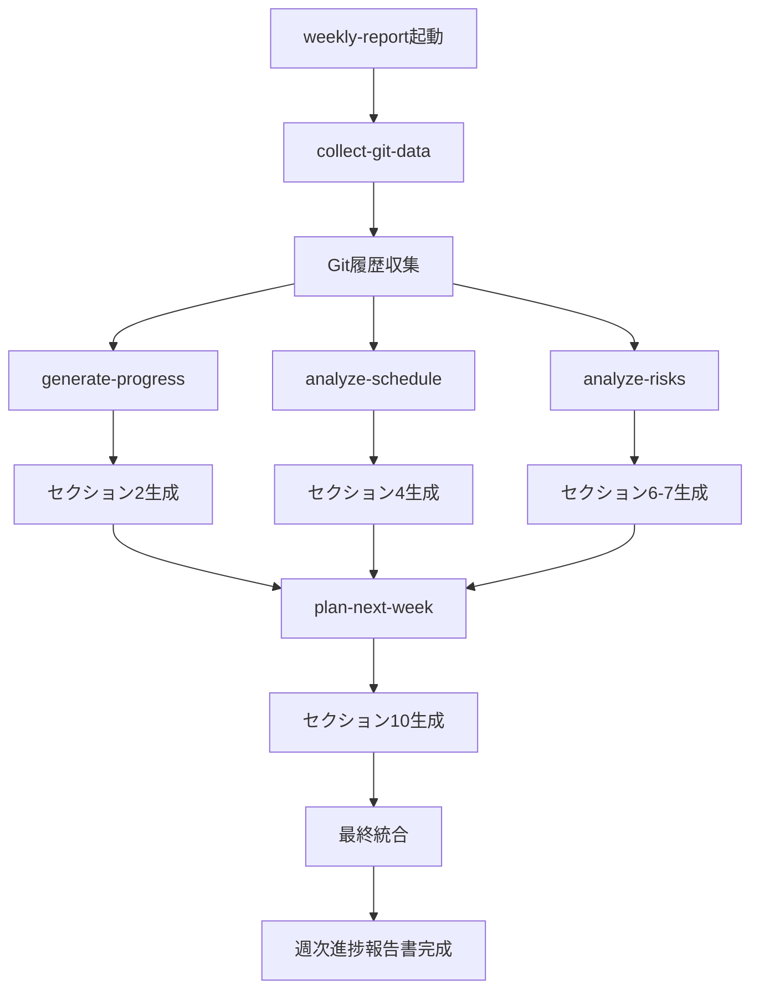

# Weekly Report Skills

週次進捗報告書を自動生成するClaude Code Skillsパッケージです。

## 📋 概要

このスキルパッケージは、[05_進捗報告/](../../../05_進捗報告/)で定義された週次進捗報告書作成ワークフローをClaude Code上で自動化します。

手動作業時間: **2-3時間** → Skills使用時: **約45分** （**60-70%の時間削減**）

## 🎯 含まれるスキル

### メインスキル

- **[weekly-report](./weekly-report.md)** - 週次進捗報告書作成のオーケストレーター
  - 全サブスキルを順次実行し、完全な週次進捗報告書を生成

### サブスキル（個別実行可能）

1. **[collect-git-data](./collect-git-data.md)** - Git履歴データ収集
   - Git履歴から過去7日間のコミット、統計、ブランチ情報を収集
   - 所要時間: 約1分

2. **[generate-progress](./generate-progress.md)** - 実績レポート生成
   - セクション2「今週の実績」を自動生成
   - Git履歴から開発活動サマリー、実装完了機能、修正・改善項目を抽出
   - 所要時間: 約5分

3. **[analyze-schedule](./analyze-schedule.md)** - スケジュール分析
   - セクション4「スケジュール状況」を生成
   - 遅延リスク判定、バッファ分析、推奨アクション提示
   - 所要時間: 約5-10分

4. **[analyze-risks](./analyze-risks.md)** - 課題・リスク分析
   - セクション6-7「課題管理」「リスク管理」を生成
   - 優先度付け、定量評価、エスカレーション判定
   - 所要時間: 約5-10分

5. **[plan-next-week](./plan-next-week.md)** - 次週計画生成
   - セクション10「次週の予定」を生成
   - 重点タスク選定、予定会議提案、クリティカルパス確認
   - 所要時間: 約5-10分

## 🚀 クイックスタート

### 基本的な使い方

```bash
# Claude Codeで以下を実行
/weekly-report
```

これだけで、以下が自動実行されます：
1. Git履歴データ収集
2. 4つのセクション生成（実績、スケジュール、課題・リスク、次週計画）
3. 最終統合（ユーザー入力が必要な部分は対話形式で質問）
4. 完全な週次進捗報告書を生成

### 個別スキルの実行

特定のセクションのみ更新したい場合:

```bash
# 実績レポートのみ再生成
/generate-progress

# スケジュール分析のみ実行
/analyze-schedule

# 次週計画のみ更新
/plan-next-week
```

## 📂 ファイル構成

```
.claude/skills/weekly-report/
├── README.md                    # このファイル
├── weekly-report.md             # メインスキル（オーケストレーター）
├── collect-git-data.md          # Git履歴収集
├── generate-progress.md         # 実績レポート生成
├── analyze-schedule.md          # スケジュール分析
├── analyze-risks.md             # 課題・リスク分析
└── plan-next-week.md            # 次週計画生成
```

## 🔄 実行フロー



## 📊 自動生成されるセクション

以下のセクションは完全自動生成されます：

- ✅ **セクション2**: 今週の実績（Git履歴から）
- ✅ **セクション4**: スケジュール状況（WBS・進捗データから）
- ✅ **セクション6**: 課題管理（課題管理表から）
- ✅ **セクション7**: リスク管理（リスク管理表から）
- ✅ **セクション10**: 次週の予定（WBS・今週実績から）

## 📝 手動入力が必要なセクション

以下のセクションはユーザー入力が必要です（対話形式で質問されます）：

- セクション1: エグゼクティブサマリー
- セクション3: BPR関連進捗（該当プロジェクトのみ）
- セクション5: 予算状況
- セクション8: 品質状況
- セクション9: 変更管理
- セクション11: KPI
- セクション12: その他特記事項
- セクション13: 添付資料

## 💾 出力ファイル

すべての出力は `05_進捗報告/output/` に保存されます：

```
05_進捗報告/output/
├── weekly_data.txt              # Git履歴データ
├── project_info.txt             # プロジェクト情報
├── section2_実績.md             # 今週の実績
├── section4_スケジュール.md      # スケジュール分析
├── section6-7_課題リスク.md     # 課題・リスク分析
├── section10_次週計画.md        # 次週計画
└── 週次進捗報告書_YYYY-WXX.md   # 最終成果物 ⭐
```

## ⏰ 推奨運用スケジュール

### 週次ルーチン

| 曜日 | 時刻 | タスク | 使用スキル |
|-----|------|-------|-----------|
| 月曜 | 午前 | 先週の課題・リスク棚卸し | - |
| 火-木 | - | 開発作業・進捗確認 | - |
| 木曜 | 午後 | 遅延リスク確認 | analyze-schedule |
| 金曜 | 14:00 | 週次進捗報告書作成 | **weekly-report** ⭐ |
| 月曜 | 午前 | クライアントMTGで報告 | - |

## 🔧 初回セットアップ

### 1. スクリプトの実行権限付与

```bash
cd /path/to/ai-driven-pm-project
chmod +x 05_進捗報告/scripts/*.sh
```

### 2. outputディレクトリ作成

```bash
mkdir -p 05_進捗報告/output
```

### 3. プロジェクト情報の準備

以下の情報を手元に準備:
- プロジェクト名
- 現在のフェーズ
- マイルストーン情報
- WBSファイルの場所
- 課題管理表・リスク管理表の場所

### 4. テスト実行

```bash
# Claude Codeで実行
/collect-git-data
```

データが正常に収集されることを確認してください。

## 💡 活用のコツ

### 1. データの準備
- **WBS**: 毎日更新しておく
- **課題管理表**: 発生時に即座に記録
- **リスク管理表**: 週1回は見直し

### 2. プロンプトのカスタマイズ
- プロジェクト固有の用語を各プロンプトファイルに追加
- クライアントの好みに応じた表現を事前定義

### 3. 定型データの再利用
- 前週の報告書から変更のない部分はコピー
- 特にセクション1（エグゼクティブサマリー）、3（BPR）、5（予算）

### 4. レビュー観点
生成後、以下を必ず確認:
- [ ] 数値データの正確性
- [ ] 専門用語が平易な表現になっているか
- [ ] リスク・課題が適切に伝わるトーンか
- [ ] 誤字脱字

## 🛠️ トラブルシューティング

### Q1: Git履歴が取得できない

```bash
# リモートから最新を取得
git fetch origin
git pull origin main

# データ収集を再実行
cd 05_進捗報告
./scripts/collect_weekly_data.sh > output/weekly_data.txt
```

### Q2: セクション生成に失敗した

各セクションは独立しているため、失敗したセクションのみ個別に再実行できます。

```bash
# 例: 実績レポートのみ再生成
/generate-progress
```

### Q3: 生成された報告書が長すぎる

プロンプトファイルを編集して制約を追加:
```markdown
- 報告書は全体で5ペ��ジ以内に収めてください
- 各セクションは簡潔に（1セクション最大10行）
```

### Q4: 専門用語が多く残っている

プロンプトファイルに以下を追加:
```markdown
- 以下の専門用語は使用禁止: {用語リスト}
- クライアントは技術に詳しくない前提で記述
```

## 📚 関連ドキュメント

### プロジェクト内
- [05_進捗報告/README.md](../../../05_進捗報告/README.md) - 週次進捗報告の全体概要
- [05_進捗報告/scripts/README.md](../../../05_進捗報告/scripts/README.md) - スクリプト詳細
- [05_進捗報告/テンプレート/週次進捗報告書.md](../../../05_進捗報告/テンプレート/週次進捗報告書.md) - 最終フォーマット

### 外部参照
- [Claude Code Skills Documentation](https://docs.claude.com/en/docs/claude-code/skills)
- [Conventional Commits](https://www.conventionalcommits.org/) - コミットメッセージ規約

## 🔄 更新履歴

- **2025-10-27**: 初版作成
  - メインスキル（weekly-report）追加
  - サブスキル5種追加（collect-git-data, generate-progress, analyze-schedule, analyze-risks, plan-next-week）

## 🤝 フィードバック

このスキルパッケージに関するフィードバックや改善提案は、プロジェクトのIssueで受け付けています。

---

**作成日**: 2025-10-27
**最終更新**: 2025-10-27
**メンテナンス**: プロジェクト状況に応じてスキルをカスタマイズしてください
