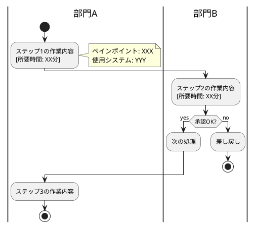
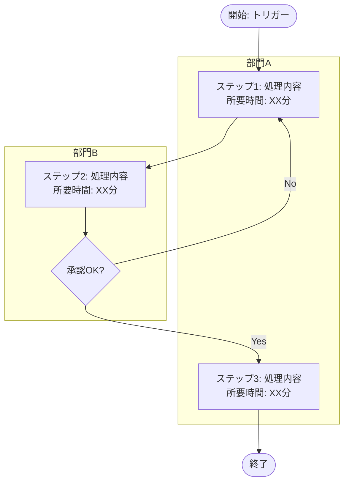

# 業務フロー図作成プロンプト（マークダウン→UML変換）

## 目的

業務記述書（マークダウン形式）からUML形式の業務フロー図を自動生成する。

---

## プロンプト（PlantUML形式）

```
以下の業務記述書から、PlantUML形式のアクティビティ図を生成してください。

# 業務記述書
"""
{ここに業務記述書の内容を貼り付け}
"""

# 生成ルール

## 1. 基本構造
- アクティビティ図として生成
- スイムレーンを使用して、部門・役割ごとに分ける
- 開始と終了を明記

## 2. 表現方法
- **アクション（四角形）**: 各ステップの作業内容
- **判断（ひし形）**: 承認や条件分岐
- **並行処理（フォーク/ジョイン）**: 同時に行われる作業
- **ノート**: ペインポイントや所要時間を注釈として追加

## 3. 記載内容
- 各アクションに所要時間を記載（例：[30分]）
- 判断ポイントでは条件を明記
- システム名を記載（例：【ERPシステム】）
- ペインポイントがある場合はノートで追記

## 4. スイムレーン
- 部門・役割ごとに縦に分ける
- システムも1つのスイムレーンとして表現可能

# 出力形式

PlantUMLのコードブロックとして出力してください：



# 注意事項
- 業務記述書の「ステップ」をそのまま順番に変換
- 例外処理は分岐として表現
- 承認フローは判断（ひし形）で表現
- 並行して行われる作業はfork/joinで表現
- システム連携は別のスイムレーンで表現可能
```

---

## プロンプト（Mermaid形式）

```
以下の業務記述書から、Mermaid形式のフローチャートを生成してください。

# 業務記述書
"""
{ここに業務記述書の内容を貼り付け}
"""

# 生成ルール

## 1. 基本構造
- flowchart TD（上から下）またはflowchart LR（左から右）
- サブグラフでスイムレーンを表現
- 開始と終了を明記

## 2. 表現方法
- **処理**: 四角形 `[処理内容]`
- **判断**: ひし形 `{判断内容}`
- **開始/終了**: 角丸 `([開始])` `([終了])`
- **データ**: 平行四辺形 `[/データ名/]`

## 3. 記載内容
- 各処理に所要時間を記載
- 判断ポイントでは条件を明記
- システム名を記載

# 出力形式

Mermaidのコードブロックとして出力してください：



# 注意事項
- 業務記述書の「ステップ」をそのまま順番に変換
- 例外処理は分岐として表現
- 承認フローは判断（ひし形）で表現
```

---

## 使い方

### 1. PlantUMLを使う場合

1. 業務記述書を用意
2. プロンプトに貼り付けてAIに実行
3. 出力されたPlantUMLコードをコピー
4. PlantUML対応ツールで可視化
   - VSCode拡張機能「PlantUML」
   - オンライン: https://www.plantuml.com/plantuml/
   - IntelliJ IDEA / PyCharm等のJetBrains製品

### 2. Mermaidを使う場合

1. 業務記述書を用意
2. プロンプトに貼り付けてAIに実行
3. 出力されたMermaidコードをコピー
4. Mermaid対応ツールで可視化
   - GitHub / GitLab（マークダウンに直接埋め込み可能）
   - Notion
   - Mermaid Live Editor: https://mermaid.live/
   - VSCode拡張機能「Markdown Preview Mermaid Support」

---

## PlantUMLの基本構文

### スイムレーン
```plantuml
|部門A|
:処理1;

|部門B|
:処理2;
```

### 判断分岐
```plantuml
if (条件?) then (yes)
  :処理A;
else (no)
  :処理B;
endif
```

### 並行処理
```plantuml
fork
  :処理A;
fork again
  :処理B;
end fork
```

### ノート追加
```plantuml
:処理;
note right
  補足説明
end note
```

---

## Mermaidの基本構文

### サブグラフ（スイムレーン）
```mermaid
subgraph 部門A
    A1[処理1]
    A2[処理2]
end
```

### 判断分岐
```mermaid
A{条件?}
A -->|Yes| B[処理B]
A -->|No| C[処理C]
```

### スタイル設定
```mermaid
classDef painPoint fill:#ff9999
A1:::painPoint
```

---

## 応用例：As-Is/To-Be比較図

```
以下のAs-Is業務記述書とTo-Be業務記述書から、比較できるフロー図を2つ生成してください。
削減されたステップは赤色、新規追加されたステップは緑色で強調してください。

# As-Is業務記述書
"""
{As-Isの内容}
"""

# To-Be業務記述書
"""
{To-Beの内容}
"""

# 出力
1. As-Isフロー図（PlantUML/Mermaid）
2. To-Beフロー図（PlantUML/Mermaid）
3. 主な変更点の一覧表

| 変更内容 | As-Is | To-Be | 期待効果 |
|---------|-------|-------|----------|
```

---

## ヒント

### フロー図の種類の選び方

| 図の種類 | 用途 | ツール |
|---------|------|--------|
| アクティビティ図 | 業務の流れ全体を表現 | PlantUML |
| シーケンス図 | システム間のやり取りを表現 | PlantUML, Mermaid |
| スイムレーン図 | 部門間の役割分担を明確に | PlantUML, Mermaid |
| フローチャート | シンプルな業務フロー | Mermaid, draw.io |

### 可視化ツールの選び方

| ツール | メリット | デメリット |
|--------|---------|-----------|
| PlantUML | UML標準、多機能 | 学習コストやや高い |
| Mermaid | GitHubで表示可、シンプル | 表現力がやや限定的 |
| draw.io | GUI操作、直感的 | コードベースでない |
| Lucidchart | 高機能、共同編集 | 有料 |

### フロー図作成のベストプラクティス

1. **1つの図は1ページに収める**
   - 大きすぎる場合は複数の図に分割

2. **色を使い分ける**
   - 通常フロー：青
   - 例外フロー：赤
   - ペインポイント：オレンジ
   - 新規追加（To-Be）：緑

3. **注釈を活用**
   - 所要時間
   - ペインポイント
   - 使用システム
   - 改善のポイント

4. **統一した表記**
   - アクターの表記（部署名、役職名を統一）
   - システム名の表記
   - 所要時間の単位
